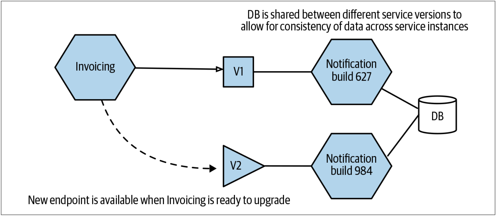
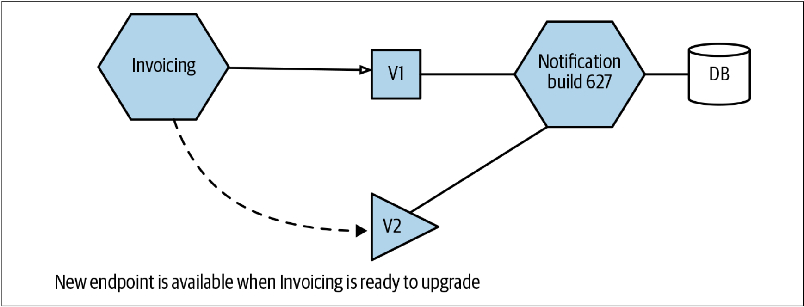

# 破坏性的服务变更
微服务作为更大的系统的一部分而存在。每个微服务要么使用其他微服务提供的功能，要么向其他微服务提供自己的功能，要么二者兼而有之。对于微服务架构而言，我们正在努力实现其独立可部署性。但是为了实现其独立部署，我们需要确保对微服务的修改不会干扰其下游消费者。

我们可以用契约的形式把服务的功能开放给其它的微服务。契约并不仅仅用来描述：“微服务将返回的数据”。契约还涉及到定义服务的预期行为。无论是否与下游服务明确的建立该契约，该契约都会存在。当修改服务时，需要确保没有违反该契约；否则，就会出现严重的线上问题。

我们迟早都要应对破坏性变化所带来的挑战——要么是因为有意做出的非向后兼容变更的决定，要么是因为无意的修改。对于无意而为之的修改，我们以为他只会影响本地服务，却发现它以难以想象的方式破坏了其他的服务。

## 该问题如何表现出来
此问题最严重的情况是，因破坏契约兼容性的、新的微服务生效而导致的系统中断。这表明，我们没有尽早捕捉意外的破坏契约的行为。如果没有快速的回滚机制，那么这些问题将是灾难性的。解决这种类型的故障的唯一的优势就是，除非修改的是很少使用的那部分服务，否则变更发布之后，很快就会表现出这类故障。

另一种迹象是，我们开始发现人们试图协调多个服务的同时部署（有时称之为同步发布（*lock-step release*））。在试图管理客户端和服务器之间的契约变化时，也可能会出现该现象。在团队中，偶尔的同步发布并不会太糟，但是如果同步发布很常见，则需要进行一些调查。

## 该问题何时会出现
我发现，破坏性修改的问题是团队很早就能遇到的发展烦恼，尤其是当开发跨越多个团队时。在一个团队中时，人们在做出破坏性修改时往往会有更清楚的认识，部分原因是开发人员很有可能会同时修改服务和该服务的消费者。当一个团队正在修改其他团队会使用的服务时，可能会更频繁的出现破坏性修改的问题。

随着时间的流逝，随着团队变得越来越成熟，团队会更加努力地做出改变来避免出现故障，并且还建立机制来尽早发现问题。

## 该问题的解决方案
我有一套管理违反契约的规则，它们非常简单：
1. 不要违反契约。
2. 参考第一条。

好的，我稍微开个玩笑。对开放出来的契约进行破坏性的修改并不好，并且也很难管理。如果可以的话，我们真的要最小化这种破坏性的修改。也就是说，如下的规则是更现实的规则：
1. 消灭意外的破坏性修改。
2. 在做破坏性修改之前要三思而后行——可以避免破坏性修改吗？
3. 如果需要进行破坏性修改，请给下游消费者一些时间来迁移到新的契约。

让我们更详细地了解这些步骤。

### 消灭意外的破坏性修改
微服务的显示模式（*explicit schema*）可以快速检查出契约中的破坏性修改。如果开放了一个方法，该方法的参数为两个整型参数，而现在改方法的参数为1个整型参数，则这显然是一项破坏性变更，这种破坏性修改在新的模式中显而易见。向开发人员提供显示模式可以帮助开发人员及早发现破坏性修改。如果开发人员必须手动修改模式，那么这将成为一个显示的步骤，该步骤有望让开发人员停下来并对修改进行思考。如果使用的是正规的模式格式，那么也可以选择以编程的方式来处理模式修改的问题，尽管该方式并不能按照我所想要的那样工作。[protolock](https://github.com/nilslice/protolock)就是该类工具的一个例子，该工具实际上将禁止不兼容的模式修改。

许多人会默认选择使用无模式的交换格式（*schema-less interchange formats*），最常见的例子就是JSON。尽管理论上而言，可以为JSON定义显式模式，但实际上却并未应用于实践。开发人员一开始都讨厌正规模式的约束。但是，在他们不得不处理跨服务的破坏性修改之后，他们就会改变主意。还值得注意的是，使用模式的某些序列化格式的数据可以提升服务的性能，这一点也值得考虑。

但是，破坏协议结构只是破坏性修改的一部分。还需要考虑语义上的破坏。如果我们的计算方法仍然有两个整型参数，但是最新版本的微服务是将这两个整数相乘，而以前只是将它们相加，这也是契约的破坏性修改。实际上，测试是检测此问题的最佳方法之一。我们将在稍后讨论。

无论做什么，当开发人员修改对外开放的契约时，最好的方式就是尽可能地让修改对开发人员显而易见。这可能意味着要避免采用魔术般地序列化数据或者利用代码生成模式的技术，而更愿意采用手动的方式来生成这些内容。相信我，让服务契约难以修改总比不断破坏下游消费者更好。


**JSON-Schema**

对于Json格式的接口定义，已经不单纯停留在理论阶段了，目前已经有一些可用于实践的方案：

* [JSON-Schema](http://json-schema.org/)目前可以用来定义Json格式的接口。
* 由Swagger发起的，目前由[Linux Foundation](https://www.linuxfoundation.org/)维护的[OAS:OpenAPI Specification](https://swagger.io/specification/)也可以用来解决这个问题。
* 当然，最近的[YAPI平台](https://github.com/YMFE/yapi)也可以用于解决json接口定义的问题。

前两年，在我负责质量的横向TOPIC的时候，我亲身经历了几十起破坏性修改隐示的json契约而导致的严重的线上问题。因为研发人员拒绝使用显示的、手工编写的JSON-Schema，当然这也确实会花一些时间。因此，研发人员根本就不会意识到他们对服务的修改实际上已经破坏了契约。因此而带来的问题，各种各样，但每一个问题都非常严重，并且一上线就开始表现出来，例如：
* 客户端崩溃
* 下游服务异常
* ……

尤其是整个系统服务数量较多，而不同服务采用的技术栈又不同时，这种情况尤为严重。例如上游的`PHP`服务，将`string`类型的数据修改为`integer`类型，而下游的`c++`利用`rapid-json`或`boost`来处理该数据时，就会引起服务异常。这时，最好的情况是下游服务立刻发生崩溃而让研发人员感知到问题，否则就会带来严重的逻辑错误。然而，即便是崩溃这种及时反馈机制而言，对于服务的影响也是非常严重的。

崩溃还是逻辑异常，这是一个非常难的问题。

既然如此，那还不如使用`JSON-Schema`，当然这也意味着要花一点点时间来写`JSON-Schema`。没有不劳而获的好处，就是这样子的。


### 在破坏性修改之前，三思而后行
如果可能的话，尽可能对契约进行扩展性修改。增加新的方法，资源，topics或在不删除旧方法的情况下支持新功能。尝试找到方法以便在支持旧版本的同时仍然可以支持新版本。这可能意味着最终不得不支持旧代码，但这仍然比解决破坏性修改的工作更少。请记住，如果我们决定破坏契约，必须由我们来解决因此而带来的问题。

### 给下游消费者时间来迁移
从一开始我就很清楚，微服务是为可独立部署而设计。当修改微服务时，需要能够在无需部署任何其他东西的情况下将该微服务部署到生产环境。为了达到这个目的，需要以不影响现有消费者的方式修改服务契约。因此，即使有新的契约可用，也要允许下游消费者仍然可以使用旧契约。然后，需要给所有的消费者留有时间去修改他们的服务，以迁移到较新的服务版本。

有两种方法可以实现如上的目的。第一种方法是运行两个版本的微服务，如[图5-2](#f52)所示：可以同时使用Notifications服务的两个构建版本，每个构建都开放了供消费者选择的相互不兼容的功能。这种方法的主要挑战是，必须具有更多的基础设施来运行额外的服务，可能必须维护服务版本之间的数据兼容性，并且可能需要对所有正在运行的版本进行bug修复，这不可避免地需要拉取源代码分枝。如果仅在短时间内共存两个版本，则可以在某种程度上缓解版本共存的问题，只有在这种情况下，我才会考虑采用这种方法。

图5-2. 共存同一微服务的两个版本以支持向后不兼容的升级

我更喜欢的方法是：让正在运行的微服务版本同时支持新、老两种契约，如[图5-3](#f53)所示。这可能会涉及在不同端口上开放两个API。这将复杂性推到了微服务的实现，但避免第一种方法的挑战。我与很多团队做过沟通，由于外部的服务无法修改，数年之后，他们会在同一个服务中支持三种或更多的旧的契约。这中境地并不好，但是如果我们发现无法改变的服务正在使用我们提供的服务时，我仍然认为该方法是最好的选择。

图5-3. 一个服务开放了两个版本的契约

当然，如果同一个团队同时处理消费者和生产者，则可以同步发布并部署消费者和生产者的新版本。这不是我想要经常做的事情，但是至少在一个团队中，更容易管理发布顺序——只是不要养成这种习惯！

团队内部的变更更容易管理，因为我们可以控制修改的服务及其下游消费者。随着要修改的微服务的使用范围更广，管理变更的成本也会随之增加。结果就是，我们可以更轻松地进行团队内部的破坏性修改，但是破坏开放给第三方的API可能会很痛苦。

不管我们怎么做，都需要与使用我们的服务的管理者进行良好的沟通。我们可能会给他们带来不便，因此与他们保持良好的关系是一个好主意。像对待客户一样对待服务的消费者——我们应该好好对待客户！

> **
解决破坏性修改的问题——要快！
**
> 
> 随着组织的微服务越来越多，他们最终会找到方法来最大程度的消除意外的破坏性变化，并提出一种可管理的机制来处理有目的的变化。如果不这样做，那么破坏性变化的影响会大的让微服务架构站不住脚。换句话说，我高度怀疑没有解决破坏性修改的小型微服务组织无法持续到成为大型的微服务组织。