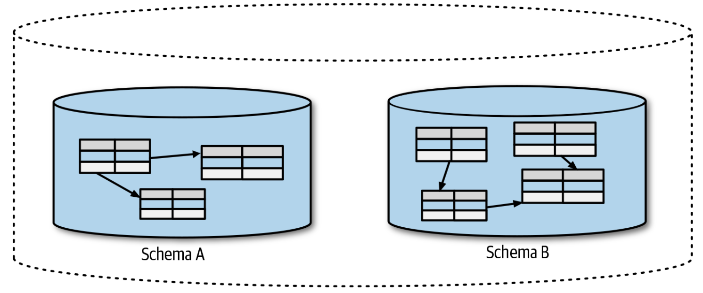

# 然而，现在无法拆分数据库
因此，理想情况下，我们希望我们的新服务拥有独立的schema。但是，当从现有的单体系统上开启行程时，我们无法让新的服务拥有独立的schema。难道这意味着我们应该始终将这些schema进行拆分？我仍然坚信，在大多数情况下，拆分schema是合适的，但一开始就对其进行拆分并非总是可行的。

正如我们稍后将要探讨的那样，有些时候，拆分schema所涉及的工作会花费很长时间，或者会涉及对系统中特别敏感的部分的修改。在这种情况下，使用各种应对模型可能会非常有用。这些模型至少可以避免让事情变得更糟，并且在最好的情况下，这些模型会成为迈向更好的未来的不错的垫脚石。

> **
Schemas and Databases
**
> 
> 过去，我经常混用“database”和“schema”这两个术语，对此我感到很内疚。因为“database”和“schema”存在一些不同，因此混用二者有时会引起混乱。从技术上讲，我们可以将模式视为保存数据的表的集合，其中这些表在逻辑上是独立的，如[图4-2](#f42)所示。然后，多个模式可以托管在一个数据库引擎上。根据我们所处的背景，当人们说“database”时，他们可能是指“schema”或数据库引擎。例如，当人们说“The database is down!”的时候，他们指的是数据库引擎。
> 
> 
> 图4-2. 一个数据库引擎的实例可以托管多个schema，schema之间是逻辑隔离的
>
> 由于本章主要关注逻辑数据库的概念，在逻辑数据库的背景下，通常使用术语“database”来有效的关联一个逻辑上隔离的schema。因此，在本章中，我仍将使用“database”来关联逻辑上隔离的“schema”。因此，在我说“database”的地方，要想到“逻辑上隔离的schema”。为了简洁起见，除非另有明确说明，否则我将在图表中忽略数据库引擎的概念。
> 
> 值得注意的是，各种NoSQL数据库可能有、也可能没有类似的逻辑划分，尤其是对于云供应商提供的数据库。例如，在AWS上，DynamoDB仅具有表的概念，其使用基于角色的访问控制来限制谁可以查看或修改数据。如何在这种情况下考虑逻辑划分，会是一件具有挑战的事情。


对于当前系统而言，我们将会遇到看起来无法立即解决的问题。与团队的其他成员一起来解决该问题，以便每个人都可以达成共识：这是一个你想解决的问题，即使你现在还不知道怎么解决。然后确保，至少从现在开始，做正确的事。随着时间的流逝，一旦掌握了一些新的技能和经验，最初看似无法解决的问题将变得更容易处理。
