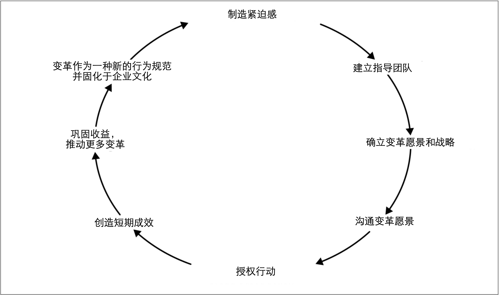

# 组织变革

Dr. John Kotter提出的[**组织变革的8个步骤**](https://www.amazon.com/Leading-Change-New-Preface-Author/dp/1422186431)是全球管理者变革的基础。John Kotter把变革所需行动提炼为环环相扣的、可理解的步骤，这也是该模型能够具备如此影响力的部分原因。虽然John Kotter的变革模型并非变革方面的唯一模型，但我发现它是最有用的模型。

图2-2丰富的概述了关于领导变革的过程，此处，将不再对其进行过多的介绍[^6]。但是，有必要简要概述这些步骤并思考这些步骤将如何在我们考虑采用微服务时给我们提供帮助。

在概述该变革模型之前，我应该注意到：John Kotter的变革模型通常用于建立大规模的组织行为转变。因此，如果只想将微服务带到一个10人的团队，那就大材小用了。不过我发现，John Kotter的模型——尤其是前面提到的8个步骤——即使在这些较小规模的范围内，也很有用。

图2-2. Kotter提出的组织变革的8个步骤

## 制造紧迫感
人们可能会认为我们转向微服务的想法是一个好主意。问题是：我们的想法可能只是组织中涌动着的很多好想法之一。让大家都认为确实要采用微服务的诀窍是帮助团队认识到：现在就是进行这一特殊变革的时刻。

寻找“教化”的时机可以帮助我们达到目的。有时，修补羊圈的正确时机是在狼通过窟窿将羊叼走之后，因为人们突然意识到羊被叼走是需要考虑的事情。现在他们意识到羊圈上有一个窟窿：“哦，看那，修补这个窟窿就可以啦！”在危机解决之后的那一刻，我们的建议会在人们的意识中短暂停留一会儿，此时就是推动变革的时机。一旦时间拖的太长，人们就会慢慢忘记痛点以及痛点的原因。

谨记，要做的事情不是对人们说：“我们现在应该做微服务！”我们应该分享待实现的目标的紧迫感——正如我之前所述，微服务不是目标！

## 建立指导团队
推动变革不需要所有人参与，但需要足够的资源来推动变革的发生。需要确定组织内部哪些人员可以帮助我们推动变革。如果是开发人员，那么可以首先选择我们团队中的同事，或者更高等级的同事——技术主管，架构师或交付经理。投入多少人员来推动变革需要根据变革的范围来定。如果只是要改变自己团队的工作方式，那么确保提供足够的**空中掩护**[^译注1]就足够了。如果想改变整个公司的研发模式，则可能需要公司执行级别的高管来支持（CIO或CTO）。

别人参与进来并帮助我们实现变革可能并不容易。无论我们认为这个主意有多好，如果我们从未被人所知，或者从未与别人合作过，别人为什么会支持我们的主意呢？因此，首先要赢得信任。如果有人曾经与我们在小的事情上合作并取得成功，则他们更有可能会支持我们的大创意。

让软件交付之外的人员参与到变革中是一件重要的事情。如果我们所在的企业已经解决了“ IT”和“业务”之间的屏障，那么不引入交付之外的人员也是可以的。另一方面，如果这些屏障仍然存在，则可能需要跨越鸿沟在业务部门寻找支持者。当然，如果我们采用微服务架构的重点是解决业务所面临的问题，这将更容易实现微服务的落地。

需要IT部门之外的人员参与到变革的原因在于：我们所做的许多变革都可能对软件的工作方式和行为产生重大影响。例如，我们需要围绕如下的类似场景而给出不同的权衡：
* 系统在故障模式下的行为方式
* 如何解决延迟

例如，在分布式系统中，缓存是一种用来避免服务调用，进而降低系统中关键请求的延迟的好方法。但是，却需要在缓存以及用户可能会看到脏数据之间做出权衡和折衷。这种缓存方案是正确的做法吗？我们可能必须与用户讨论这个问题——并且如果连公司内部的用户体验团队[^译注2]都不了解变革的逻辑，这将是一场艰难的讨论。

## 确立变革愿景和战略
到了这一步时，我们已经为变革召集齐了人马，并且已经就希望带来的变化（愿景）以及如何实现目标（策略）达成一致。愿景是一件棘手的事情。愿景既要务实，又要务虚，并且关键是要找到二者之间的平衡点。越大范围的愿景，就需要做更多的工作以让人们参与进来。但是，愿景没有必要必须是高大上的事情，并且愿景也可以在小规模的团队发挥作用——我们必须降低我们的Bug数！。

愿景主要解决**我们的目标是什么**的问题。策略则解决我们将如何实现目标。微服务则是用来实现我们期望的目标——因此，微服务是战略的一部分。谨记，策略可能会改变。致力于愿景很重要，但是在面对相反的证据下还过分执着于特定策略是危险的，并且这种执着可能导致我们陷入值得关注的**[沉没成本谬误](Understanding_the_Goal.md#fn_译注2)**。

## 沟通变革愿景
有一个宏大的愿景当然很棒，但也不要宏大的让人们不相信愿景有实现的可能。我最近见到一个大公司的CEO发表声明说：

> 在接下来的12个月中，我们将通过迁移到微服务并采用云原生技术来降低成本并提高交付速度。
> 
> 
——未透漏姓名的CEO

这家公司中，我与之交谈过的员工，没有人相信CEO声明的愿景有任何实现的可能性。上述声明的部分问题是存在潜在的相互矛盾的目标：全面变革软件交付方式可能会帮助实现更快地交付软件，但是在12个月内完成这样的变革并不会降低成本。在变革的过程，我们可能必须引进新技能，并且在采用新技能之前，变革可能会对生产效率产生负面影响。上述声明的另一个问题是对时间范围的描述。对于这个特殊的公司而言，其变革速度足够慢以至于12个月的目标被认为是荒唐可笑的。因此，无论我们分享什么愿景，都必须令人信服。

在分享愿景时，我们可以从小处着手。几年前，我在谷歌参与了一个名为“Test Mercenaries”的计划，其旨在帮助推广测试自动化的实践。该计划开始启动的原因来自于谷歌的某个小组（*grouplet*）先前在帮助分享自动化测试的重要性的事情上所作出的努力。现在，我们称这种小组为实践社区（*community of practice*）。该计划在分享测试相关信息的早期努力之一是一项名为“Testing on the Toilet”的行动。TotT由固定在厕所门背面的、简短的一页文章组成，以便人们可以“在闲暇时”阅读这些测试的相关信息！我并不建议其他公司也采用这种技术，但在谷歌，TotT的效果确实很好。TotT确实是一种分享那些小而可行的建议的有效方法。

最后一点，目前，人们更倾向于使用Slack之类的系统来取代面对面交流。当要分享类似愿景这种重要信息时，面对面的交流会大大提高效率。面对面分享使我们更容易了解到人们听到这些想法的反应，有助于校准我们的信息并避免误解。即使需要其他形式的沟通以在较大的组织中传播我们的愿景，也要先进行尽可能多的面对面分享。面对面分享将帮助我们更有效地优化我们的信息。

## 授权行动
授权是**管理咨询公司**[^译注3]在帮助他们自己完成工作时的代名词。通常，这意味着一些非常简单的事情——消除障碍。

我们已经分享了自己的愿景并鼓舞了士气，然后会发生什么？变革还是没有发生。最常见的问题之一是：人们忙于现在所做的事情以至于对变革分身乏术。这就是为什么公司经常会为组织引入新人（例如通过招聘或顾问）以便为团队变革提供额外的力量和专业知识的原因。

举一个具体的例子，在采用微服务时，围绕基础设施供应的现有流程可能是一个真正的问题。如果我们对于部署新的产品服务的解决方案涉及到提前六个月订购硬件，那么采用允许按需定制虚拟化执行环境（例如虚拟机或容器）的技术可能会是一大福利。转而采用公有云供应商也可以带来好处。

不过，我确实想回应[上一章的建议](What_Are_Microservices.md#微服务的相关技术)。不要为了新技术而引入新技术。引入新技术的目的在于解决我们看到的具体问题。一旦确定障碍，就采用新技术来解决这些问题。不要花一年的时间去定义“完美的微服务平台”，而到头来却发现它实际上并不能解决我们遇到的问题。

作为Google的“Test Mercenaries”计划的一部分：
* 我们最终创造了很多框架，以简化测试套件的创建和管理
* 我们促进了可视化的测试作为CR(code review)系统的一部分
* 我们甚至最终推动并创造了公司范围的新CI工具，以使测试执行更加容易。

不过，我们并不是一次完成了所有操作。我们与几个团队合作，了解了痛点，从中吸取了教训，然后花时间投入到新的工具。我们也是从小事做起——解决*更容易的创建测试套件*是一件非常简单的事情，但是改变公司范围的CR系统则是一个更大的问题。在取得成功之前，我们一直没有尝试过解决更大的问题。

## 创造短期成效
如果需要花很长时间才能看到变革的成果，人们就将对愿景失去信心。因此，需要获得一些短期的胜利。最初，将重心放在那些小的、容易的、触手可及的事情上将有助于提供变革的动力。对于微服务拆分而言，可以轻松地从单体应用中抽取出来的功能应该具有较高的优先级。但是，正如我们已经确定的那样，微服务本身并不是目标。因此，我们需要对功能抽取的难易程度和其带来的收益进行权衡。我们将在本章的稍后部分再次讨论这种权衡。

当然，如果我们选择了容易的事情，并且最终遇到了很大的问题，此时可能需要审视我们的战略，并且可能让我们重新考虑自己在做什么。这完全没有任何问题！关键是，如果我们首先专注于简单的事情，那么我们很可能会早日洞悉这些问题。犯错是很正常的——对于犯错，我们所能做的就是理清问题以确保我们尽快从那些错误中学习。

## 巩固收益，推动更多变革
一旦取得成功，最重要的就是不要不思进取。如果我们不继续努力，唯一的成果可能就是短期成果。在成功（失败）后停下来反省一下很重要，这样我们就可以思考如何继续推动变革。当我们位于公司的不同部门时，我们可能需要不同的方法。

随着微服务迁移工作的深入，我们可能会发现更难以前进。起初，我们可能会推迟数据库的拆分，但也不能永远拖延。正如我们将在第4章中探讨的那样，我们可以使用许多技术，但是需要仔细考虑哪种方法是正确的方法。谨记，单体应用中某个区域的拆分方法可能对其他部分的拆解无能为力，我们需要不断尝试新的方法以取得新的进展。

## 变革作为一种新的行为规范并融入企业文化
通过持续迭代、推动变革、并分享成功（和失败）的故事，新的工作方式将开始一切如常。我们工作的很大一部分是与同事，其他团队和其他人分享变革的故事。通常，一旦我们解决了一个难题，就会进入下一个难题的解决。为了实现规模化变革并坚持下去，持续寻找在组织内部分享信息的方法至关重要。

随着时间流逝，新的做事方式成为工作的方式。如果我们认为公司在采用微服务架构上还有很长的路要走，微服务是否是正确的方案就不再是一个问题。这就是目前的工作方式，并且公司了解怎样才能做好。

继而会产生一个新问题：一旦新的方式成为已确立的工作方式，我们如何确保未来更好的方案有发展的空间，甚至取代现有的工作方式？

---
[^6]: Kotter’s change model is laid out in detail in his book Leading Change (Harvard Business Review Press, 1996).
[^7]: For a more detailed history of the change initiative to roll out testing at Google, Mike Bland has an [excellent write-up](https://mike-bland.com/2012/07/10/test-mercenaries.html) that is well worth a read. Mike wrote up a [detailed history](https://mike-bland.com/2011/10/25/testing-on-the-toilet.html) of Testing on The Toilet as well.
[^译注1]: Macmillan Dictionary将空中掩护定义为“一项军事行动，在这种行动中，飞机会定期飞过某个区域，以阻止敌人的进攻”。为团队提供空中掩护意味着为团队创造一些安全空间以便让他们实验和学习，并且当实验失败时，需要保护他们免受他人的质疑。
[^译注2]: 原文为：The people who champion the cause of your users inside your organization. 公司内部负责倾听用户声音，为用户代言的团队或部门，是综合了产品团队，用研团队，客服团队等职能的人群。
[^译注3]: 管理咨询公司是指从事软科学研究开发、并出售“智慧”的公司，又称“顾问公司”。管理咨询公司属于商业性公司，接收委托者的意向和要求，运用专门的知识和经验，用脑力劳动提供具体服务。