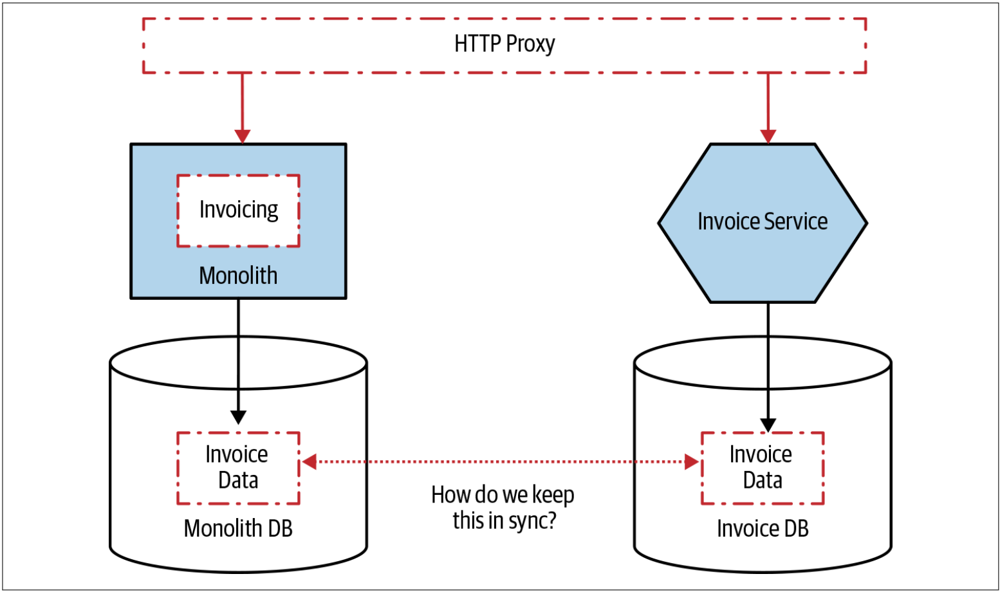

# 数据同步
正如我们在[第3章](To_Change_the_Monolith_or_Not.md)中讨论的那样，像如[绞杀者模式](Pattern_Strangler_Fig_Application.md)之类的方法的好处之一是：当我们切换到新服务时，如果有问题，我们可以再切换回旧的服务。当所讨论的服务所管理的数据需要在单体和新服务之间保持同步时，就会出现问题。

在[图4-12](#f412)中，我们会看到这样的一个例子。我们正在切换到新的Invoice服务。但是，新服务以及现有的、单体中的等效代码同样在管理此数据。为了维护在两种实现之间进行切换的能力，我们需要确保两组代码都可以看到相同的数据，并且可以用一致的方式来维护这些数据。

图4-12. 我们想使用绞杀者模式迁移到新的Invoice服务，但是该服务会管理状态

那么，此时我们有什么方案呢？首先，我们需要考虑数据之间所需要的数据一致性的程度。如果任何一组代码都需要始终看到完全一致的发票数据，那么最直接的方法之一就是：确保把数据保存在一个地方。把数据保存在一个地方可能会使我们倾向于让新的Invoice服务短期内直接从单体中读取数据；或者使用视图，正如我们在第128页的[数据库视图](Pattern_Database_View.md)的部分中所探讨的那样。一旦我们觉得服务切换是成功的，此时我们就可以迁移数据，正如我们先前在第141页的[改变数据的所有权](Transferring_Ownership.md)一节中所讨论的那样。但是，不要夸大使用共享数据库的担忧：应该仅将其作为一种短期措施，作为更完整的抽取服务的一部分；长时间的使用共享数据库会导致长期的痛苦。

如果我们要进行一次大规模（big-bang）的服务切换（我会尽量避免这种情况），同时迁移应用程序代码和数据，则可以在切换到新的微服务之前使用批处理程序来复制数据。把与发票相关的数据复制到我们的新微服务之后，新服务就可以开始提供服务。但是，如果我们需要回滚到使用现有的单体系统中的功能时，会发生什么？在微服务架构中修改的数据不会反应在单体数据库的状态上，因此我们最终可能会丢失状态。

另一种方法是考虑利用代码使两个数据库保持同步。因此，我们会让单体或新的Invoice服务同时对这两个数据库进行写操作。这会涉及一些更仔细的思考。


虽然可以再代码层面来执行数据库的双写，但是，我觉得，除非万不得已，不要再代码层面进行数据库的双写。

