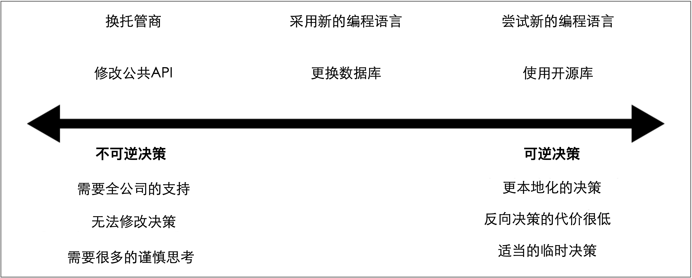

# 局部优化 VS. 全局优化
假设团队对自己的本地决策负有更多的责任，或许团队会拥有他们所管理的微服务的整个生命周期，那么我们将需要开始在本地决策与更多的全局指标之间做出平衡。

作为该问题的一个例子，我们来考虑下管理Invoicing，Notifications和Fulfillment服务的三个团队。因为Invocing团队特别了解Oracle，因此，该团队决定采用Oracle作为数据库。因为MongoDB特别适合Notifications团队的编程模型，因此该团队希望使用MongoDB。然而，因为Fulfillment团队已经在使用PostgreSQL了，因此，他们希望使用PostgreSQL。当我们依次查看每个决策时，这很有意义，同时我们可以了解该团队是如何做出这种决策的。

但是，如果退一步并放眼大局，我们必须问问自己：作为一个组织，我们是否要为某些相似的功能引入3种数据库，为其构建相应的技能并支付许可费用。仅采用一个数据库是否会更好呢？对于所有人而言，仅采用一个数据库并不完美，但是对于大多数人来说这足够好了。如果没有能力查看本地发生的事情，并且又无法将本地发生的事情放于全局空间，那么我们将如何做出此类决策？

## 该问题如何表现出来
我发现这个问题的最常见的方法是：当有人突然意识到多个团队以不同的方式解决了相同的问题，却从未意识到他们都在试图解决同一问题。随着时间流逝，这可能会变得非常低效。

我记得和澳大利亚房地产公司REA的人交谈过。经过多年的微服务构建，他们意识到自己的团队可以通过多种方式部署服务。当人们从一个团队转到另一个团队时，这会引起问题，因为他们必须学习新的做事方式。但是，也很难证明每个团队正在做重复的工作。结果，他们决定进行某些工作以提出一种通用的方法来解决此问题。

通常，可能是在午餐时无意偷听了一段评论之后，偶然发现了这些事情。如果拥有某种跨团队的技术小组，例如[“实践社区”](Changing_Organizations.md#沟通变革愿景)，则可以更早地发现这些问题。

## 该问题何时发生
随着时间的流逝，在多团队的组织中往往会出现此问题，尤其是为团队提供更多的自由来决定其工作方式的组织。不要期望在微服务旅程的早期就发现此问题。一开始，我们对如何做事可能会有一个清晰的共同理解。随着时间的推移，每个团队将越来越专注于自己的本地问题，并将基于本地问题来优化他们解决问题的方式，以至于“这就是我们的工作方式”的核心共识开始发生变化。

在组织经历了一段时间的扩张之后，我经常发现人们正提出并讨论该问题。在短时间内涌入大量开发人员使之前临时的信息共享难以扩展。这可能导致需要桥接更多的信息孤岛。

因为集体服务所有制在解决问题上需要一定程度的一致性。因此，如果我们采用集体服务所有制，那么可能会帮助避免或至少限制这些问题。换句话说，如果我们想采用集体所有制，则必须解决此问题。否则，我们的集体所有制将无法扩展。

## 该问题的解决方案
我们已经讨论了一些可以在此方面有所帮助的想法。在[第2章](Cost_of_Change.md#可逆决策和不可逆决策)中，我们探讨了不可逆决策和可逆决策的概念，如[图5-8](#f58)所示。变革成本越高，影响越大，我们越希望在决策背后达成更广泛的共识。影响越小，回滚就越容易，本地团队就可以做更多的决策。

图5-8. 可逆决策和不可逆决策的差异及其在决策频谱图中的例子

诀窍是帮助团队中的人们认识到他们的决策是趋向于不可逆决策呢还是趋向于可逆决策。决策越是趋向于不可逆决策，让团队边界之外的其他人参与决策就变得越重要。为了使该方法可以正常运行，需要团队至少对大局问题有基本的了解，以了解他们可能和大局问题重叠的地方。同时，团队还需要一个网络，在该网络中，他们可以揭示这些问题并从其他团队的同事的参与中获得帮助。

作为一种简单的机制，明智的做法是：每个团队至少有一位技术负责人成为跨部门技术小组的成员，而该跨部门的技术小组用于解决本章节涉及到的问题。该小组可以由CTO，CA（首席架构师，chief architect）或负责公司总体技术构想的其他人担任主席。

这个跨部门小组可以双向工作。除了提供一个让团队可以在更大的论坛上讨论他们想讨论的本地问题的地方之外，人们还可以在这里找到跨领域的问题。如果团队之间没有任何沟通，我们又如何认识到我们正在以不同的方式在本地解决问题，或许，在全局范围内解决问题可能更明智？

根据组织的性质，我们可以依赖临时的非正式流程。例如，在Monzo，人们可以提交在内部称为“提案”的自由格式文档。这些提案会发布到共享空间，并通过Slack提醒整个公司有新提议可用。对提案感兴趣的各方可以讨论该提案并进行完善。期望这些建议并不是完美的，实际上必须是可以改变的。对于Monzo来说，这似乎行之有效，部分原因是该公司围绕沟通和责任分担的文化。

从根本上讲，每个组织都需要在全局决策和本地决策之间找到适当的平衡。愿意让团队承担多少责任？想让高层控制多少责任？让团队承担的责任越多，获得更大自治权的好处就越多。但是，此时需要权衡的是：在解决问题的方式上可能缺乏一致性。越从高层推动事情，就越需要达成共识，这很可能会降低事情的推动速度。我无法告知大家如何以适合自己的方式在这两种力量之间取得平衡，大家需要自己解决该平衡。只需要知道这种平衡的存在，同时需要确保收集正确的信息，以确保可以随着时间而调整这种平衡。
