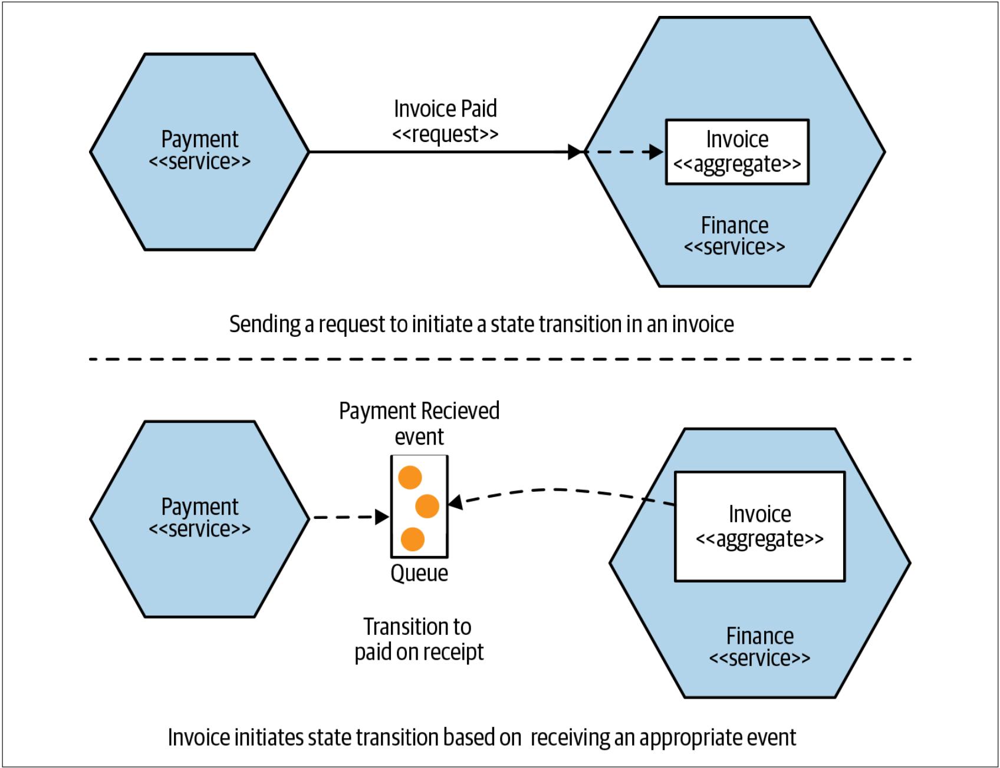
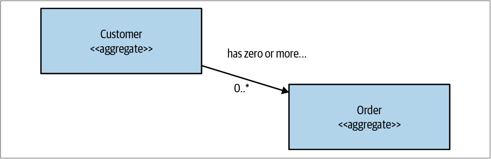

# 领域驱动设计
正如我们已经讨论的那样，围绕业务领域对服务建模对于微服务架构而言具有明显的优势。问题是如何给出该模型——领域驱动设计（DDD）应运而生。

希望程序更好地代表程序所运行其中的现实世界并不是一个新的想法。 可以利用诸如Simula之类的面向对象编程语言对真实业务领域建模。但是，要真正实现这个想法，不仅需要程序语言能力，还需要更多其他的能力。

[Eric Evans](https://skillsmatter.com/legacy_profile/eric-evans)的领域驱动设计[^10]提出了一系列重要思想，这些思想可以帮助我们更好地在程序中表示问题领域。对面向领域驱动设计的全面探索不在本书的讨论范围之内，但是我会简要概述其中的、微服务架构会涉及到的重要思想。

## 聚合
在DDD中，聚合有多种不同的定义，因此聚合是一个有点令人困惑的概念。聚合只是对象的任意集合吗？聚合是从数据库中提取的最小单元吗？对我而言，一直有效的模型是：首先将聚合视为真实领域概念的表示，例如Order，Invoice，Stock Item等。聚合通常具有一个围绕其产生的生命周期，在聚合生命周期中，聚合像状态机一样执行。我们希望将聚合视为独立单元，我们要确保把处理聚合状态转换的代码与状态本身放在一起。

在考虑聚合和微服务时，单个微服务将处理一种或多种不同类型的聚合的生命周期和数据存储。如果另一个服务中的功能想要更改这些聚合中的某一个，则或者直接发送一个对该聚合进行更改的请求，或者让聚合本身对系统中的其他事情做出反应以启动自己的状态转换，如[图1-17](#f117)所示。

图1-17. Payment服务可能会以不同的方式触发Invoice聚合中的Paid状态转变

这里要了解的关键一点是，如果外部服务请求聚合中的状态转换，聚合可以拒绝该请求。理想情况下，我们希望聚合不能执行非法的状态转换。

聚合可以与其他聚合存在关系。在[图1-18](#f118)中，我们有一个Customer聚合，它与一个或多个Order聚合相关联。我们决定把Customer和Order建模为单独的聚合，并且可以让不同的服务来处理该聚合。

图1-18. 一个Customer聚合与一个或多个Order聚合相关联

把系统分解为聚合的方法有很多，并且有些选择是非常主观的。我们可能出于性能原因或便于实现的原因而决定随着时间的推移来重塑聚合。 不过，首先，我认为实现的问题是次要的。首先让系统用户的心理模型来指导初始设计，直到其他的因素发挥作用。在[第2章](Domain_Driven_Design.md#事件风暴)中，我将介绍一种称为Event Storming的协作方式，以在非开发人员的帮助下塑造领域模型。

## 界定的上下文
界定的上下文通常代表组织内部的更大的组织边界。在界定的上下文范围内，需要执行明确的职责。如上的说法有点模糊，所以让我们来看另一个具体示例。

在Music Corp，我们的仓库看起来非常忙碌：管理发货的订单（和零星的退货），接收新库存，繁忙的叉车等等。然而，财务部门可能不那么忙碌，但在我们组织内部仍然发挥着重要的作用，例如处理薪资，支付货款等。

界定的上下文隐藏了实现细节。有很多只需要内部关心的问题，例如，除了仓库人员以外，几乎没有人会对使用的叉车类型感兴趣。应该对外界隐藏这些内部问题——外界不需要知道、也不必关心这些内部问题。

从实现的角度来看，界定的上下文包含一个或多个聚合。有些聚合可能暴露在界定的上下文之外，而其他的聚合则可能隐藏于界定的上下文内部。与聚合一样，界定的上下文可能与其他界定的上下文存在关系——当映射到服务时，这些依赖关系将成为服务间的依赖关系。

## 将聚合和界定的上下文映射到微服务
聚合和界定的上下文为我们提供了内聚的服务单元，这些服务单元在更广泛的系统中具有明确定义的接口。聚合是一个独立的状态机，它专注于系统中的单个领域的概念。界定的上下文表示相关联的聚合的集合。在界定的上下文的帮助下，聚合可以通过显示接口与更广泛的世界交互。

因此，聚合和界定的上下文都可以很好地作为服务边界。正如我已经提到的，刚开始时，我想大家会希望减少使用的服务数量。因此，我认为应该把目标锁定为包含整个界定的上下文的服务。一旦适应该方法，在决定将服务拆分为较小的服务时，考虑围绕聚合边界来拆分服务。

这里的一个技巧是，即使以后决定将对整个界定的上下文进行建模的服务拆分为较小的服务，仍然可以对外界隐藏此想法，甚至可以通过向下游消费者提供更粗粒度的API来实现。把服务拆分成更小的部分是由实现决定的，因此，如果可以的话，我们最好将其隐藏起来！

## 进一步阅读
全面研究领域驱动设计是一项值得的活动，但这不在本书的范围之内。 如果想进一步了解领域驱动设计，建议阅读Eric Evans的*Domain Driven Design*[^10]或Vaughn Vernon的*Domain-Driven Design Distilled*[^ 11]。

---
[^10]: Eric Evans, Domain-Driven Design: Tackling Complexity in the Heart of Software (Boston: Addison-Wesley, 2004).
[^11]: See Vaughn Vernon, Domain-Driven Design Distilled (Boston: Addison-Wesley, 2014).