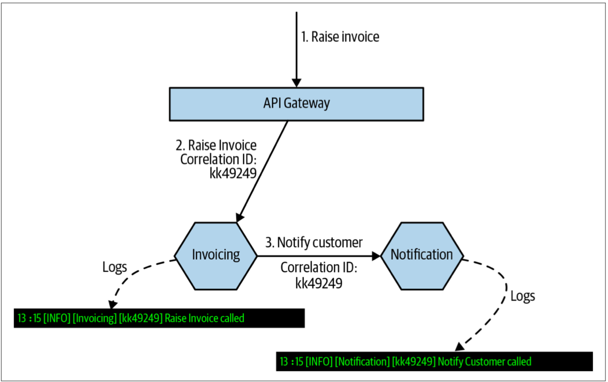
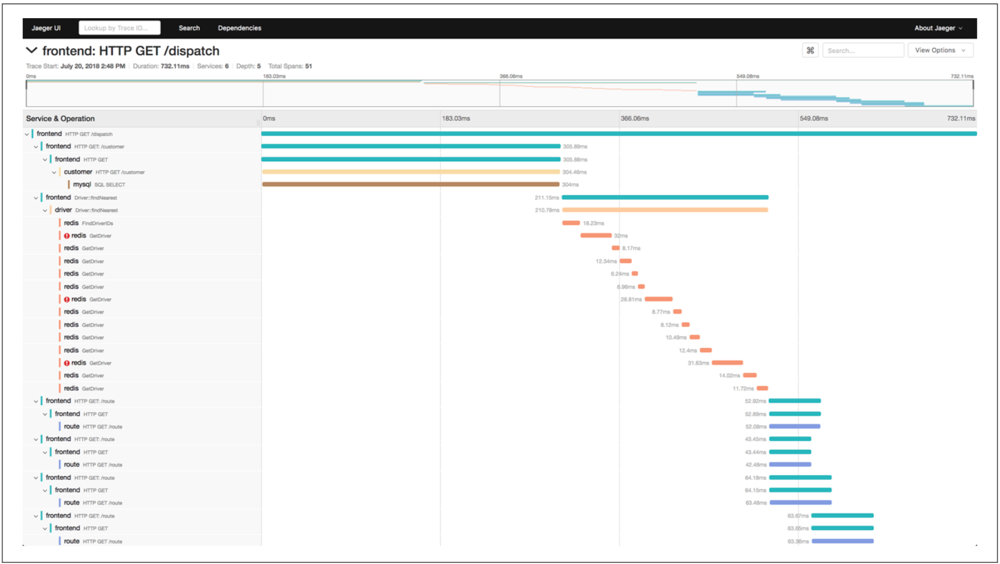

# 监控和问题定位
> We replaced our monolith with microservices so that every outage could be more like a murder mystery.
>
> 我们用微服务代替了我们的单体，这使得每次服务中断都更像是一个迷案。
> 
> [**
——Honest Status Page(@honest_update)
**](https://twitter.com/honest_update/status/651897353889259520)

对于标准的单体应用而言，我们可以采用一种相当简单的方法来监控。我们需要监控的机器数量很少，并且在某种程度而言，应用程序的故障模式是二元的——应用程序通常要么全部可用，要么全部不可用。而对于微服务架构，可能仅有一个服务实例出现故障，或者可能仅需要考虑某种类型的实例——我们可以作出正确的选择吗？

对于单体系统，如果CPU的利用率长时间处于100％的状态，我们知道这是一个大问题。但是，在具有数十或数百个进程的微服务架构中，我们可以作出同样的论断吗？当只有一个进程的CPU利用率达到100％时，我们是否需要在凌晨3点把某人喊醒？

随着微服务的数量越来越多，如下的事情变的更加复杂：
* 查清楚问题出在哪里
* 了解我们所看到的那些问题是否是实际上需要担心的事情

随着微服务架构的发展，监控和问题定位的方法需要随之改变。监控和问题定位是一个需要持续关注和投入的领域。

## 该问题何时会发生
准确预测何时会出现监控和定位的问题比较困难。简单的答案可能是：“线上第一次出现问题”，但要尝试找出问题所在时（该问题是上线之前，开发和测试人员可能必须处理的问题）。当有几个服务时，可能会遇到这些问题，或者直到达到20个或更多的服务时，才可能遇到这些问题。

因为很难准确预测现有的监控方法何时会开始失效，所以我只能建议大家优先实施一些基本的改进。

## 该问题是怎样发生的
从某种意义上说，很容易发现该问题。我们会发现我们无法解释或理解线上问题，尽管系统看起来很健康，但仍会触发报警，并且很难回答一个简单的问题“系统的一切都还好吗？”

## 该问题的解决方案
有很多机制——其中一些易于实施，而另一些则更为复杂——可以帮助我们改变微服务架构下的监控以及问题定位的方式。接下来是对要考虑的一些关键事项的详尽介绍。

### 日志聚合
对于少量的机器，尤其是长时间运行的机器，当我们需要检查日志时，通常会登录该机器并获取信息。微服务架构的问题在于我们有更多的进程，这些进程通常运行在更多的机器上，而这些机器可能是短暂运行的机器（例如虚拟机或容器）。

日志聚合系统允许我们捕获所有日志，并将日志转存到一个中央位置，并可以在该中央位置搜索日志。在某些情况下，日志聚合系统甚至可以用来产生报警。存在许多日志聚合系统可供选择，从开源的[ELK（Elastic search，Logstash/Fluent D，Kibana）](https://www.elastic.co/cn/what-is/elk-stack)到我个人最喜欢的[Humio](https://www.humio.com/)，这些系统都非常有用。


在实现微服务架构之前，请首先考虑实现日志聚合。日志聚合非常有用，并且可以很好地测试组织在运维空间中实施变更的能力。


日志聚合是最简单的实现机制之一，我们应该尽早构建日志聚合系统。 实际上，我建议日志聚合是实现微服务架构时应该做的第一件事。之所以如此，部分原因是因为日志聚合从一开始就非常有用。此外，如果团队难以实施合适的日志聚合系统，则可能需要重新考虑是否对微服务做好了准备。实施日志聚合系统所需的工作非常简单，作为一个组织，如果还没有准备好日志聚合系统，微服务可能就太激进了。

### 请求追踪
只分析相互隔离的、单个服务的信息，则很难了解：
* 在微服务之间的一系列调用中，哪里失败了？
* 哪个服务导致了延迟峰值？

能够整理出连续的请求调用链并将其视为一个整体非常有用。

首先，为进入系统的所有请求生成关联ID，如[图5-6](#f56)所示。Invoice服务收到请求时，会为其提供一个关联ID。当Invoice请求Notification服务时，Invoice服务会将该关联ID传递到Notification服务。ID的传递可以通过HTTP头、或者消息有效负载（*message payload*）中的字段、或某种其他的机制来完成。通常，我希望使用API网关或service mesh来生成最初的关联ID。

图5-6. 使用关联ID来确保某个特殊的调用链信息可以关联起来

Notification服务在处理请求时，可以使用相同的关联ID来记录该服务所做的事情，从而允许我们可以使用日志聚合系统来查询与给定关联ID相关联的所有日志（假设将关联ID置于日志格式中的标准位置）。当然，还可以使用关联ID执行其他操作，例如管理分布式事务[sagas](https://microservices.io/patterns/data/saga.html)（如第4章所述）。

更进一步，我们可以使用工具来追踪请求的时间。由于日志聚合系统的工作方式——定期对日志进行批处理并转发到中央代理，因此日志聚合系统无法获取准确的信息以使我们可以精确的确定在调用链中的不同请求所花费的时间。分布式跟踪系统，例如[图5-7](#f57)所示的、开源的[Jaeger](https://www.jaegertracing.io/)，可以给予我们帮助。

图5-7. Jaeger是一个用于捕获分布式跟踪信息并分析单个调用性能的开源工具

应用程序对延迟的敏感度越高，越希望尽快实现像Jaeger这样的分布式跟踪工具。值得注意的是，如果已经使用了关联ID，并已经将其用于现有的微服务架构（在需要分布式跟踪工具之前，我通常会提倡这一点），那么我们现有的服务栈已经具备这种能力，对其简单修改就可以将数据推送到合适的工具。也可以使用service mesh，虽然service mesh无法很好地处理单个微服务内部的调用跟踪，但是service mesh至少可以为我们处理入站和出站跟踪。

### 线上测试
功能自动化测试通常用于在部署之前给我们提供反馈以确定我们的软件是否具备部署的质量。但是，一旦上线，我们仍然希望获得同样的反馈！即使给定的功能在线上曾经是可用的，新的服务部署或环境修改也可能会在以后破坏该功能。

通过把假的用户行为注入到我们的系统，我们可以用人造流量的方式来定义我们所期望的行为，并在预期行为没有发生时给出相应的报警。在我以前工作过的Atomist公司，对于新用户，我们有某些复杂的新用户引导流程，该引导流程需要用户使用其GitHub和Slack帐户对我们的软件授权。而该引导过程的早期，会有足够多的服务出现问题，例如GitHub API的限速。我的同事，Sylvain Hellegouarch，编写了注册假用户的脚本。我们会定期让其中的某个假用户触发注册流程，而整个端到端的过程会编写成脚本。如果注册失败，通常表明我们的系统出了问题。此时，“假”用户比正常注册的用户可以更好地发现问题！

线上测试的一个很好的起点是：采用现有的、端到端的测试用例，并对其修改以使其可以用于生产环境。重要的是需要确保这些“测试”不会对线上造成意外影响。在Atomist，我们创建了GitHub和Slack帐户，我们可以控制这些账号来合成流量，因此没有真正的用户会参与或受到影响，并且对于我们的脚本而言，之后可以轻而易举的清除这些帐户。另一方面，我确实听说过关于一家公司的报道，因为他们没有考虑到测试订单也会发货这一事实，因此该公司最终意外订购了发往他们总部的200台洗衣机。所以，线上测试时一定要小心！

### 向着可观察性发展
在传统的监控和报警过程中，我们要考虑可能出了什么问题，然后采集信息以告诉我们什么时候会出现这种情况，并以此来触发报警。因此，我们主要是在处理那些已知原因的问题——磁盘空间不足，服务实例无响应，或出现延迟峰值。

随着我们的系统变得越来越复杂，越来越难以预测系统可能无法正常工作的所有原因。此时，重要的是，允许我们在出现这些问题时询问系统开放式问题，以帮助我们首先止损并确保系统可以继续运行，同时也允许我们收集足够的信息来进一步解决问题。

因此，我们需要能够采集有关系统运行状况的大量信息，使我们能够在事后对我们所不知道的数据提出问题。请求跟踪和日志可以构成重要的数据源，我们可以从中提出问题并使用真实的信息，而不用靠猜测来确定问题所在。秘诀在于使这些信息易于在上下文中查询并查看。

不要以为我们会预先知道答案。然而，如果我们以为我们会预知答案，我们将会感到惊讶。因此擅长于向系统提出问题，并确保可以使用工具链来执行即席查询（*ad hoc querying*）。如果想更详细地探讨这个概念，我建议将Distributed Systems Observability一书作为一个很好的起点[^2]。


**ad hoc**

ad hoc 一般都说是查询，那么到底什么是即席查询呢？

在wikipedia上的解释为：ad hoc允许终端用户自己去建立特定的、自定义的查询请求。通常是通过一个用户友好的图形界面来进行数据查询，而无需用户对SQL 或者数据库架构有深入的了解。

ad hoc查询通常是临时的，有特殊目的的，一般其查询计划也无法重复利用。


---
[^2]: See Cindy Sridharan, Distributed Systems Observability (Sebastopol: O’Reilly Media, Inc., 2018).