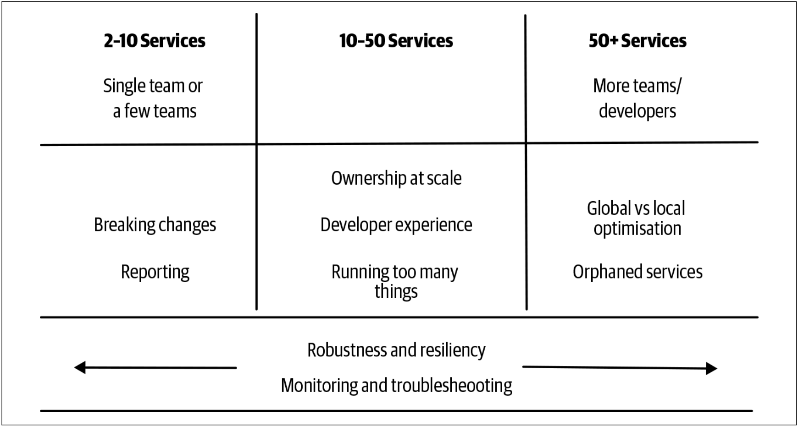

一旦采用微服务架构，沿途将会遇到各种挑战。我们已经了解了其中的某些问题，但我想进一步探讨这些挑战，以帮助在遇到这些问题之前对其有所了解。

对于可能会遇到的各种问题，我希望本章能提供足够的信息。我无法在本书中全部解决这些问题，此处概述的许多问题在“Building Microservices”一书中已有更详细的处理方案，在编写该书时就充分考虑了这些挑战。

我还想提供一些提示来帮助大家确定：何时需要解决这些问题。同时，我还会给出在迁移微服务的旅程中，哪里最有可能出现这些问题。

## 服务越多，烦恼越多
采用微服务架构时，何时会出现哪种问题与很多因素有关。服务交互的复杂度，组织的规模，服务数量，技术的选择，延迟和所要求的正常运行时间等因素仅仅是可能导致问题的部分原因。这意味着很难说出何时会，或实际上是否会，遇到这些问题。

不过，总的来说，我已经意识到，提供几十个服务的公司与提供数百个服务的公司所遇到的问题大不相同。对于何时会出现哪种问题而言，服务数量的指标和其他的任何指标一样好。此处，我需要标注一下，当我谈论服务数量时，除非另有说明，否则我所指的是不同逻辑的服务。把这些服务部署到生产环境之后，每个服务都可以有多个服务实例。

不要把采用微服务视为按一下开关，将其视为转动某个拨盘。当转动拨盘并获得更多服务时，希望可以有更多机会从微服务中获取好处。但是，当转动拨盘时，会遇到不同的痛点。此时，需要找到解决这些问题的方法，而解决方案可能需要新的思维方式、新的技能、不同的技术、甚至是新的技术。


**拨盘计时器**

按一下开关是一件最简单不过的事情了，整个过程没有任何的中间阶段。但是微服务的迁移却并非是这样的。

就像拨盘计时器一样，从0到指定的时间之间会有很多的间隔和步骤，而对于不同的时间所需要的发条的动力也不相同。微服务的迁移就像拨盘上的不同的刻度一样，随着刻度值的变化，会遇到不同的问题。



根据这些问题最有可能出现的阶段，[图5-1](#f51)大致绘制了本章其余部分将介绍的痛点。这种划分是非常不科学的，并且很大程度上基于经验，但我仍然认为将其作为一种概述很有用。

图5-1. 在高层级上显示出某些痛点经常出现的位置

我并不是说肯定会在这些时间点遇到这些问题。某些涉及到的变量会让[图5-1](#f51)这样简单的图表无法真正实现。当这些问题发生时，可能会变化的一个特别的因素是：架构最终是如何耦合在一起的。架构的耦合越大，围绕鲁棒性、测试、跟踪等问题就会越早的表现出来。我所做的所有的一切就是希望照亮那些可能存在的潜在陷阱。

但是，请记住，应该将[图5-1](#f51)用作一个通用指标。需要确保自己正在建立反馈机制，以寻找我在此处概述的一些潜在指标。

现在，我已经阐述了[图5-1](#f51)的注意事项，让我们更详细地研究一下每个问题。我将提供一些提示以指出哪些因素会让这些问题显现出来，了解这些问题如何影响我们，并提供一些解决这些挑战的思路。