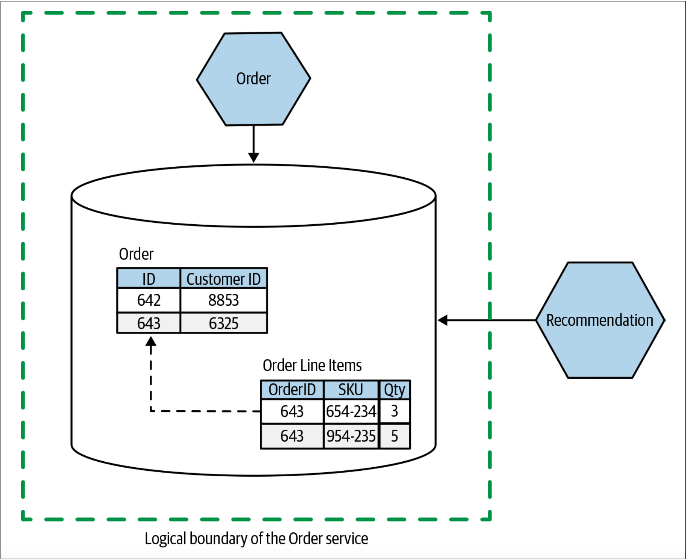
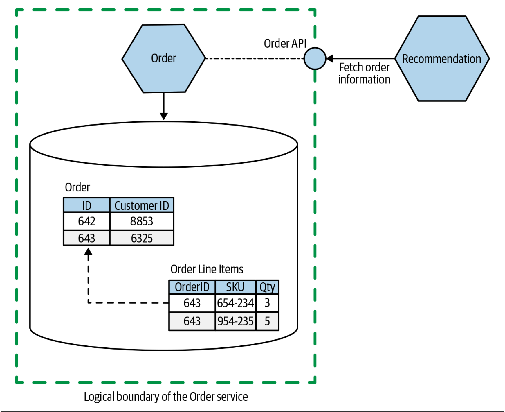
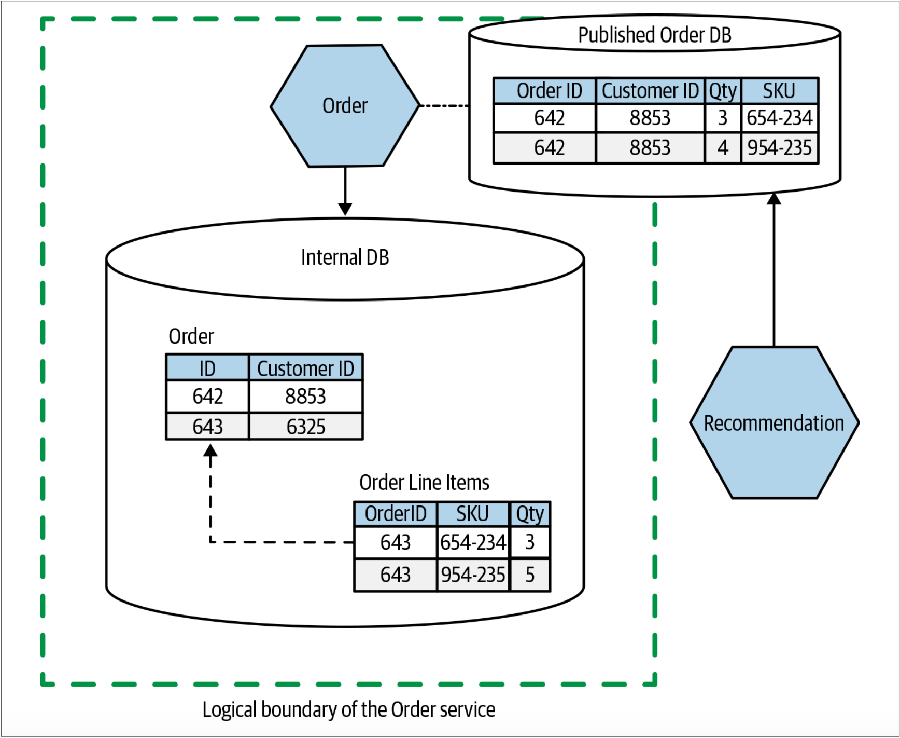
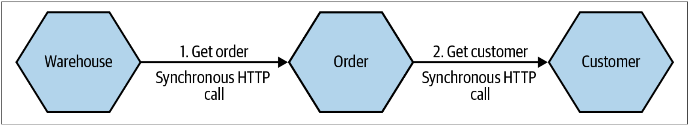
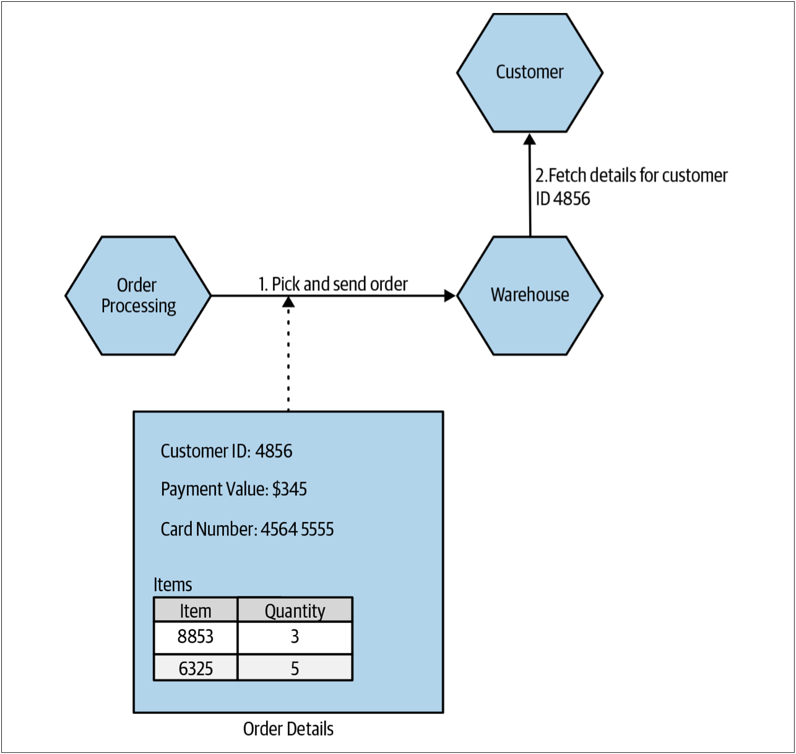
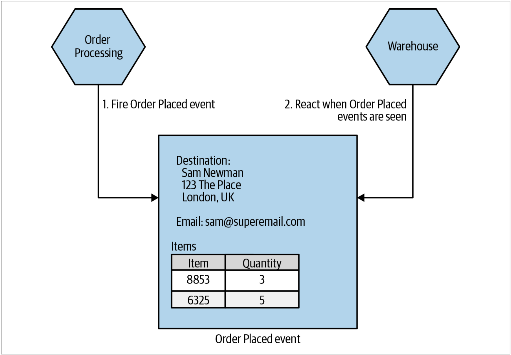

# 关于耦合和内聚
在定义微服务边界时，了解耦合和内聚之间的平衡非常重要。耦合说明改变一件事情时需要改变另一件事情。内聚说明了我们如何组织相关代码。耦合和内聚这两个概念直接关联。Constantine的法则很好地阐明了耦合和内聚的关系：

> A structure is stable if cohesion is high, and coupling is low.（如果一个结构具备高内聚、低耦合的特性，则该结构是稳定的。）
> [**
——Larry Constantine
**](https://history.computer.org/pioneers/constantine.html)

高内聚、低耦合看似是一个明智、有用的观点。如果我们有两段紧密相关的代码，因为相关功能分散在这两者之间，因此是低内聚的。同时，因为当更改相关代码时，这两段代码都需要更改，因此是高耦合的。

因为跨分布式系统的服务边界进行更改的成本非常高，因此，如果代码系统的结构发生变化，则会非常麻烦。此时，必须在一个或多个可独立部署的服务上进行更改，或许还要处理修改服务契约带来的影响，这些都可能是变更的巨大阻力。

单体结构的问题在于，单体对内聚和耦合而言是相反的（低内聚，高耦合）。单体架构不是倾向于内聚，而是趋向于把变化的代码组织在一起，获取各种不相关的代码并将其拼贴在一起。同样，对于单体而言，低耦合实际上并不存在。如果想改一行代码，可能很容易地就能够修改，但是却不能在不影响单体的其他部分的情况下部署变更，必须重新部署整个系统才能部署那一行代码的变更。

我们的目标是尽可能地拥抱独立部署的概念，也就是说，我们希望无需改动其他的任何东西就可以更改我们的服务并将其部署到生产环境。因此，我们对系统的稳定性有一定要求。为此，我们要求我们所依赖的服务具备稳定性，并且要为依赖我们的服务提供提供稳定的服务契约。

关于耦合和内聚已经有大量的信息，所以在这里过多地重复这些内容并不明智，但是我认为应该对其进行总结，特别是把这些想法置于微服务架构的上下文中。内聚和耦合的概念会极大地影响我们对微服务架构的看法。这不足为奇：内聚和耦合是模块化软件所关注的。那么，除了通过网络通信并可以独立部署的模块以外，微服务架构还是什么呢？

> **
耦合和内聚简史
**
> 在计算领域，内聚和耦合的概念已经存在很长时间了。内聚和耦合的概念最初由[Larry Constantine](https://history.computer.org/pioneers/constantine.html)在1968年提出。这对概念构成了如何编写计算机程序的许多思想的基础。Larry Constantine和Edward Yourdon的[**Structured Design(Prentice Hall，1979)**](https://dl.acm.org/doi/book/10.5555/578522)等书籍随后影响了几代程序员（我本人在攻读大学学位期间，是要求必需阅读该书的，该书距其首次出版已有仅20年的时间）。
> 
> Larry在1968年（对计算机领域而言，这是特别幸运的一年）的全国模块化编程研讨会（*National Symposium on Modular Programming*）上首次提出了内聚和耦合的概念。在该会议上还首次提出了康威定律。1968年，还举办了两次北约软件工程大会（*infamous NATO-sponsored conferences*）[^译注1]，并且在会议上提出了[**软件工程**](http://homepages.cs.ncl.ac.uk/brian.randell/NATO/nato1968.PDF)的概念（软件工程是Margaret H. Hamilton在之前创造的一个术语）。

## 内聚
我听说过的描述内聚最简洁的定义之一是：“代码一起变化，并保持在一起。”就我们的目的而言，这是一个很好的定义。正如我们已经讨论过的那样，我们正在围绕简化业务功能变更的过程来优化微服务架构，因此我们希望将功能分组，以便可以在尽可能少的地方进行更改。

如果我想改变发票审批的管理方式，则不必在多个服务之间寻找要进行更改的功能，然后再协调发布这些新更改的服务以推出我们的新功能。相反，我想确保更改仅涉及修改尽可能少的服务，以保持较低的变更成本。

## 耦合
> 像节食一样，信息隐藏是一件说起来容易做起来难的事情。
> [**
——David Parnas, The Secret History Of Information Hiding
**](https://link.springer.com/chapter/10.1007/978-3-642-59412-0_25)

我们喜欢我们喜欢的内聚，但是我们对耦合却很谨慎。“耦合”的事情越多，必须一起变更的事情就越多。然而，耦合有很多不同的类型，并且每种类型可能需要不同的解决方案。

有很多现有技术可以用于耦合类型的分类，特别是Myers，Youdan和Constantine所做的工作[^译注2]，[^译注3]。对于耦合类型而言，我会在本书提出我自己的观点，但这并不是说该领域以前所做的工作是错误的。之所以提出我的观点，仅仅是因为我发现这种分类更有助于人们理解分布式系统耦合的相关内容。因此，我在本书提出的耦合类型的目标并不在于对不同形式的耦合进行详尽的分类。

> **
信息隐藏
**
> 在有关耦合的讨论中，会不断的出现一个概念：信息隐藏技术。信息隐藏技术最初由David Parnas在1971年提出。信息隐藏技术也是David Parnas在研究如何定义模块边界工作中的成果。[^6]
> 
> 信息隐藏的核心思想是将经常更改的代码与不会发生更改的代码区分开来。我们希望模块边界是稳定的，其应该隐藏那些希望经常变化的模块的实现部分。也就是说，只要保持模块的兼容性，就可以安全地修改模块内部。
> 
> 就我个人而言，我采用的方式是：尽可能少的公开模块（或微服务）边界。一旦某些东西成为模块接口的一部分，再将其从模块接口中移除就非常困难了。但是，如果现在将其隐藏，则日后就可以随时决定将其共享。
> 
> 作为面向对象（OO）软件的一个概念，封装（*Encapsulation*）会与信息隐藏联系在一起。但是根据我们所接受的封装的定义，封装和信息隐藏可能不是一回事。OOP中的封装意味着将一个或多个事物捆绑到一个容器中——想想类的字段和作用于这些字段的方法。然后，可以在类定义中使用可见性标记来隐藏类的部分实现。
> 
> 我推荐阅读Parnas的“The Secret History of Information Hiding”，来更深入地了解信息隐藏的历史.[^7]

### 实现耦合
**实现耦合**(*implementation coupling*)通常是我所看到的、最有害的耦合形式。幸运的是，实现耦合通常是最容易解决的耦合形式。对于实现耦合而言，A与B耦合于B的实现——当B的实现发生变化时，A也会变化。

这里的问题是，实现细节通常是开发人员的任意选择。解决问题有很多方法，我们会从中选择一个方法，但我们可能会改变主意。但是，当我们决定改变主意时，我们不希望影响依赖该模块的服务（还记得独立部署吗？）。

实现耦合的经典又常见的例子是以共享数据库的形式出现的。在[图1-9](#f19)中，Order服务包含了系统中所有订单的记录。Recommendation服务根据顾客的购买历史向顾客推荐其可能要购买的唱片。当前，Recommendation服务会直接从数据库访问订单数据。

图1-9. Recommendation服务直接访问Order服务存储的数据

Recommendation服务需要有关已下订单的信息。我们[稍后会讨论](#领域耦合)，在某种程度上，这是不可避免的领域耦合。但是在[图1-9](#f19)这种特殊的情况下，我们会耦合到特定的数据库模式结构（*schema structure*），SQL语言，甚至记录的内容。如果Order服务修改了列的名称，拆分了“Customer Order”表或执行了其他任何操作，那么从概念上讲，该服务仍包含订单信息。但是，此时，我们却破坏了Recommendation服务获取订单信息的方式。更好的选择是隐藏获取订单信息的实现细节，如[图1-10](#f110)所示——此时，Recommendation服务通过API调用来访问其所需的信息。

图1-10. 隐藏内部的实现细节，Recommendation服务通过API访问订单信息

如[图1-11](#f111)所示，我们还可以让Order服务以数据库的形式发布数据集，该数据集的目的在于供其他服务批量访问。该数据集维护Order和其他服务的公共契约，Order服务只需要发布相应数据，而其服务内部所做的任何更改对于其他服务而言都是不可见的。这种方式也为改善面向消费者的数据模型提供了机会，同时为适应消费者的需求提供了机会。我们将在第3章和第4章中更详细地探讨这种模式。

图1-11. Recommendation服务通过公开的数据库访问订单信息，该数据库的结构与Order服务的内部数据库不同

实际上，在上述两个例子中，我们都在使用信息隐藏。将数据库隐藏在定义良好的服务接口后面的行为使服务可以限制公开内容的范围，并可以使我们修改此数据的表示方式。

另一个有用的技巧是在定义服务接口时使用“由外而内”的思想——首先从服务使用者的角度考虑事情，从而驱动服务接口的设计，然后再找出如何实现该服务契约的方法。另一种方法的做法恰恰相反，不幸的是，我已经观察到该方法被普遍使用。团队采用数据模型或其他的内部实现细节开发服务，然后考虑将其公开给外界。

在“由外而内”的思想下，我们首先要问：“服务的消费者需要什么？”我并不是说我们要问自己：我们的客户需求是什么。我的意思是：我们要咨询那些调用我们服务的人。


把微服务公开的服务接口看作用户界面（*user interface*）。使用“由外而内”的思维与将要调用我们的服务的人员合作以设计服务接口。


把服务与外界的契约视为用户界面。在设计用户界面时，询问用户他们想要什么，并与我们的用户一起迭代设计。在制定服务契约时，也应该采用相同的方式。这意味着我们最终将得到更易于消费者使用的服务，除此之外，这还有助于使外部契约与内部实现之间保持一定的隔离。

### 时间耦合
时间耦合（*temporal coupling*）主要是运行时的问题，通常是分布式环境中同步调用的主要挑战之一。当发送一条消息，处理该消息的方法是以时间连接起来时，我们称之为时间耦合。这听起来有些奇怪，所以让我们看一下[图1-12](#f112)的一个例子。

图1-12. 三个服务之间利用同步调用来执行操作的方式称为时间耦合

在这里，我们看到Warehouse服务对下游Order服务发起了同步HTTP调用，以获取有关订单的所需信息。为了实现该请求，Order服务必须再次利用同步HTTP调用从Customer服务获取信息。为了完成整个操作，Warehouse、Order和Customer这三个服务需要一起工作并保持链接。 因此，这三个服务是时间耦合的。

我们可以利用各种方式来减少时间耦合的问题。可以考虑使用缓存——如果Order服务缓存了它所需要的、来自Customer服务的信息，那么在某些情况下，Order服务就能够避免与下游服务之间的时间耦合。我们也可以考虑使用异步请求，例如使用消息代理（*message broker*）之类的机制。消息代理允许把消息发送到下游服务，并在下游服务可用之后处理该消息。


**译者补充**

对于分布式系统而言，时间耦合的另一个问题是：当同步调用的下游依赖链特别长时，则服务发生故障的可能性就会增加。因为每增加一层调用，同时增加的还有该次调用失败的可能性。


关于service-to-service的通信方式的完整探讨不在本书的讨论范围之内，但是在[**Building Microservices**](https://www.oreilly.com/library/view/building-microservices/9781491950340/)一书的第4章中有对此的更详细的介绍。

### 部署耦合
考虑一个由多个静态链接库而构成的单个程序。如果我们修改了其中某个模块的一行代码，并且想要部署该变更。为此，我们必须部署整个单体程序——甚至还包括那些未作修改的模块。一切都必须一起部署，因此，我们具有部署耦合。

就像静态链接程序的例子一样，我们可能不得不使用部署耦合，但是部署耦合也是一个选择的问题，可以选择来自实践的[火车发版模式（*release train*）](https://www.thoughtworks.com/radar/techniques/release-train)。使用火车发版模式，可以预先制定发布计划。通常，该计划可以重复使用。当发布时间点到来时，会部署自上次发布以来的所有变更。对于某些人来说，火车发版模式可能是一种有用的技术。但是，我更愿意将其视为向适当的按需发布技术发展的过渡技术，而不是将其视为终极目标。我就曾经在这种组织中工作过，作为这种火车发版过程的一部分，我们会一次部署系统中的所有服务，而不去思考这些服务是否需要变更。

部署会带来风险。有很多方法可以降低部署的风险，其中之一就是仅变更需要变更的内容。如果可以减少部署耦合，就可以通过缩减部署范围来降低每次部署的风险。或许可以通过把较大的程序拆分为可独立部署的微服务来实现这一目标。

越小的发布会带来越低的风险，同时也让我们更少的犯错。如果确实出现问题，因为我们所做的变更比较少，因此更容易找出问题所在及其解决方法。寻找减小发布量的方法是持续交付（*continuous delivery, CD*）的核心。持续交付也赞成快速反馈和按需发布的方法的重要性[^8]。发布范围越小，推出新功能就越容易、越安全，同时我们还将获得更快的反馈。我一直在寻找让持续交付更容易采用的架构，对微服务的兴趣也源自先前对持续交付的关注。

当然，减少部署耦合并不需要微服务。像Erlang这样的运行时允许把模块的新版本热更新到正在运行的程序。最终，我们中的更多的人可能会使用我们日常使用的技术堆栈所支持的类似能力来减少部署耦合[^9]。


**译者补充**

我也曾经参与个一个大型的项目，该项目涉及到数10个团队的协作。而这个项目每次新功能的上线都是一场恶梦：数十个团队的几十个研发人员在一个会议室，按照既定的依赖顺序缓慢的部署。一旦在某个地方发生了部署异常，我们所有人就会意识到，今天晚上可能没法下班了……


### 领域耦合
从根本上说，在一个由多个独立服务组成的系统中，服务之间不得不存在某些交互。在微服务架构中，服务之间的交互是对实际领域中的交互的建模，因此，领域耦合是结果。如果要下订单，则需要知道客户购物车中有哪些物品。如果要运送产品，则需要知道运送的目的地。在我们的微服务架构中，这些信息可能包含在不同的服务中。

以MusicCorp作为具体的例子。我们有一个存储货物的仓库。当用户下单购买CD时，仓库的工作人员需要了解：需要对哪些CD拣货打包，还需要了解要把包裹发送到何处。因此，订单信息需要与仓库的工作人员共享。

[图1-13](#f113)展示了这样的一个例子：
* Order Processing服务把订单的所有详细信息发送到Warehouse服务
* 然后Warehouse服务触发该订单商品的打包

在此期间，Warehouse服务使用客户ID从单独的Customer服务获取用户的相关信息，以便我们了解如何在订单发出时通知用户。

在这种情况下，Order Processing服务与Warehouse服务共享整个订单，这可能没有什么意义——因为Warehouse服务仅需要拣货的商品信息和收获地点的信息。Warehouse服务不需要知道商品的价格（如果需要在包裹中包含发票，则可以提供PDF格式的发票并传递到Warehouse服务）。在必须控制信息以使其无法广泛共享时，我们也会遇到问题——如果我们共享整个订单信息，最终可能会使信用卡的详细信息暴露给不需要该信息的服务。

图1-13. 把订单发送到仓库以允许打包

因此，我们可能会提出一个新的领域概念——Pick Instruction，其仅包含Warehouse服务所需的信息，如[图1-14](#f114)所示。这是信息隐藏的另一个例子。

图1-14. 使用Pick Instruction减少发送到Warehouse服务的信息量

我们可以通过消除Warehouse服务所需的信息来进一步减少耦合。甚至，当Warehouse服务需要用户信息时，可以由Pick Instruction提供所有的适当的详细信息。如[图1-15](#f115)所示。

图1-15. 把更多信息放入Pick Instruction可以避免Warehouse服务调用Customer服务

[图1-15](#f115)所示的这种方法可能意味着Order Processing服务必须在某个时刻访问Customer服务才能先生成Pick Instruction。但是，无论如何，Order Processing可能会出于其他原因而访问客户信息，因此[图1-15](#f115)的方法不是什么大问题。“发送”一个Pick Instruction的过程意味着Order Processing服务对Warehouse服务发起了API调用。

除了API调用外，另一种方法是让“Order Processing”发出某种类型的事件，并由Warehouse服务消费该事件，如[图1-16](#f116)所示。通过发送由Warehouse服务消费的事件，我们有效地翻转了依赖关系。之前，Order Processing服务需要依赖Warehouse服务以确保订单的发货。而现在，Warehouse服务只需要监听来在Order Processiong服务的事件即可。这两种方法各有千秋。我会选择哪种方法取决于对Order Processing的逻辑与封装于Warehouse服务中的功能之间的交互的广泛理解。某些领域建模也可以帮助解决如上的方法的选择，我们接下来就会对其探讨。

图1-16. 触发Warehouse服务可以接收的事件，该事件仅包含打包和发货的信息

从根本上讲，需要一些有关订单的信息，以使Warehouse服务能够执行某些工作。我们无法避免这种层级的领域耦合。但是，通过仔细思考我们要共享什么信息以及如何共享这些信息，我们仍然可以降低耦合的层级。

---
[^6]: Although Parnas’s well known 1972 paper “On the Criteria to be Used in Decomposing Systems into Mod‐ ules” is often cited as the source, he first shared this concept in “Information Distributions Aspects of Design Methodology”, Proceedings of IFIP Congress ‘71, 1971.
[^7]: See Parnas, David, “The Secret History of Information Hiding.” Published in Software Pioneers, eds. M. Broy and E. Denert (Berlin Heidelberg: Springer, 2002).
[^8]: See Jez Humble and David Farley, Continuous Delivery: Reliable Software Releases through Build, Test, and Deployment Automation (Upper Saddle River: Addison Wesley, 2010) for more details.
[^9]: Greenspun’s 10th rule states, “Any sufficiently complicated C or Fortran program contains an ad hoc, infor‐ mally specified, bug-ridden, slow implementation of half of Common Lisp.” This has morphed into a newer joke: “Every microservice architecture contains a half-broken reimplementation of Erlang.” I think there is a lot of truth to this.
[^译注1]: 原文为two now infamous NATO-sponsored conferences，不确定为什么要用now infamous来形容这次大会。
[^译注2]: W. P. Stevens, G. J. Myers and L. L. Constantine, "Structured design," in IBM Systems Journal, vol. 13, no. 2, pp. 115-139, 1974, doi: 10.1147/sj.132.0115.
[^译注3]: Yourdon Edward, Constantine Larry, "Structured design. Fundamentals of a discipline of computer program and systems design."

