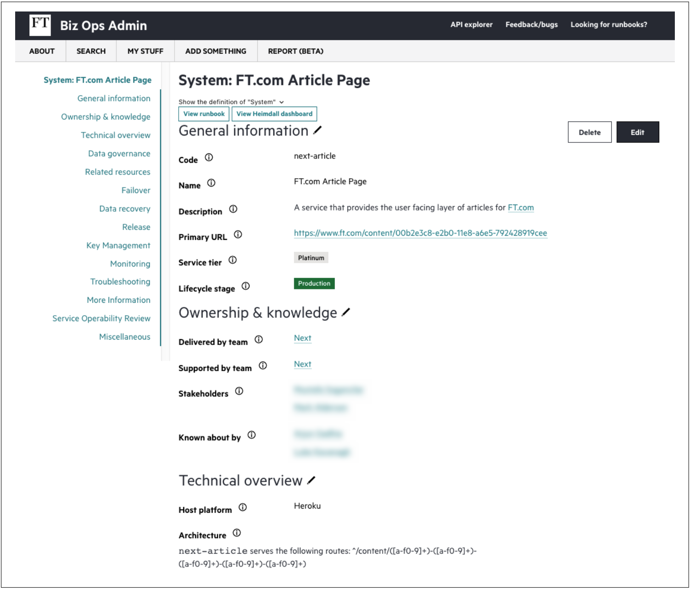
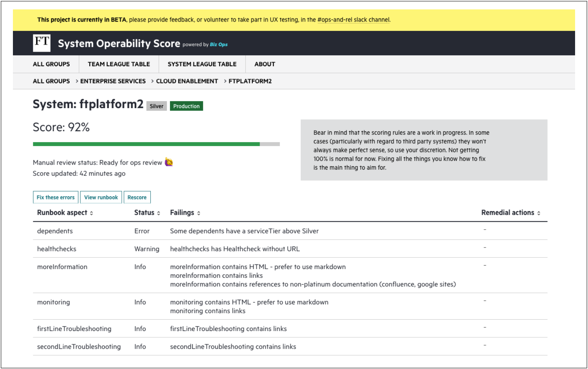

# 孤儿服务的问题
我们拥有令人惊奇的技术，同时我们正在构建极其复杂和可大规模扩展的系统，但仍然会出现一些最平淡无奇的问题，这看起来很奇怪。举个例子，我发现，许多组织都为如下的事情而努力：准确地知道自己拥有什么，他们在哪里，谁拥有他们。

随着微服务越来越专注于它们的用途，我们会发现，越来越多的服务已经愉快地运行了数周、数月甚至数年，而无需对其进行任何修改。一方面，这正是我们想要的。独立部署是一个很吸引人的概念，部分原因是它使系统的其余部分保持稳定，并且保持系统中不需要修改的部分的稳定性是一个好主意。

我将这些经年未动的服务称为孤儿服务，因为从根本上说，公司中没有人对这些服务负责。

## 该问题如何表现出来
我记得曾经听到（也许是伪造的）一个关于在旧的办公室里发现旧服务器的故事。没有人能记得起那里还有服务器，但是这些服务器仍然快乐地运行着，做着他们之前做的事情。没有人能确切地记得这些新发现的服务器的功能，人们不敢将其关闭。微服务也会表现出某些类似的特征；我们不知道这些服务在哪里，并且（我们假设）他们正在工作中。但是，我们有一个同样的问题：我们可能不知道该如何处理它们，并且这些担心会阻止我们修改这些服务。

根本问题是，如果该服务确实停止工作了或需要进行修改，那么人们将无所适从。我已经与不止一个团队交流过，这些团队分享了他们不知道所涉及服务的源代码在哪里的故事，这是一个很大的问题。

## 该问题何时发生
对于长期使用微服务的组织来说，通常会出现此问题——时间太长了，以至于对该服务的用途的集体记忆都被时间冲散了。与此微服务有关的人员，或者忘记了对该服务做了什么，或者也许离开了公司。

## 该问题的解决方案
我有一个（未经尝试的）假设，即实践服务的集体所有制的组织可能不太容易出现孤儿服务的问题，主要是因为他们已经实现了允许开发人员在不同服务之间流转并对其修改的机制。这类组织可能已经限制了语言和技术选择，以减少在服务之间切换上下文的成本。他们可能有通用的工具来对服务进行修改、测试和部署。如果自上次修改服务以来这些常规做法已发生变化，那么这当然可能无济于事。

我曾与许多遇到孤儿服务问题的公司进行过交谈，最终，这些公司创建了简单的内部注册表，以帮助整理服务的元数据。有些注册表只是简单地抓取源代码仓库，寻找元数据文件来构建服务列表。可以将这些信息与来自服务发现系统（如consul或etcd）的真实数据合并，以更全面地了解正在运行的服务以及可以与谁谈论该服务。

英国《金融时报》创建了Biz Ops，以帮助解决孤儿服务的问题。该公司拥有由全球不同的团队开发的数百个服务。Biz Ops工具（[图5-9](#f59)）为他们提供了一个单一的场所，除了有关网络和文件服务器等其他的IT基础设施服务的信息之外，还可以在该工具中找到有关其微服务的许多有用的信息。这些信息建立在图数据库之上，图数据库在收集哪些数据以及如何对信息进行建模方面具有很大的灵活性。

图5-9. 《金融时报》用于整理有关其微服务信息的Biz Ops工具

但是，Biz Ops工具比我所见过的大多数工具都更先进。Biz Ops工具计算所谓的系统可操作性得分，如[图5-10](#f510)所示。其想法是，服务及其团队应做某些事情，以确保可以轻松地运维服务。这些事情从确保团队在注册表中提供正确的信息到确保服务进行正确的运行状况检查。 通过计算这些分数，对是否有需要修复的地方，团队可以做到一目了然。

图5-10. 《金融时报》微服务的服务可操作性得分的例子

服务注册表之类的工具会有所帮助，但是如果孤儿服务比注册表出现的还要早，会发生什么呢？关键是要使这些新发现的“孤儿”服务与其他服务的管理方式保持一致，这要求我们要么将孤儿服务的所有权分配给现有团队（如果实行强服务所有制），要么提出该服务需要改进的工作项目（如果采用集体服务所有制）。
