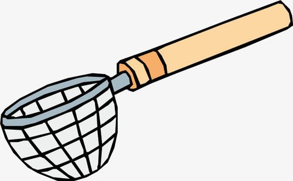

# 团队不断扩张时的微服务所有制问题
随着越来越多的开发人员加入微服务架构，我们将会处于可能想要重新考虑如何处理服务所有制的地步。

Martin Fowler已经从一般的代码所有制的角度区分了[不同类型的代码所有制](https://martinfowler.com/bliki/CodeOwnership.html)。我发现，从广义上讲，Martin Fowler对代码所有制的分类在微服务所有制的上下文中也起作用。此处，主要是从修改代码的角度，而不是从部署、一线支持等角度来考虑服务的所有制。在讨论各种问题之前，首先让我们看一下Martin的代码所有制的分类，并将它们放在微服务架构的上下文中：

* 强代码所有制：所有的服务都有负责人。如果其他人想要修改非自己负责的服务的代码，则他们必须将自己的修改提交给服务的负责人，并由服务的负责人来确定是否允许此次修改。其他人可以使用`pull request`的方式来修改费自己负责的服务。
* 弱代码所有制：大多数服务都是有负责人的，但是其他人无需利用`pull request`之类方法就可以直接修改代码。实际上，源代码的控制虽然设置为允许任何人修改任何内容，但是如果我们会修改其他人的服务，仍然期望我们事先与这些服务的负责人沟通。
* 集体代码所有制：任何个人都不拥有任何事情，任何人都可以修改任意他想修改的事情。

## 该问题如何表现出来
随着服务数量和开发人员的增加，我们可能会开始遇到集体所有制的问题。为了使集体所有制可以发挥作用，集体必须有足够的联系，以便对什么是好的变化达成共识，同时可以从技术的角度对所提供的特定服务的方向达成共识。

不管怎样，我已经发现集体代码所有制对于微服务架构而言是一种灾难。我曾与一家金融科技公司分享过一个小型团队快速发展的故事。该团队从30–40个开发人员发展到100多人，但是在这个过程中，除了“people know what is right”外，他们没有对系统的不同部分或任何概念的所有制进行任何的职责划分。

随着系统架构的发展，整个系统不再像之前一样清晰，而是成为一个糟糕的“分布式单体”。因为整个系统充斥着洞（*hole*），因此团队的某位开发人员称他们的架构为“漏勺架构”——当他们想要开放数据或执行大量点对点调用时，他们就会“打一个新的洞”[^1]。实际上，单体系统更容易解决这些挑战，而分布式系统下解决这些问题则要困难得多——改变一个分布式单体的成本更高。


**漏勺式系统**

日常生活中，漏勺就像下面的图一样：

还有一种系统，我称之为“筛子式系统”，平时看起来挺健壮的，但是实际上充满了各种漏洞。一旦倒上水，才发现漏洞百出呀，并且水量越大，危险系数越大。



## 该问题何时会出现
对于许多刚起步的团队来说，集体代码所有制模型是有意义的。当开发人员的数量较少时（大约20名），我对这种模型的效果感到很满意。随着开发人员的增加或者这些开发人员并非集中于一个地方，要使每个人都对诸如如下的事情有一致的想法越来越难：
* 什么是一次好的提交
* 各个服务应如何发展

对于正处于快速增长阶段的团队而言，集体所有制模型是有问题的。此处的问题在于，要发挥集体所有制的作用，就需要时间和空间来达成共识，并随着学习到的新知识来更新这些共识。一般而言，人越多，越困难。并且，如果招聘新人的速度很快（或让新人快速投入到项目中）时，这是相当困难的一件事情。

## 该问题的解决方案
以我的经验，强代码所有制几乎是组织、实施大规模微服务架构的组织所采用的模型。对于该大规模架构而言，会有多个团队、100多名开发人员参与其中。每个团队都可以轻松地决定良好变更的规则。每个团队可以视为在本地采用集体代码所有制。强代码所有制模型还可用于面向产品的团队，如果团队拥有一些围绕业务领域的服务，那么团队将更加专注于业务领域的某个领域。这使得保持以客户为中心的、建立领域专业知识的团队变得更加容易，这些团队通常由指派到该团队的产品负责人来指导团队的工作。

---
[^1]: A colander is a bowl with lots of holes, used for straining pasta, for example.