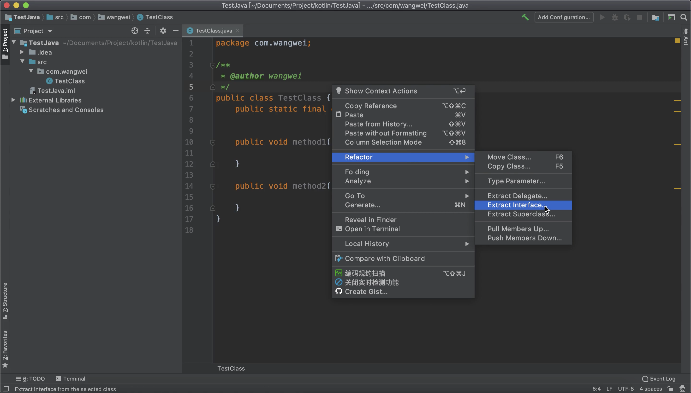
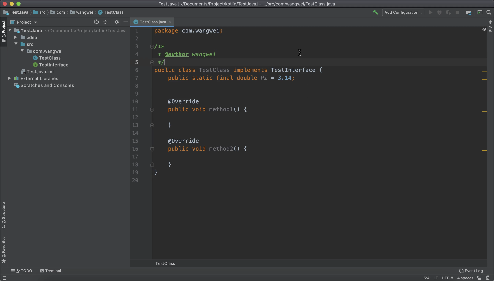
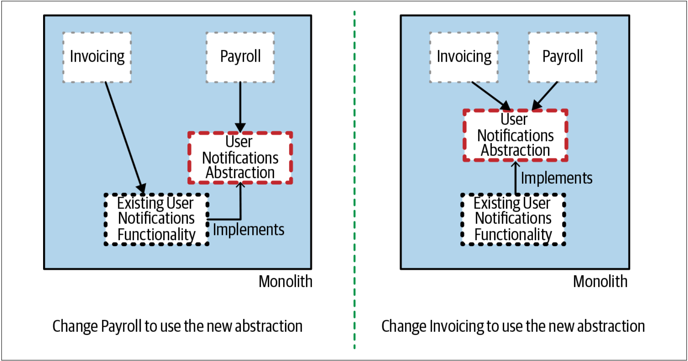
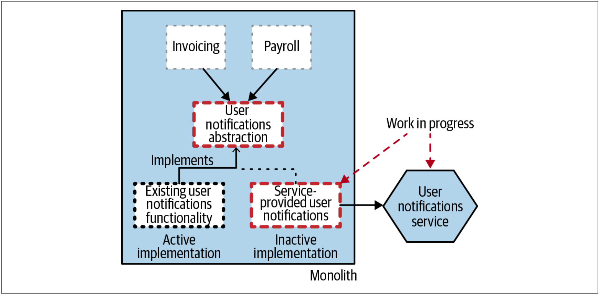
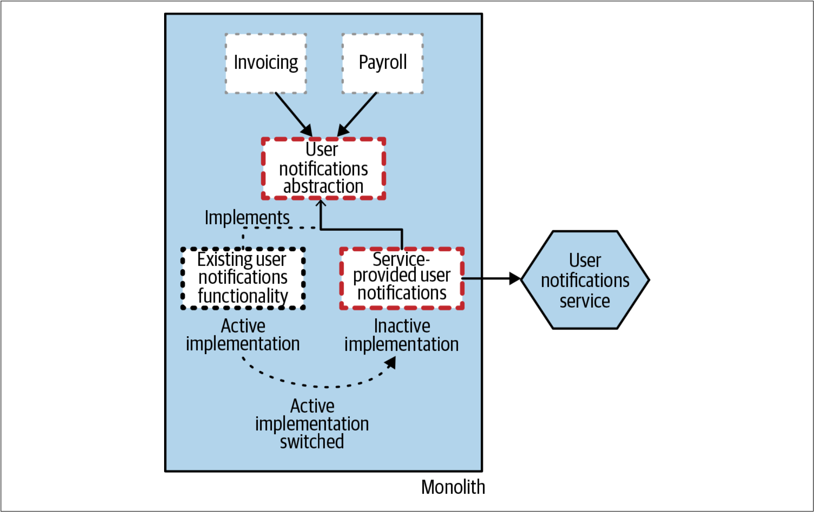
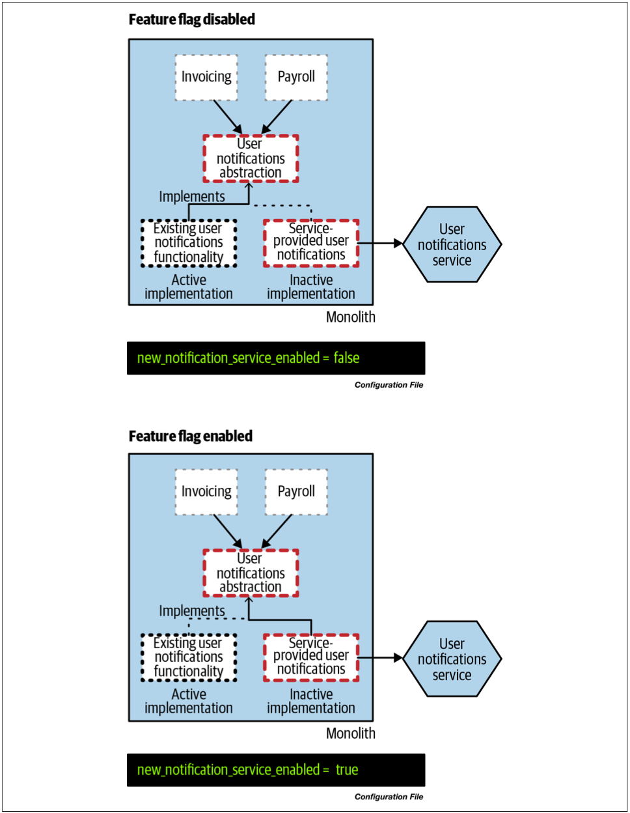
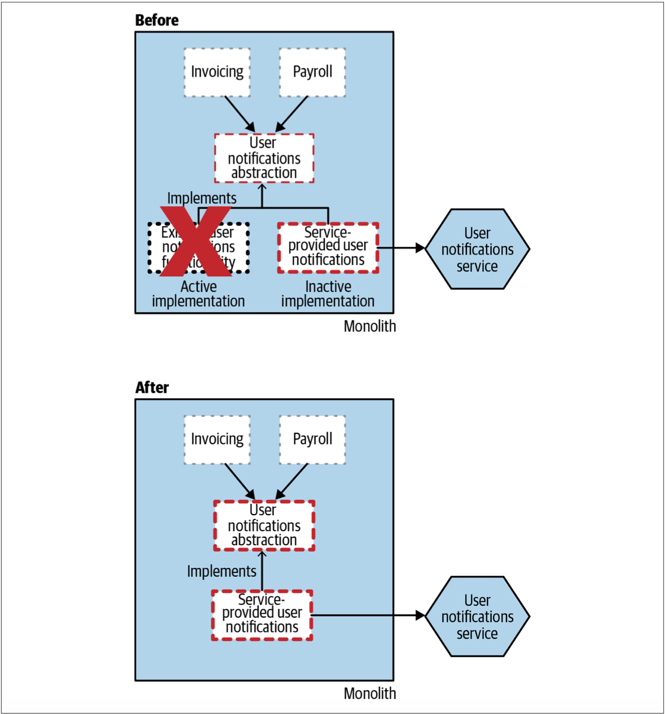
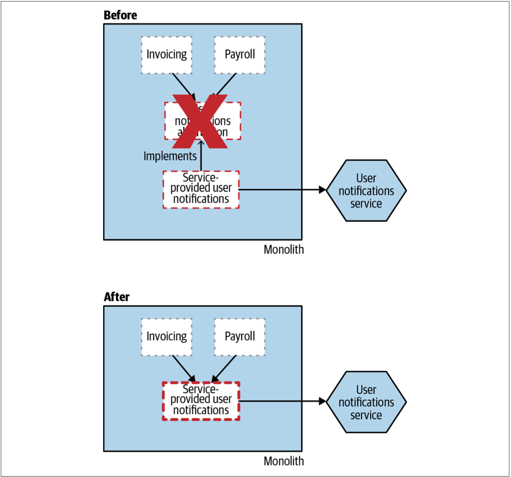
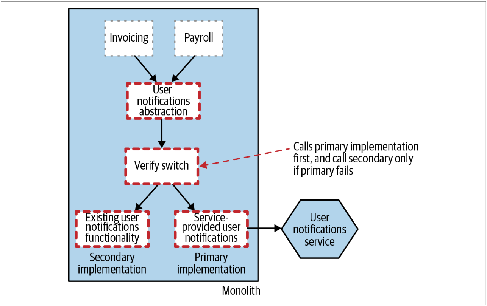

# 抽象分支模式
为了让绞杀者模式可以发挥作用，我们需要能够拦截对单体发起的请求调用。但是，如果要抽取的功能位于现有系统中的底层时，我们该怎么办？再次回到前面、如[图3-4](Pattern_Strangler_Fig_Application.md#f34)的例子，想一下提取Notification功能的需求。

为了抽取系统底层的功能，我们需要修改现有系统。这些修改可能是非常大的修改，并且会破坏同时开发代码库的其他开发人员的工作。此时，我们将陷入相互竞争的紧张局势。一方面，我们希望以增量方式进行修改。另一方面，对工作在代码库的其他区域的其他人员而言，我们希望减少对其带来的干扰。这自然会促使我们朝着希望快速完成工作的方向迈进。

通常，当修改现有代码库的某些部分内容时，人们会在一个独立的源代码分支上修改。如此，可以在修改代码的同时而不影响其他开发人员的工作。但是，这种方式面临的挑战是：一旦在分支上完成修改，这些变更就必须合并回之前的分支。合并分支通常会带来严峻的挑战。分支存在的时间越长，合并分支带来的问题就越大。此刻，我不会详细介绍与长期存在的源代码分支相关的问题，只是说它们与CI的原则背道而驰。我会引用来自[“ The 2017 State of DevOps Report”](http://bit.ly/2pctNfn)中收集的数据来表明：采用基于主干的开发模式（避免使用分支，直接在主干上修改）以及使用短暂的分支会有助于提高IT团队的性能。我不是long-lived分支的粉丝，而且并非我一人如此。

因此，我们希望能够以增量的方式修改代码库，同时还希望把开发代码库其他部分的开发人员的干扰降到最低。此时，我们可以使用另一种模式。这种模式允许我们在不依赖源代码分支的情况下逐步修改单体。与源代码分支方法不同，抽象分支模式修改现有的代码库，以实现在同一代码版本中安全地共存不同的修改，同时还不会造成过多的干扰。

## 抽象分支模式如何工作
抽象分支模式由5个步骤构成：
1. 为要替换的功能创建一个抽象。
2. 修改使用现有功能的客户端，以使用该功能的新的抽象。
3. 重新实现该抽象，在我们的例子中，新的实现将会调用我们的新的微服务。
4. 在抽象中进行切换，以使用我们的新实现。
5. 清理抽象，并删除旧的实现。

让我们看一下，如何利用如上的步骤迁移如图[3-4](Pattern_Strangler_Fig_Application.md#f34)中所示的Notification功能。

### 第一步：创建抽象
第一个任务是创建一个抽象用来表示需要修改的代码与其调用者之间的交互，如[图3-22](#f322)所示。如果已经对现有的Notification功能做了合理拆分，那么创建一个抽象就像我们在IDE中应用Extract Interface重构一样简单。如果没有，则可能需要抽取一个前面介绍过的[接缝](To_Change_the_Monolith_or_Not.md#重构单体)。创建抽象可能会让我们在代码库中搜索那些对发送电子邮件、SMS、或可能存在的其他通知机制的API的调用。找到这些代码，并创建用于其上游模块使用的抽象是必需的步骤。


**IDEA中的Extract Interface重构**



### 第二步：使用抽象
创建抽象之后，我们现在需要重构使用Notification功能的现有客户端，以使用新的抽象，如[图3-23](#f323)所示。IDE中的Extract Interface重构有可能为我们自动完成了，但是以我的经验，这通常是一个递增的过程，并涉及到手动跟踪对相关功能的入站调用。令人高兴的是，这些变更很小并且是逐步进行的，很容易一步一步来完成，而又不会对现有的代码产生太大影响。此时，系统行为不应有功能上的变化。

图3-23. 修改现有的客户端以使用新的抽象

### 第三步：创建抽象的新实现
新的抽象已经发挥作用，我们现在就可以开始实现新服务了。如[图3-24](#f324)所示，在单体内部所实现的Notification的功能只是用来调用外部服务的客户端而已，Notification的大部分功能都位于外部的服务。

此时，关键是要认识到，对于创建的抽象而言，尽管我们在代码库中同时有两个实现，但是当前系统中只有一个实现处于活动状态。直到我们认为我们的新服务可以提供服务时，我们的新服务实际上一直处于休眠状态。当我们努力在新服务中实现所有的等效功能时，抽象的新实现可能会返回Not Implemented错误。当然，这并不会阻止我们为已经编写的功能编写测试用例，并且这是尽早集成这项工作的好处之一。

图3-24. 创建抽象的新实现

在此过程中，我们也可以像使用绞杀者模式那样，把开发中的Notification服务部署到生产环境。新服务还没有完成的事实是极好的，此时，由于我们对Notifications抽象的新实现尚不存在，因此实际上并不会调用新的Notification服务。但是，我们可以部署新的服务，对其进行测试，并验证我们已经实现的功能是否可以正常运行。

此阶段可能会持续很久。[Jez Humble详细介绍了如何利用抽象分支模式来迁移GoCD中的数据库持久层](http://bit.ly/2p95lv7)，当时GoCD被称为[Cruise Control](http://cruisecontrol.sourceforge.net/)。从iBatis到Hibernate的切换持续了几个月的时间，在此期间，GoCD仍然保持着每周两次的交付频率。

### 第四步：
一旦我们认为新的实现能够正常工作，此时就可以切换抽象点，以便启用我们的新实现，同时旧的功能将不再使用，如[图3-25](#f325)所示。

图3-25. 切换到抽象的新实现以启用我们的新的微服务

理想情况下，像绞杀者模式一样，我们希望使用某种机制以便可以轻松实现切换。如果发现问题，这种机制使我们能够快速切换回旧功能。常见的解决方案是使用 [功能开关（*feature toggles*）](https://martinfowler.com/articles/feature-toggles.html)。在[图3-26](#f326)中，我们使用配置文件实现切换，这使我们可以无需修改代码就可以改变正在使用的实现。如果想了解有关功能切换以及如何实现功能开关的更多信息，那么[Pete Hodgson的文章](https://martinfowler.com/articles/feature-toggles.html)就很好。

图3-26. 使用功能开关切换不同的实现

在这个阶段，我们有同一个抽象的两个实现，我们希望它们应该在功能上等效。我们可以测试其等效性，但是我们还可以选择在生产环境中同时使用这两种实现来提供额外的验证。[113页的“并行运行模式”](Pattern_Parallel_Run.md)会进一步探讨此想法。

### 第五步：清理
现在，随着我们新的微服务为用户提供所有的通知，我们可以将注意力转移到背后的清理工作。此时，以前的User Notification功能已不再使用，因此显而易见的步骤就是将其删除，如[图3-27](#f327)所示。我们开始为单体瘦身！

图3-27. 移除旧的实现

当删除旧的实现时，删除我们可能已经实现的任何功能开关也很有意义。与使用功能开关相关的真正问题之一是：让旧开关无处不在——不要这样做！删除不再需要的开关，以便保持简洁。

最后，随着旧实现的消失，我们可以选择删除之前创建的抽象，如[图3-28](#f328)所示。但是，创建抽象可能会将代码库改进到需要保持其存在的程度。如果抽象像接口一样简单，则保留抽象对现有代码库的影响最小。

图3-28. 移除抽象（该步骤为可选操作）

## 后备方案
如果我们的新服务无法正常运行，我们可以切换回旧的实现，这种能力非常有用。但是，有没有办法可以实现其自动切换呢？Steve Smith详细介绍抽象分支模式的一种变体——[校验抽象分支模式](http://bit.ly/2mLVevz)。如[图3-29](#f329)所示，校验抽象分支模式现了一个实时的校验步骤，其想法是，如果对新实现的调用失败，则可以改用旧实现。

图3-29. 校验抽象分支模式

这显然增加了一些复杂度，不仅增加了代码的复杂度，而且还增加了系统推理的复杂度。实际上，抽象的两种实现都可能在任何给定的时间点处于活动状态，从而更加难以理解系统的行为。如果这两个实现无论如何都是有状态的，那么我们还需要考虑数据一致性问题。尽管对于任何情况下的实现切换而言，数据一致性都是一个挑战，但是“校验抽象分支模式”允许我们在请求维度上实现来回切换不同的实现。这意味着需要一个这两种实现都可以访问的共享数据集。

稍后，我们将在介绍更通用的并行运行模式时，更详细地探讨如上的想法。

## 何处使用
抽象分支模式是一种通用模式。当对现有代码库的修改会持续很长时间，但我们又想避免在修改过程中对其他开发人员造成干扰时，对于这种修改的任何情况而言，抽象分支模式都可以发挥作用。我认为，与在几乎所有情况下都使用跨度较长的代码分支相比，抽象分支是一个更好的选择。对于向微服务架构的迁移，我几乎总是希望首先使用绞杀者模式，因为它在许多方面都比较简单。但是，在某些情况下，例如此处的Notification，则不能使用绞杀者模式。

抽象分支模式假定我们可以修改现有系统的代码。如果出于某种原因，我们无法修改系统代码，则可能需要看一下其他的方案，我们将在本章的其余部分探讨其中的一些方案。