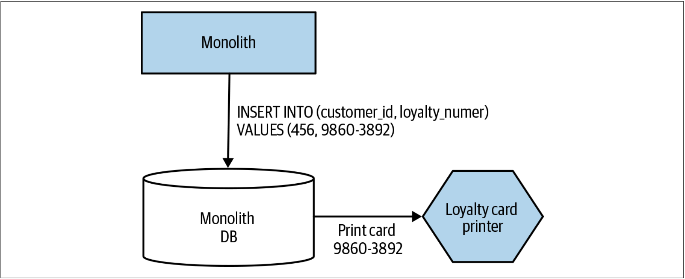
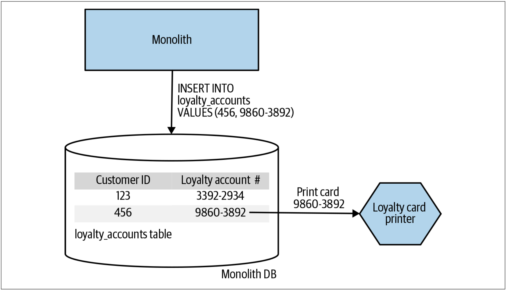
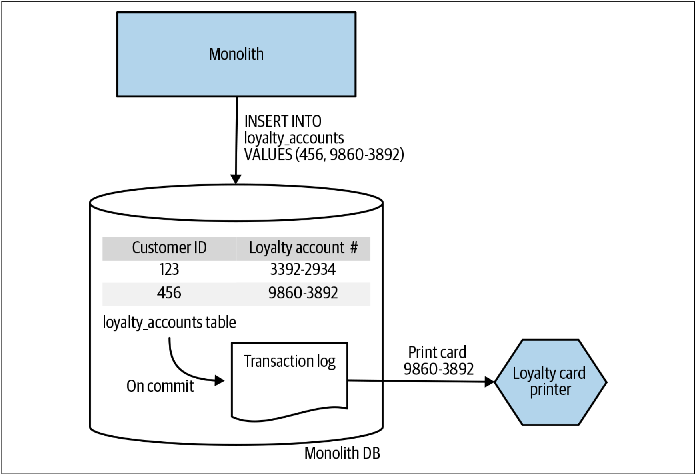

# CDC模式
不用拦截并处理对单体发起的请求，我们可以使用CDC技术对数据库中的变更做出反应。为了使CDC正常工作，必须将底层的捕获系统耦合到单体的数据库中。这一点确实是CDC模式中的无法避免的挑战。

## 发行会员卡的例子
我们希望集成一些功能以便在用户注册时为其打印会员卡。目前，在注册时会创建一个会员帐户。如[图3-34](#f334)所示，当从单体返回注册请求的响应时，我们仅知道用户已注册成功。为了打印会员卡，我们需要和用户相关的更多详细信息。这使得在单体上游插入该行为——可能使用装饰协作模式——更加困难，我们需要在响应返回的地方增加对单体的请求以提取所需的其他信息，而这些信息是否通过开放的API而提供是未知的。

图3-34. 当用户完成注册后，单体无法提供更多的信息

我们决定使用CDC模式。我们会检测LoyaltyAccount表的所有插入操作，数据插入后，我们将调用新的Loyalty Card Printing服务，如[图3-35](#f335)所示。在这种特殊场景下，我们决定触发一个“Loyalty Account Create”事件。我们的打印进程最好以批处理方式运行，因此，我们可以在消息代理（*message broker*）中建立要执行的打印列表。

图3-35. CDC如何调用新的打印服务

## CDC的实现
我们可以使用各种技术来实现CDC，所有这些技术在复杂性、可靠性和及时性方面都有不同的权衡。让我们来了解下其中的几种技术。

### 数据库触发器
大多数关系型数据库都允许在修改数据时触发自定义的行为。这些触发器的确切定义以及它们可以触发的事情各不相同，但是所有的现代关系型数据库都以某种方式支持这些触发器。在[图3-36](#f336)的例子中，只要LoyaltyAccount表存在INSERT操作，就会调用我们的服务。

图3-36. 当插入数据时，使用数据库触发器来调用微服务

像其他任何存储过程一样，触发器也需要安装到数据库中。这些触发器的功能可能也有局限性，尽管至少对于Oracle而言，可以用触发器来调用Web服务或自定义Java代码。

乍一看，触发器似乎很简单。无需运行任何其他软件，无需引入任何新技术。但是，像存储过程一样，数据库触发器可能会让事情越来越糟。

我的一个朋友Randy Shoup曾经说过：“一两个数据库触发器并不可怕，但用触发器来构建整个系统是一个可怕的想法。”这通常是与数据库触发器相关的问题。触发器越多，就越难理解系统的实际工作方式。问题经常出在数据库触发器的工具和变更管理——触发器使用的过多，应用程序就可能会成为某种巴洛克风格的建筑[^译注1]。

因此，如果要使用触发器，请非常谨慎地使用它们。

### 轮训事务日志
在大多数数据库（当然是所有的主流事务数据库）中，都存在一个事务日志。事务日志通常是一个文件，其中记录了所有已完成的数据库的修改。对于CDC而言，最精密的工具都倾向于使用此事务日志。

基于事务日志的CDC系统以单独的进程而运行，并且系统与现有数据库的唯一交互是通过事务日志进行的，如[图3-37](#f337)所示。此处，值得注意的是，只有已提交的事务才会记录在事务日志中（这一点非常重要）。

基于事务日志的CDC工具需要了解底层的事务日志格式，并且不同类型的数据库的事务日志格式有所不同。因此，此处可以使用的工具取决于我们所使用的数据库。尽管有大量的工具用于解析事务日志，但大多数工具都是用来支持数据复制。还有许多解决方案旨在把事务日志的变更映射为消息代理（*message broker*）中的消息。如果微服务本质上是异步的，那么这中映射可能非常有用。

基于事务日志的CDC工具需要了解底层的事务日志格式，并且不同类型的数据库的事务日志格式有所不同。因此，此处可以使用的工具取决于我们所使用的数据库。尽管有大量的工具用于解析事务日志，但大多数工具都是用来支持数据复制。还有许多解决方案旨在把事务日志的变更映射为消息代理（*message broker*）中的消息。如果微服务本质上是异步的，那么这中映射可能非常有用。

除了一些限制外，在很多方面，基于事务日志的CDC是最简洁的解决方案。事务日志本身仅显示底层数据的变化，因此不必担心需要查出到底发生了什么更改。工具在数据库之外运行，并且可以基于事务日志的副本运行，因此也无需过多的担心耦合或冲突。

### 批处理增量复制
可能最简单的方法是编写一个程序，该程序定期扫描数据库并检查哪些数据发生了变化，然后将变化的数据复制到目标位置。这些任务通常使用cron之类的工具或类似的批处理调度工具来执行。

主要的问题是要清楚自上次复制以来哪些数据发生了变化。数据库的模式设计可能让数据修改显而易见，也可能无法察觉数据的变化。有些数据库允许查看表的元数据，以查看数据库的某些部分何时发生了修改，但这种方法并不是通用的方法。当希望获取行级修改的信息时，可能只能获取表级修改的时间戳。我们可以自己添加这些时间戳信息，但这可能会增加大量的工作，并且CDC系统可以更优雅地处理数据变化的问题。

## 何处使用

---
[^译注1]: 巴洛克建筑是17～18世纪在意大利文艺复兴建筑基础上发展起来的一种建筑和装饰风格。放荡不羁，极尽奢华是巴洛克建筑的主要特征，在巴洛克建筑里装饰满了壁画雕塑。这种建筑的特点是重于内部的装饰，其全体多取曲线，常常穿插曲面与椭圆空间。此处借用巴洛克风格的建筑来形容使用太多触发器而构建的系统，因为触发器也是位于数据内部的，相当于建筑的内部装饰。