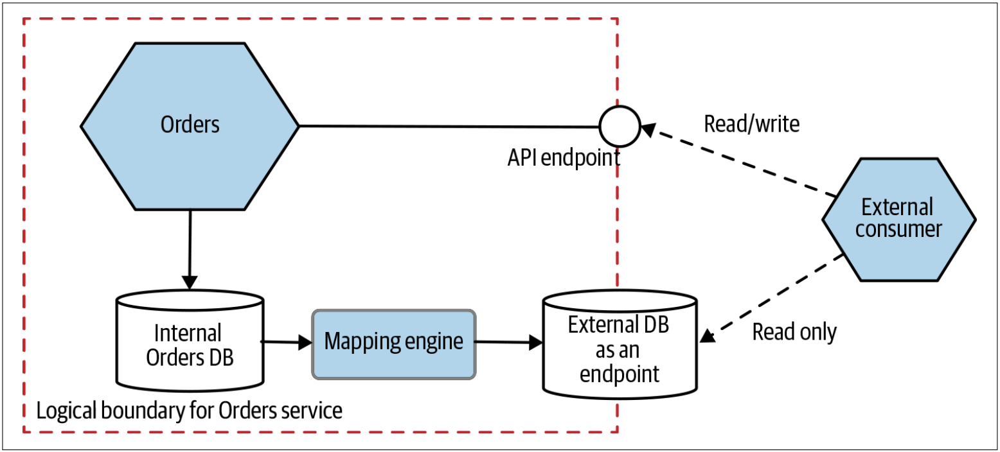

# 把数据库视为服务接口
有时，客户端（*clients*）只需要一个用于查询的数据库。可能是因为他们需要查询来获取大量数据，或者可能是由于外部各方已经在使用需要SQL的工具链（例如Tableau之类的工具，这些工具通常用于对业务指标的深入分析）。在这些情况下，允许客户端查看服务在数据库中管理的数据是很有意义的，但是我们应注意将公开的数据库与服务边界内使用的数据库分开。

我见过的一种有效的方法是创建一个专用数据库，该数据库设计为只读的端点而公开，并在底层数据库中的数据变更时修改此专用数据库。实际上，服务可以将事件流作为一个端点而公开，并且将同步API作为另一个端点，利用这种方式也可以将数据库开放给外部使用者。在[图4-7](#f47)中，我们看到了Orders服务的一个例子：通过API开放了一个读/写端点，并以一个只读接口的形式开放了一个数据库。映射引擎在获取内部数据库的修改，并确定需要在外部数据库中进行什么变更。

图4-7. 开放专用数据库为端点，以使内部数据库保持隐藏状态

> **
数据库报表模式（Reporting Database Pattern）
**
> 
> Martin Fowler已经在[Reporting Database](https://martinfowler.com/bliki/ReportingDatabase.html)中对本节的方法进行了描述，那么为什么我在这里还要使用另一个名称？当我与更多人交谈时，我意识到，尽管报表是这种模式的常见应用，但这并不是人们使用该技术的唯一原因。与传统的面向批处理的工作流相比，允许客户端定义[即席查询（*ad hoc queries*）](Monitoring_and_Troubleshooting.md#adhoc)的功能具有更广泛的使用。因此，尽管该模式可能广泛应用于支持这些报表的case，但我想用一个不同的名称来反映这一事实，即该技术可能具有更广泛的适用性。

映射引擎可以完全忽略内部数据库的变更，也可以将内部数据库的变更直接开放出来，也可以介于二者之间。关键是：映射引擎充当内部数据库和外部数据库之间的抽象层。当内部数据库的结构修改时，映射引擎需要修改以确保对外的数据库与内部数据库保持一致。在几乎所有的情况下，映射引擎都会落后于内部数据库的写操作。通常，映射引擎的具体实现决定了才延迟的大小。从公开数据库中读取数据的客户端需要认识到他们可能会读到脏数据。因此，我们可能会发现，以编程方式公开外部数据库的最新更新时间是合适的。

## 实现一个映射引擎
此处的细节在于确定如何更新，即如何实现映射引擎。

* 我们已经研究了[CDC](Pattern_Change_Data_Capture.md)系统，CDC是一个非常好的选择。事实上，CDC可能是最可靠的解决方案，同时还提供了最为及时的数据更新。
* 另一个选择是使用批处理来复制数据，但是这种方案可能会存在问题：因为该方案可能会增加内部数据库和外部数据库之间的数据延迟；并且对于某些数据schema而言，很难确定需要复制哪些数据。
* 第三种选择是从相关服务来监听触发事件，并使用监听事件来更新外部数据库。

之前，我会使用批处理来处理此问题。但是，如今，我可能会使用专门的CDC系统，例如Debezium。批处理程序无法运行或者无法长时间运行已经让我多次受到伤害。随着世界不再使用批处理作业，并且希望更快地获取数据，批处理的方案正在被实时解决方案而取代。使用CDC系统来处理数据变更很有意义，尤其是如果我们正在考虑使用CDC来开放服务边界之外的事件时，尤其如此。

## 和数据库视图的对比
把数据库视为服务接口的模式比简单的数据库视图更为复杂。数据库视图通常与特定的技术栈绑定：如果我想提供Oracle数据库的视图，则视图的底层数据库和托管视图的架构都要运行在Oracle上。通过本节的方法，我们公开的数据库可以是完全不同的技术栈。我们可以在服务内部使用Cassandra，但可以用传统的SQL数据库作为开放的端点。

把数据库视为服务接口的模式比数据库视图具有更强大的灵活性，但是需要更多的成本。如果下游消费者的需求可以通过简单的数据库视图来满足，那么一开始实现的工作量可能会减少。请注意，数据库视图可能会限制接口的演变方式。我们可以从使用数据库视图开始，然后再考虑转移到专用的报表数据库。

## 何处使用该模式
显然，因为作为端点而开放的数据库是只读的，因此，该方案仅对需要只读访问权限的客户端有用。该方法非常适合于报表的case，此时，我们的客户可能需要对给定服务所拥有的大量数据进行合并。可以扩展该方法，然后将数据库的数据导入到更大的数据仓库中，从而可以查询来自多个服务的数据。我在《Building Microservices》的第5章对此进行了更详细的讨论。

不要低估确保此外部数据库投影的时效性所需的工作。根据我们当前服务的实现方式，这可能是一项复杂的工作。