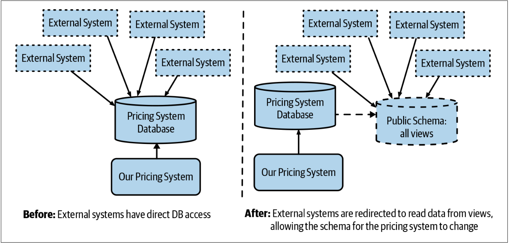
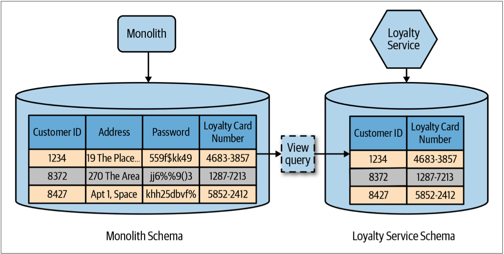

# 数据库视图
有时候，我们希望让多个服务使用一个数据源。在这种情况下，可以使用视图来降低耦合。利用视图，可以为服务提供一个schema，该schema是对它底层的schema的有限投影（*limited projection*）。这种投影可能会限制服务对数据的可见性，从而隐藏服务不应该访问的信息。


**数据库视图**

视图是从一个或几个基本表（或视图）中导出的虚拟的表。在系统的数据字典中仅存放了视图的定义，不存放视图对应的数据。视图是原始数据库数据的一种变换，是查看表中数据的另外一种方式。

可以将视图看成是一个移动的窗口，通过它可以看到感兴趣的数据。视图是从一个或多个实际表中获得的，这些表的数据存放在数据库中。那些用于产生视图的表叫做该视图的基表。一个视图也可以从另一个视图中产生。

视图的定义存在数据库中，与此定义相关的数据并没有再存一份于数据库中。通过视图看到的数据存放在基表中。

视图看上去非常像数据库的物理表，对它的操作同任何其它的表一样。当通过视图修改数据时，实际上是在改变基表中的数据。相反地，基表数据的改变也会自动反映在由基表产生的视图中。

由于逻辑上的原因，有些视图可以修改对应的基表，而有些则仅用于查询使用。


## 作为公共契约的数据库
在[第3章](Pattern_Parallel_Run.md#比较信贷衍生品定价的例子)中，我讨论了帮助一家现在已经倒闭的投资银行对其现有的信用衍生品系统更换平台的经历。我们解决了数据库严重耦合的问题：我们需要提高系统的吞吐量，以便为使用该系统的交易者提供更快的反馈。经过一番分析，我们发现系统的瓶颈是对数据库的写操作。经过短暂的调整后，我们意识到，如果我们重新组织schema，我们可以大大提高系统的写入性能。

正是在这一点上，我们发现有多个不在我们控制范围之内的应用会对数据库进行读请求，有时也会是读/写请求。不幸的是，我们发现所有这些外部系统都使用相同的用户名和密码，因此无法了解这些用户是谁，他们正在访问什么。我们估计，这涉及到“超过20个”应用，但是，这是根据对入站调用的一些基本分析得出的结论[^1]。


如果每个参与者（例如，一个人或一个外部系统）拥有一组不同的凭据，则限制特定角色的访问会更加容易，减少撤销凭据和[轮换凭据](https://www.infoq.cn/article/u2rW1ET45hzJ0o01qJuL)的影响，并更好地了解每个参与者在做什么 。管理不同的凭据集可能很麻烦，尤其是在微服务系统中，可以需要多个凭据集来管理每一个服务。我喜欢使用专门的secret stores来解决此问题。HashiCorp的Vault是该领域的出色工具。Vault可以为诸如数据库之类的短暂且范围有限的访问生成每个角色的凭证。


我们不知道这些用户是谁，但我们必须与他们联系。最终，有人想到禁用他们正在使用的共享帐户，然后等待他们与我们联系以进行投诉。显然，这不是解决我们最初不应该遇到的问题的好方法，但是这个方法是有效的。然而，我们很快就意识到，这些应用程序中的大多数都不再进行主动维护（*active maintenance*），这意味着它们不会为新的schema设计而升级[^2]。实际上，我们的数据库schema已成为不可修改的、面向公众的契约：我们必须继续维持该schema结构。

## 视图的呈现
我们的解决方案是首先解决外部系统对schema执行写操作的场景。幸运的是，在我们的case中，这种情况很容易解决。对于所有的读操作的客户端，我们创建了一个专门的视图schema，该schema看起来和旧schema一样，然后让客户端访问该新的schema，如[图4-3](#f43)所示。只要可以保持视图不变，我们就可以修改自己的schema。让我们仅讨论那些涉及很多存储过程的场景。

图4-3. 使用试图以允许修改其底层的schema

在投资银行的例子中，最终，视图和其底层的schema的差异非常大。当然，我们可以更简单地使用视图，也可以隐藏我们不希望外界看到的信息。举一个简单的例子，在[图4-4](#f44)中，我们的loyalty服务仅提供系统中的会员卡列表。目前，会员卡信息以customer表的列的形式存储在customer表。因此，我们定义了一个视图，该视图仅开放表中的customer ID和loyalty ID的映射，而不开放customer表中的其他任何信息。同样，单体数据库中的其他的任何表对loyalty服务是完全隐藏的。

图4-4. 数据库试图投影其底层schema的子集

视图能够从底层的源schema中投影有限信息的能力使我们能够实现某种形式的信息隐藏。视图让我们可以控制信息的共享和隐藏。视图不是一个完美的解决方案，该方法存在一些限制。

根据数据库的特性，可以选择创建一个materialized view（*物化视图*）。对于materialized view，通常使用缓存来预先计算视图。这意味着从视图中读取数据时无需读取其底层schema，从而可以提高性能。然后，需要围绕如何更新这个预计算的视图来进行权衡和折衷，materialized view很可能意味着我们可能正在从视图中读取“脏”数据。

## 视图的限制
视图的实现方式可能有所不同，但是视图通常是查询的结果。这意味着视图本身是只读的。这直接限制了视图的用途。另外，尽管视图是关系数据库的常见功能，而且许多更成熟的NoSQL数据库都支持视图（例如，Cassandra和Mongo都支持视图），但并非所有的数据库都支持视图。即使我们的数据库引擎确实支持视图，也可能会有其他限制，例如，源schema和视图都必须位于同一数据库引擎中。这中限制可能会增加物理部署的耦合，从而导致潜在的单点故障。

## 视图的所有制
值得注意的是，底层的源schema的修改可能需要视图的更新，因此应该仔细考虑谁“拥有”该视图。我建议将任何已发布的数据库视图与其他任何服务接口等同看待，因此，团队应该让视图随源schema而保持最新状态。

## 何处可以使用视图
当我认为无法拆分现有的单体schema时，我通常会使用数据库视图。 理想情况下，如果最终目标是通过服务接口公开信息，则应尽量避免使用视图。相反，最好进行适当的schema分解。值得关注视图技术的局限性。但是，如果认为完全拆分schema的工作量太大，那么视图可能是朝着正确方向迈出的一步。

---
[^1]: When you’re relying on network analysis to determine who is using your database, you’re in trouble.
[^2]: It was rumored that one of the systems using our database was a Python-based neural net that no one under‐ stood but “just worked.”