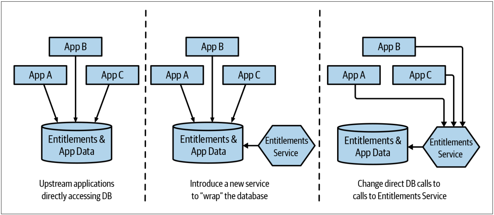
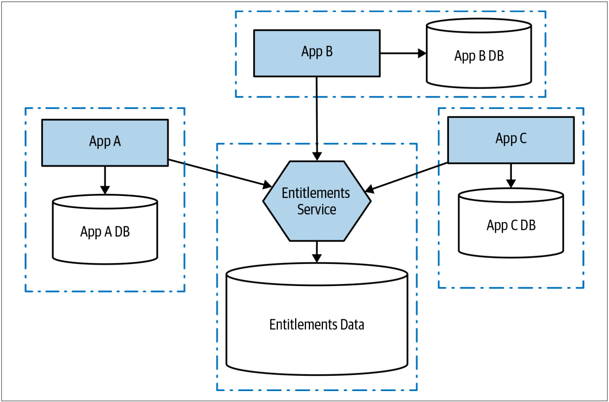

# 把数据库包装成服务
有时候，当某些事情太难处理时，隐藏这些乱糟糟的事情是有意义的。 使用把数据库包装成服务的模式（*database wrapping service pattern*），我们可以做到：将数据库隐藏在某个服务之后，该服务作为数据库的一层薄薄的包装，从而将数据库依赖转变为服务依赖，如[图4-5](#f45)所示。

图4-5. 使用一个服务来包装数据库

几年前，我曾在澳大利亚一家大型银行短暂的工作，以帮助其中的一个部门实施产品的的改进路径。第一天，我们与关键人物进行了一些访谈，以了解他们面临的挑战，并建立了当前流程的概况。会议期间，有人跑上前来并介绍说他们是公司中该领域的DBA主管。他说：“请阻止他们把东西放到数据库中！”

我们喝了一杯咖啡，然后DBA阐述了问题。在大约30年的时间里，作为该组织的“皇冠上的明珠”，一个商业银行系统已初具规模。该系统最重要的部分之一是管理他们所谓的“权利(*entitlements*)”。在商业银行中，管理哪些个人可以访问哪些帐户并确定这些帐户可以进行的操作非常复杂。为了让大家可以大致了解这些“权利”，我们来考虑一名可以查看公司A、B、C的账户的会计员。对于公司B而言，帐户之间的转账限额为$500；对于公司C，账户之间的转账没有限额，但最多可以提取$250。这些“权利”的维护和应用几乎完全在数据库的存储过程中进行管理。所有的数据访问都通过此“权利”逻辑来控制。

随着银行规模的扩大，以及其逻辑和状态数量的增长，数据库开始无力承担负载。“我们已经将所有可能的钱都给了Oracle，但还远远不够。” 令人担忧的是，考虑到预期的增长，即便算上硬件性能的提高，该组织的需求最终也会超出数据库的能力。

在进一步探讨该问题时，我们讨论了拆分数据库以减少负载的想法。问题是，这些错综复杂的核心在于这个权利系统。试图理清这团逻辑将是一场噩梦，并且在这一领域犯错会带来巨大的风险：搞错一步，就可能会阻止某人访问其帐户，或者更糟的是，某人可能会获得权限来访问他们不应该有权限的财产。

我们提出了一个计划来尝试解决这种情况。我们相信，短期内我们无法修改权利系统，因此，当务之急是至少要使问题不能变得更糟糕。因此，我们需要阻止人们把更多数据和行为放入entitlements 数据库中。一旦一切就绪，我们就可以考虑移除entitlements数据库中那些比较容易提取的部分，以希望把数据库的负载降低到可以减轻对系统长期生存能力的担忧。这将为下一步的思考提供一些喘息的空间。

我们讨论了引入新的Entitlements服务，该服务使我们能够“隐藏”有问题的schema。最初，Entitlements服务的行为很少，因为当前数据库已经以存储过程的形式实现了很多行为。但是我们的目标是鼓励编写其他应用的团队将entitlements数据库视为其他人的应用，并鼓励他们在本地存储自己的数据，如[图4-6](#f46)所示。

图4-6. 使用把数据库包装成服务的模式来减少对中央数据库的依赖

就像使用数据库视图一样，把数据库包装成服务允许我们可以控制要共享的内容以及要隐藏的内容。这种方法为其下游的消费者提供了一个固定的接口，并且变化发生在接口幕后的数据库上，以此来改善数据依赖的场景。

## 何处使用该模式
该模式在底层数据schema很难拆分的情况下非常有效。通过在schema周围放置一个显式包装器，并明确只能通过该schema来访问数据，这至少可以阻止数据库的进一步增长。数据库的包装服务清楚地描述了什么是“我们的”以及什么是“其他人的”。我认为，当我们将底层的数据schema和服务层的所有权调整到同一团队时，这种方法也最有效。服务API需要适当的包含在托管接口中，并且对该API层的修改方式进行适当的监督。这种方法对上游应用程序也有好处，因为它们可以更轻松地了解它们如何使用下游的schema。这使得那些针对测试而进行的打桩之类的行为更加易于管理。

与使用简单的数据库视图相比，该模式更具优势。首先，我们不必呈现可以映射到现有表结构的视图；我们可以在包装服务中编写代码，以对基础数据进行更复杂的投影。包装服务还可以通过API调用执行写操作。 当然，采用这种模式确实需要上游消费者做出改变，上游消费者必须从直接的数据库访问转移到API调用。

理想情况下，使用此模式是进行更根本的修改的垫脚石，使我们有时间拆分API层之下的schema。可以说，我们只是在解决问题，而不是解决根本问题。尽管如此，本着不断改进的精神，我认为这种模式与此密切相关。

