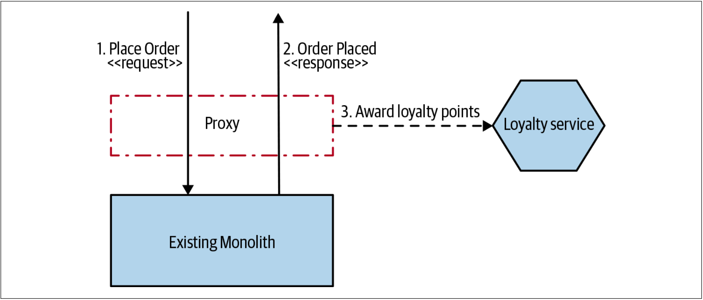
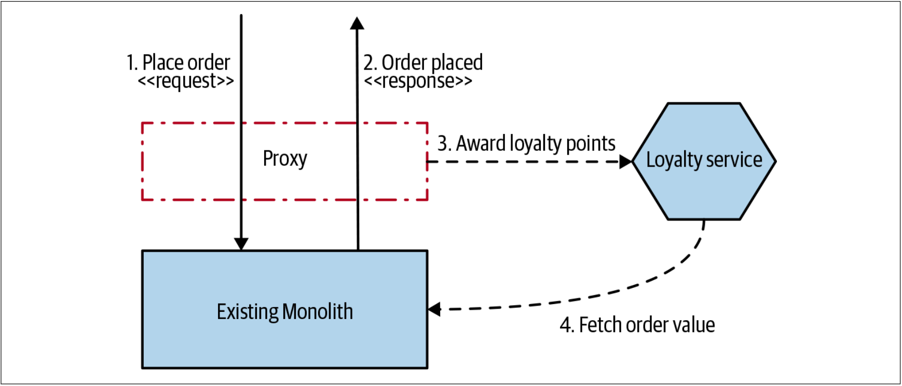

# 装饰协作模式 
如果要基于单体内部发生的事情来触发某些行为，但又无法修改单体时，会发生什么？此时，装饰协作模式可以给予我们很大的帮助。广为人知的装饰器模式可以允许我们在在不改变原有对象的情况下给对象增加新功能。我们将使用装饰器来让我们的单体看起来像是直接调用了我们的服务，即使我们实际上并未修改单体。

我们不是在请求达到单体之前截获调用，而是允许这些请求照常执行。然后，基于请求的结果，我们可以利用任意的协作机制来调用外部微服务。让我们通过Music Corp的例子来详细探讨这个想法。

## 会员计划的例子
Music Corp公司整体上在围绕用户而工作！我们希望增加根据用户下单情况而给用户增加积分的功能，但是我们当前的下单功能非常复杂，我们不希望立即对其修改。因此，下单功能将保留在现有的单体中，但我们将使用一个代理来拦截这些调用，并根据单体的响应结果来确定要给用户增加多少积分，如[图3-32](#f332)所示。

图3-32. 成功下单后，代理会调用Loyalty服务为用户增加积分

绞杀者模式让代理非常简单。现在，我们的代理正具备更多的“智能”。 它需要请求新的微服务，并将响应回传给用户。和以前一样，请时刻关注代理的复杂度。在代理中增加的代码越多，最终，它就越有可能成为具有微服务功能的微服务。此时，代理作为一种技术的服务，也会具有我们之前讨论的关于微服务的所有挑战。

另一个潜在的挑战是，我们需要从入站请求中获取足够的信息才能够调用微服务。例如，如果我们想基于订单的价格来奖励积分，但是在下单的请求或响应中又没有订单价格，那么我们可能需要查找额外的信息——也许会回调单体来获取所需的信息，如[图3-33](#f333)所示。

图3-33. Loyalty服务需要加载额外的订单的详细信息来确定奖励用户多少积分

该调用可能会产生额外的负载，并且会引入循环依赖，因此最好修改单体以便在下单完成后可以提供所需的信息。但是，这可能需要修改单体的代码，或者可能需要使用更具侵入性的技术，例如变更数据捕获技术（*CDC: change data capture*）。

## 何处使用
在保持简单时，与CDC相比，装饰协作模式是一种更优雅、耦合性更低的方法。当可以从入站请求或者单体响应中提取所需信息时，装饰协作模式最有效。在需要更多信息才能调用新服务时，装饰协作模式最终会变得更加复杂。我的直觉是，如果单体的请求和响应不包含所需的信息，在使用此模式之前请仔细思考。