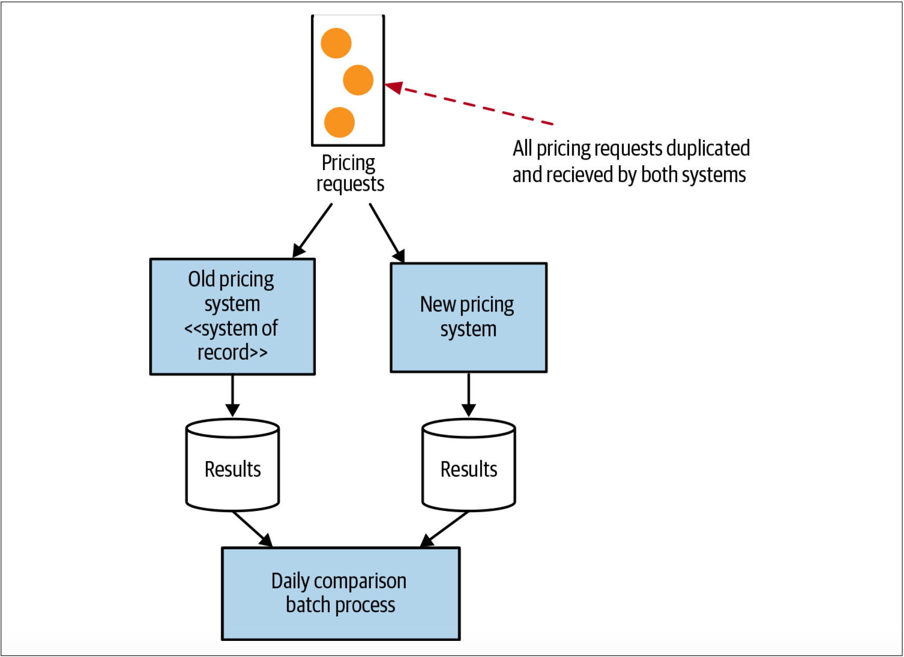

# 并行运行模式
在新实现部署之前，所能做的事情也就只有执行尽可能多的测试了。在正常测试过程中，需要尽最大努力来尽可能的模拟生产环境，并完成对新微服务的预发布的验证。但是我们都知道，考虑生产环境中可能发生的每个场景并非总是可以实现。但是，我们还有其他可用的技术。

绞杀者模式和抽象分支模式都允许在生产环境中同时存在同一功能的新旧实现。通常，这两种技术都允许我们或者执行单体中的旧实现，或者执行基于微服务的新解决方案。为了降低切换到新的基于服务的实现的风险，这些技术使我们能够快速切换回以前的实现。

当使用并行运行时，我们不是调用新旧实现的其中之一，而是同时调用二者，以允许我们比较其结果以确保它们是等效的。尽管调用了两种实现，但在任何给定的时间内，只有一个实现的结果是正确的。一般而言，在不断校验并相信我们的新实现之前，我们认为旧实现的结果是正确的。

尽管并行运行模式通常用于并行运行两个系统，但该模式已经以不同的形式被使用了数十年。当比较相同功能的两种实现时，并行运行模式在单个系统中同样有用。

并行运行技术不仅可以用于验证：新实现是否可以提供与现有实现一致的响应。并行运行技术还可用于非功能性参数的验收。例如，新服务的响应是否够快？我们发现太多超时了吗？

## 比较信贷衍生品定价的例子
许多年前，我参与了一个项目，该项目的目的在于修改一种称为信贷衍生品（*credit derivatives*）的金融产品的计算平台。银行需要确保他们所提供的各种衍生品对他们而言是明智的。银行能在这笔信贷衍生品的交易中赚钱吗？该交易风险大吗？该信贷衍生品一旦发行，市场环境也将发生变化。因此，银行还需要评估当前交易的价值，以确保它们不会因市场环境的变化而遭受巨额亏损。[^6]

我们几乎完全重写了执行这些重要计算的现有系统。由于涉及的资金量很大，而且很多人的奖金也基于所进行的交易的价值，因此人们对这种变化非常关注。我们决定同时用新老系统执行两组计算，并每天对比新老系统的计算结果。定价事件是通过事件触发的，所以，复制定价事件很简单，因此两个系统都可以计算定价，如[图3-30](#f330)所示。

图3-30. 并行运行的例子——调用两个定价系统，并离线比较结果

每天早晨，我们会对结果进行对账，并考虑结果中的任何差异。实际上，我们写了一个程序来对账。我们将对账结果写入Excel中，以便可以轻松地与银行专家讨论变化。

事实证明，我们确实有一些问题需要修复，但是我们还发现了由现有系统的bug而引起的大量差异。这意味着某些结果的差异实际上是正确的，但是我们不得不对其进行解释（由于可以在Excel中显示结果，因此该工作变得更加容易）。我记得，我不得不与分析家坐下来，并解释了为什么要以老系统的计算结果为准。

最终，一个月后，我们将计算系统切换到我们的新平台。又过了一段时间，我们淘汰了旧系统（因为我们要对老系统上完成的计算执行审计，因此我们才让老系统又运行了几个月）。

---
[^6]: Turned out we were terrible at this as an industry. I recommend Martin Lewis’s The Big Short (W. W. Norton & Company, 2010) as an excellent overview of the part that credit derivatives played in the global financial crisis of 2007–2008. I often look back at the small part I played in this industry with a great deal of regret. It turns out not knowing what you’re doing and doing it anyway can have some pretty disastrous implications.
