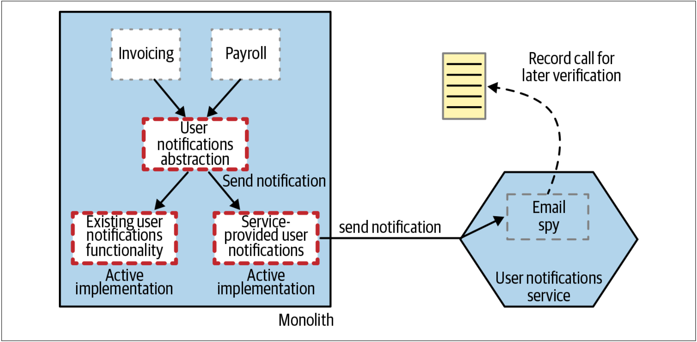

# 并行运行模式
在新实现部署之前，所能做的事情也就只有执行尽可能多的测试了。在正常测试过程中，需要尽最大努力来尽可能的模拟生产环境，并完成对新微服务的预发布的验证。但是我们都知道，考虑生产环境中可能发生的每个场景并非总是可以实现。但是，我们还有其他可用的技术。

绞杀者模式和抽象分支模式都允许在生产环境中同时存在同一功能的新旧实现。通常，这两种技术都允许我们或者执行单体中的旧实现，或者执行基于微服务的新解决方案。为了降低切换到新的基于服务的实现的风险，这些技术使我们能够快速切换回以前的实现。

当使用并行运行时，我们不是调用新旧实现的其中之一，而是同时调用二者，以允许我们比较其结果以确保它们是等效的。尽管调用了两种实现，但在任何给定的时间内，只有一个实现的结果是正确的。一般而言，在不断校验并相信我们的新实现之前，我们认为旧实现的结果是正确的。

尽管并行运行模式通常用于并行运行两个系统，但该模式已经以不同的形式被使用了数十年。当比较相同功能的两种实现时，并行运行模式在单个系统中同样有用。

并行运行技术不仅可以用于验证：新实现是否可以提供与现有实现一致的响应。并行运行技术还可用于非功能性参数的验收。例如，新服务的响应是否够快？我们发现太多超时了吗？

## 比较信贷衍生品定价的例子
许多年前，我参与了一个项目，该项目的目的在于修改一种称为信贷衍生品（*credit derivatives*）的金融产品的计算平台。银行需要确保他们所提供的各种衍生品对他们而言是明智的。银行能在这笔信贷衍生品的交易中赚钱吗？该交易风险大吗？该信贷衍生品一旦发行，市场环境也将发生变化。因此，银行还需要评估当前交易的价值，以确保它们不会因市场环境的变化而遭受巨额亏损。[^6]

我们几乎完全重写了执行这些重要计算的现有系统。由于涉及的资金量很大，而且很多人的奖金也基于所进行的交易的价值，因此人们对这种变化非常关注。我们决定同时用新老系统执行两组计算，并每天对比新老系统的计算结果。定价事件是通过事件触发的，所以，复制定价事件很简单，因此两个系统都可以计算定价，如[图3-30](#f330)所示。

图3-30. 并行运行的例子——调用两个定价系统，并离线比较结果

每天早晨，我们会对结果进行对账，并考虑结果中的任何差异。实际上，我们写了一个程序来对账。我们将对账结果写入Excel中，以便可以轻松地与银行专家讨论变化。

事实证明，我们确实有一些问题需要修复，但是我们还发现了由现有系统的bug而引起的大量差异。这意味着某些结果的差异实际上是正确的，但是我们不得不对其进行解释（由于可以在Excel中显示结果，因此该工作变得更加容易）。我记得，我不得不与分析家坐下来，并解释了为什么要以老系统的计算结果为准。

最终，一个月后，我们将计算系统切换到我们的新平台。又过了一段时间，我们淘汰了旧系统（因为我们要对老系统上完成的计算执行审计，因此我们才让老系统又运行了几个月）。

## Homegate公司的房产清单的例子
正如我们先前在第93页[“FTP的例子”](Pattern_Strangler_Fig_Application.md#ftp协议的例子)中所讨论的那样，Homegate并行运行两个列表导入系统，并比较新微服务与现有单体的运行结果。客户上传一次FTP会触发两个系统的运行。一旦确认新的微服务以同样的方式运行，则会在旧的单体中禁用FTP导入。

> **
N-Version编程
**
> 
> 可以说，在某些安全性至关重要的控制系统（例如飞机的电传飞行控制系统（*fly by wire*））中会存在某种并行运行的变体。飞机不再依赖机械控制，而是越来越依赖数字控制系统（*digital control system*）。当飞行员使用fly-by-wire而不是拉线来控制飞机的方向舵（*rudder*）时，会将控制输入发送到控制系统，以决定飞机的偏航角度。这些控制系统必须解释它们正在发送的信号，并采取适当的行动。
>
> 显然，这些控制系统中的bug相当危险。为了消除系统缺陷的影响，在某些情况下，会同时使用相同功能的多个实现。信号会发送到同一子系统的所有实现中，然后不同的实现对该信号做出响应。然后，对不同实现的响应结果进行比较并选出正确的响应，一般而言，该选择通过投票来表决。这种技术被称之为N-version编程技术[^7]。
>
> N-version编程的最终目标是不替换任何实现，这与我们在本章中介绍的其他模式不同。反之，可以相互替换的所有实现将继续彼此共存，并且这些可以相互替换的实现有望减少任何给定子系统中的bug所带来的影响。

## 校验技术
我们可以用并行运行模式来比较两个实现的功能等效性。如果我们以前面介绍的信贷衍生品定价为例，则可以将两个版本视作函数——给定相同的输入，我们期望得到相同的输出。但是，我们也可以（并且应该）对非功能性方面进行验证。跨网络边界的调用可能会引入大量的延迟，并且可能会因为超时，分区（*partitions*）等原因而导致请求丢失。因此，我们的验证过程还应该扩展到：确保在可接受的故障率范围内以及响应时间内完成对新微服务的调用。

## 使用间谍技术
对我们之前的通知功能的例子而言，我们不想向客户发送两次电子邮件。在这种情况下，间谍技术可能会派上用场。间谍模式来源于单元测试，间谍程序可以代表某项功能，并允许我们在某些事情完成后进行验证。间谍程序以桩的形式表示并替换某些功能。

因此，对于Notification功能，我们可以使用间谍程序替换实际发送电子邮件的代码，如[图3-31](#f331)所示。然后，新的通知服务将在并行运行阶段使用此间谍程序，以便我们可以验证：当服务接收到`sendNotification`调用时是否会触发发送电子邮件的行为[^译注1]。

图3-31. 在并行运行阶段，用间谍程序来校验发送邮件的功能

请注意，我们可能已经决定在单体内部使用间谍程序来避免对Notification服务发起远程调用。但是，这可能并非我们希望的事情，因为实际上，我们确实希望考虑远程调用的影响，以了解新Notification服务的超时、故障或一般延迟是否会导致问题。

事实上，间谍程序运行于单独的进程中，这会增加验证过程的复杂度。如果我们希望在原始请求的范围内进行实时验证，则可能需要在Notifications服务上开放某些方法，以允许在调用发送到我们的Notifications服务之后可以进行验证。这中做法的工作量很大，而且在许多情况下，我们不需要实时验证。交互录制模型可以用于校验进程外的间谍程序，以允许执行带外（*out of band*）校验[^译注2]（也许是天级别的校验）。显然，使用间谍程序替换对Notifications服务的调用，可以简化校验，但同时，我们可以做的测试却更少了！用间谍程序替代的功能越多，实际测试的功能就越少。

## Github Scientist
GitHub的`Scientist`库是一个著名的库，可帮助我们在代码级实施并行运行模式。`Scientist`是一个Ruby库，可以并行运行新、旧实现并捕获有关新实现的信息，以帮助我们了解新的实现是否正常运行。我自己并没有使用过`Scientist`库，但是我可以看到使用这样的库是如何真正帮助大家基于现有系统来验证新的微服务系统。如今，该库已经有多个语言版本的实现：Java，.NET，Python，Node JS，……

## Dark Launching and Canary Releasing
值得一提的是，并行运行不同于传统意义上的金丝雀发布。金丝雀发布会让部分用户体验到新功能，而其他的大多数用户看到的还是旧的实现。这种方法的目的是：如果新系统出现问题，则仅会影响一小部分的请求。

另一个相关的技术被称为**dark launching**[^译注3]。利用**dark launching**，我们可以部署并测试新功能，但是新功能对用户是不可见的。因此，并行运行是实现**dark launching**的一种方法：实际上，在我们切换系统之前，用户都无法感知到“新”功能。

**dark launching**，并行运行，和金丝雀发布是用来验证新功能是否正常工作的技术。在新功能不能按预期的工作时，该技术还可以用来降低影响。所有的这些技术都被称为“渐进式交付（*progressive delivery*）”。渐进式交付是James Governor创造的一个术语集，该术语集描述了用来帮助控制如何以更细微的方式向用户推出软件的系列方法，从而允许我们在验证功效时更快地发布软件。

## 何处使用并行运行模式
实施并行运行是一件很琐碎的事情，通常只对高风险的变更实施该模式。我们将在第4章中审查用于医疗记录的并行模式的例子。对于何时使用并行运行模式，我肯定会经过相当仔细的选择——实施这种模式需要与可以获取的利益进行权衡。我只使用过一两次并行运行模式，但是在使用时，它极其有用。

---
[^6]: Turned out we were terrible at this as an industry. I recommend Martin Lewis’s The Big Short (W. W. Norton & Company, 2010) as an excellent overview of the part that credit derivatives played in the global financial crisis of 2007–2008. I often look back at the small part I played in this industry with a great deal of regret. It turns out not knowing what you’re doing and doing it anyway can have some pretty disastrous implications.
[^7]: See Liming Chen and Algirdas Avizienis, “N-Version Programming: A Fault-Tolerance Approach to Reliability of Software Operation,” published in the Twenty-Fifth International Symposium on Fault-Tolerant Computing (1995).

[^译注1]: side effect是针对函数而言的，如果一个函数修改了自己范围之外的资源，则称之为有副作用，否则，就没有副作用。此处，新的服务会触发给用户发送邮件，因此，称之为副作用。
[^译注2]: 在计算机领域， 带外管理 （ Out-of-band management ）指的是使用独立管理通道来进行设备维护。因此，此处的带外校验也就是利用独立的其他进程来校验结果。
[^译注3]: 此处不再对该术语进行翻译，避免因此而带来的语义差异。

