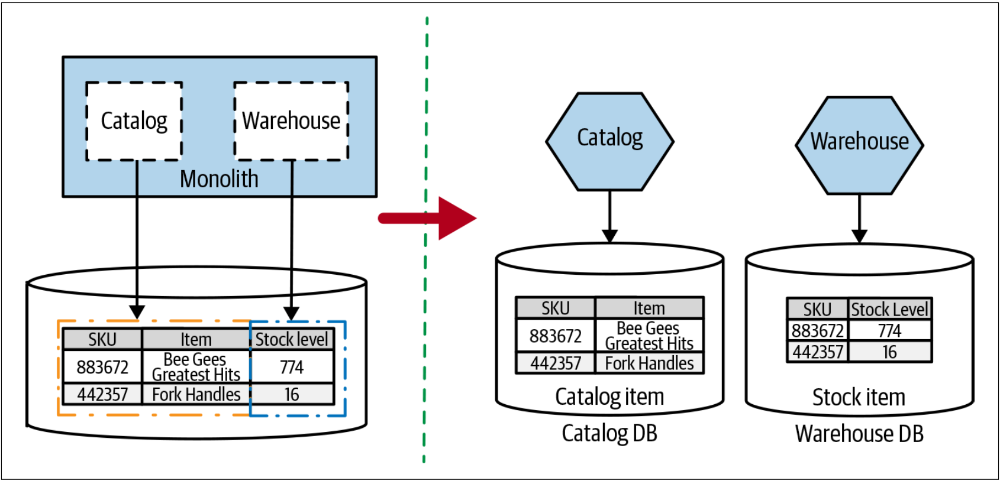
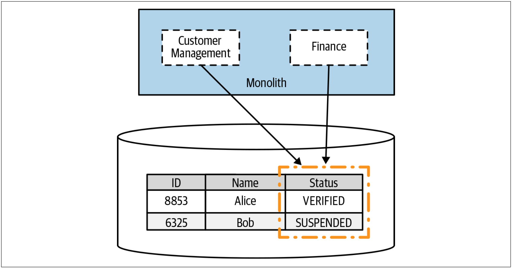
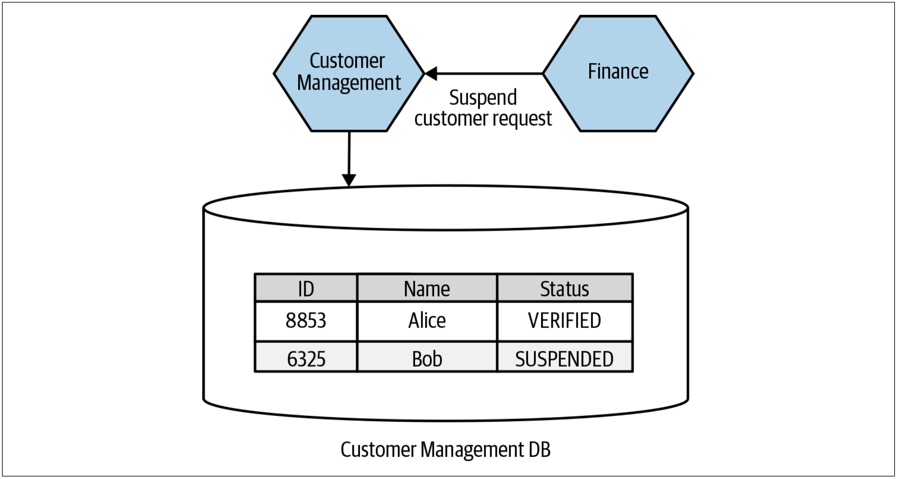

# 拆分表
有时，会在一个表中发现需要跨越两个或多个服务边界的数据，并且这可能会变得很有趣。在[图4-34](#f434)中，有一个共享表——Item表，Item表不仅存储所售商品的信息，还存储库存相关的信息。

图4-34. 桥接两个界定的上下文的单个表

在该例子中，我们希望把Catalog和Warehouse拆分为新服务，但这两个服务的数据却混合存储在一个表中。因此，我们需要把数据拆分为两个表，如[图4-34](#f434)所示。本着增量迁移的精神，在拆分schema之前，应先在现有的schema中拆分表。如果这些表位于单个schema中，则有必要声明`Stock.SKU`列到`Catalog.SKU`的外键。但是，由于我们计划将这些表最终迁移到单独的数据库中，此时，我们将不会用一个数据库来确保数据的一致性（我们将在短期内更详细地探讨这一想法），因此我们可能不会从创建外键中获得太多收益。

这个例子很简单，可以轻松地实现按照列来分离数据。但是，当很多代码都会更新同一列时，会发生什么？在[图4-35](#f435)中，我们有一个Customer表，其中包含了Status列。

图4-35. Customer Management和Finance的代码都会修改Customer表中的Status

客户在注册过程中会更新`Status`，以标记客户是否已经验证了其email。此时，`Status`的值从`NOT_VERIFIED`变为`VERIFIED`。验证后，客户便可以购物。如果客户未付款，财务模块会暂停客户的业务并把客户的`Status`更新为`SUSPENDED`。在这种情况下，客户的`Status`看起来仍然是客户域模型的一部分，因此，`Status`还应该由将来的Customer服务来管理。记住，在可能的情况下，我们希望把域实体（*domain entity*）的状态机保留在单个服务边界内。对于客户而言，更新状态看起来肯定是其状态机的一部分！这意味着服务拆分之后，我们的新的Finance服务需要调用Customer服务以更新此状态，如[图4-36](#f436)所示。

图4-36. 新的Finance服务需要进行服务调用以暂停客户的业务

像这样来拆分表的一个大问题是，我们失去了数据库事务赋予我们的安全性。本章的末尾，在[187页的**事务**]()和第[193页的**Sagas**]()中，我们将更深入地探讨该主题。

## 何处使用该模式
从表面上看，拆分表似乎很简单。当表由当前单体中的两个或更多界定的上下文所拥有时，需要对齐这些界定的上下文来拆分表。如果发现代码库的多个部分会更新表中的特定列，则需要判断：谁应该“拥有”该数据。还要明确“拥有”该数据的代码是现有的领域概念吗？这些判断将有助于确定该数据的位置。
