# 绞杀者模式
绞杀者模式是一种系统重写的常见技术。[Martin Fowler](https://martinfowler.com/)从某种藤类植物汲取灵感，并首次提出了[绞杀者模式](https://martinfowler.com/bliki/StranglerFigApplication.html)。这种藤生长于树上部的树枝，然后朝着地面的方向生长并落地生根，最后逐渐包围原来的树木。这种藤所包围的树为新的藤提供最初的结构支撑，并且如果到最后阶段，我们可能会看到原来的树死了、并且腐烂了，只剩下了新的、现在自支撑的藤。



**Martin Flower博客中提到的绞杀藤图片**



与此类似，在软件开发中，我们的新系统最初应由现有系统支持和包装。这个主意就是：新、旧系统可以共存，给予新系统成长的时间，并完全替代旧系统。我们将很快看到，这种模式的主要好处是它支持我们增量迁移到新系统的目标。而且，这种模式使我们在可以利用已经发布的新系统的优势的同时，具备暂停甚至完全停止迁移的能力。

很快就会看到，当我们在软件中实现绞杀者模式时，我们不仅要努力朝着新的应用程序架构迈进，而且还要确保每一步都易于逆转，从而降低每一步的风险。

## 绞杀者模式是如何工作的
虽然绞杀者模式通常用于从一个单体系统迁移到另一个单体系统，但我们希望利用绞杀者模式将单体系统迁移到一系列微服务。这可能涉及从单体中复制代码（如果可能），或者重新实现所讨论的功能。另外，如果所讨论的功能需要状态的持久化，则需要考虑如何将该状态迁移到新服务，并需要考虑如何再将该状态迁回单体。我们将在第4章中探讨与数据相关的迁移模式。

如[图3-1](#f31)所示，实现绞杀者模式需要三个步骤：

1. 首先，确定现有系统中要迁移的部分。需要使用我们在[第2章](Trade_Offs.md)中讨论的那种权衡方式，来判断要首先解决系统的哪些部分。
2. 然后，需要在新的微服务中实现此功能。
3. 在准备好新的实现之后，需要能够将调用从单体重新路由到新的微服务。

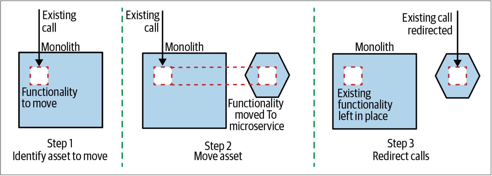

图3-1. 绞杀者模式概览

值得注意的是，在将调用重定向到迁移之后的服务之前，即使已将新功能部署到生产环境中，但从技术角度而言，该新功能仍然没有启用。这意味着，我们可能会花一些时间来获得正确的功能，并在一段时间内实现该功能。我们可以把这些修改推送到生产环境中，并在知道尚未使用新服务的情况下，让我们对修改感到安全，也让我们对新服务的部署和管理感到满意。一旦新服务实现了与单体一样的等效功能，就可以考虑使用类似并行运行（*parallel run*）的模式（稍后将探讨并行运行模式），让我们确信新功能可以按照预期运行。


区分部署（*deployment*）和发布（*release*）的概念非常重要。仅仅把软件部署到给定的环境并不意味着用户实际上正在使用它。将这两件事视为独立的概念，可以在服务使用前在最终的生产环境中验证软件的能力，从而可以降低新软件的风险。类似绞杀者模式，并行运行（*parallel run*）和金丝雀发布（*canary release*）之类的模式就利用了部署和发布是独立活动这一事实。


绞杀者方法的关键点不仅在于我们可以逐步将新功能迁移到新系统，而且在于，如果需要，我们还可以非常轻松地回滚此变更。记住，我们都会犯错，因此我们希望拥有一种技术，使我们不仅可以尽可能低成本地犯错误（因此会有很多小步骤），而且还可以快速修正错误。

如果单体内部的其他功能也会用到正在抽取的功能，则我们还需要修改这些调用的方式。我们将在本章的后面介绍一些技术用于解决这种场景。

## 何处使用绞杀者模式
绞杀者模式可让我们在无需触碰或修改现有系统的情况下将功能迁移至新的服务架构。当现有的单体还由其他人一起开发时，绞杀者模式可以减少不同人员之间的冲突。当单体程序实际上是一个黑盒系统（例如，第三方软件或SaaS服务）时，绞杀者模式也非常有用。

有时，我们可以一次提取一个完整的、端到端的、功能切片，如[图3-2](#f32)所示。除了对数据的担忧之外，这大大简化了功能抽取的过程。我们将在本书的后面部分介绍数据相关的内容。

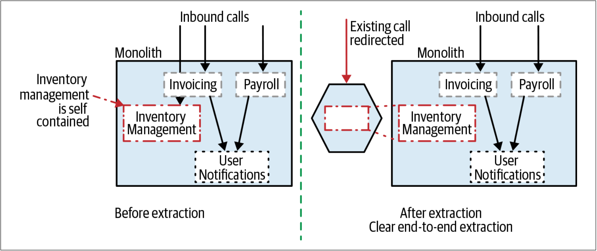

图3-2. 库存管理功能的简单的端对端的抽象

为了执行这种整洁的（*clean*）端到端抽取，我们可能倾向于提取更大的功能组以简化该过程。这可能会导致一个比较棘手的平衡——抽取更大的功能切片，将会承担更多的工作，但会简化某些集成的挑战。

如果我们确实想“蚕食”，我们可能需要考虑更多的“浅”抽取，如[图3-3](#f33)所示。此时，我们会抽取Payroll功能，但是实际上，Payroll功能会依赖仍旧位于单体中的其他功能，例如此例中的发送用户通知的功能。

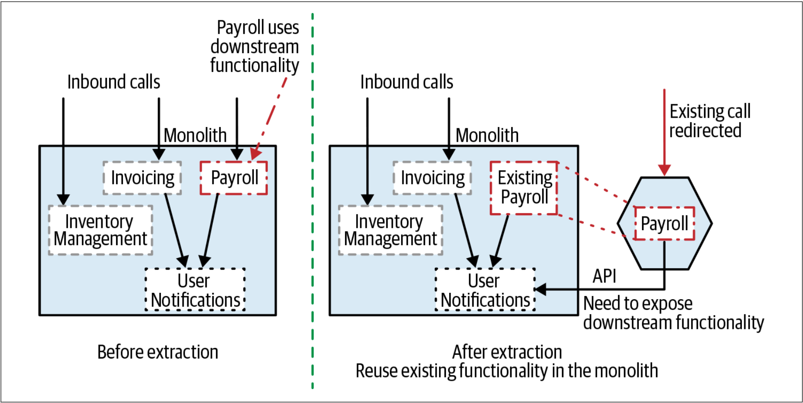

图3-3. 抽取的功能仍然依赖单体

我们没有重新实现User Notifications功能，而是通过在单体中公开该功能，从而为我们的新微服务提供了User Nofitifications功能——显然，这需要修改单体本身。

但是，为了使绞杀者模式可以发挥作用，我们需要理清我们关注的功能到我们希望迁移的部分的[入站](Domain_Driven_Design.md#fn_译注3)调用图。例如，在[图3-4](#f34)中，我们理想的情况是迁移给用户发送User Notifications的功能到一项新服务中。但是，由于该通知由现有单体的多个入站调用而触发，因此，我们无法清晰地重定向来自系统外部的调用。取而代之的是，我们需要研究一种类似于第104页[^译注1]的“[抽象分支模式](Pattern_Branch_by_Abstraction.md)”中所述的技术。

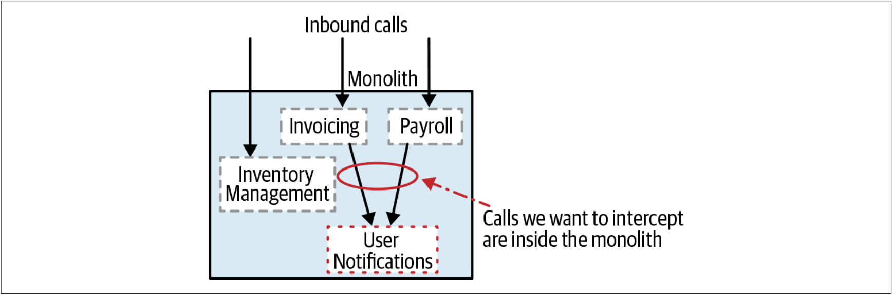

图3-4. 当要迁移的功能位于现有系统的较深的层次时，则绞杀者模式无法发挥作用

我们还需要考虑对现有系统进行请求的调用的性质。正如我们稍后将探讨的，类似HTTP之类的协议非常适合**重定向**。

HTTP本身具有内置的透明重定向的概念，代理可以使用该概念来清晰的了解入站请求的性质并做出对应的转发。其他类型的协议（例如某些RPC）则可能不太适合重定向。我们需要在代理层做的用来理解并转发入站调用的功能越多，则此协议的可行性越小。

尽管有这些限制，但绞杀者模式一次又一次地证明了自己是一种非常有用的迁移技术。作为一种轻巧易用、且易于处理增量变更的方法，在探索如何迁移系统时，绞杀者模式通常是我的首选方法。

## HTTP反向代理
HTTP具有某些很有趣的能力。HTTP可以轻而易举的以一种对调用者透明的方式对请求进行拦截并重定向。这意味着可以使用绞杀者模式迁移现有的、HTTP接口的单体系统。

在[图3-5](#f35)中，我们看到了对外公开HTTP接口的现有单体系统。该应用程序可能是**无头应用**（*headless*）[^译注2]，或者实际上可能是由上游UI调用的HTTP接口。无论哪种方式，我们的目标都是相同的：在上游调用和下游单体之间插入一个HTTP反向代理。

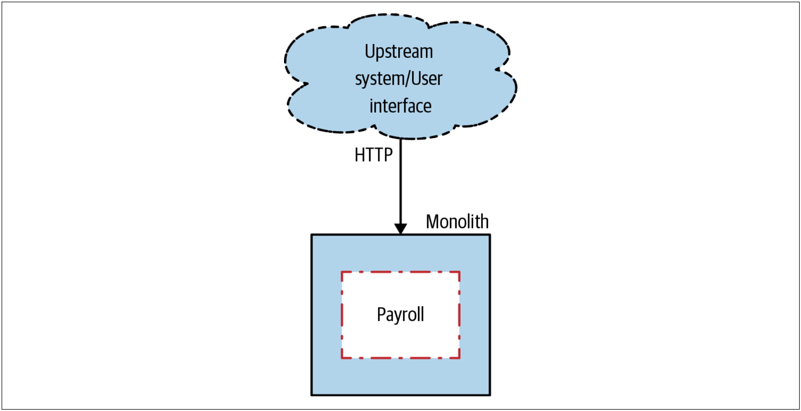

图3-5. 应用绞杀者模式前的以HTTP驱动的单体系统 



**正向代理和反向代理**

代理有正向代理和反向代理之分，因此，在继续探讨之前，需要对不同的代理有一个概念上的区分。

如果从代理的对象而言，我们可以较为容易的对二者进行区分。

如果，代理是用来代表用户访问原来用户无法直接访问到的资源，这种情况就属于正向代理。在使用正向代理时，用户一般需要手动进行配置，例如`export http_proxy=http://127.0.0.1:1087`，用户也会非常明确，此时是使用代理来访问目标资源。

如果，代理对于用户是透明的，代理是用来代理所访问的资源时，这个时候的代理就属于反向代理。例如nginx在做负载均衡时所起到的作用。



### 步骤1：插入反向代理
除非已经有了合适的、可重复使用的HTTP反向代理，否则建议首先让HTTP反向代理就位，如[图3-6](#f36)所示。在第一步中，反向代理无需对请求做任何处理，只是仅仅透传所有的调用。

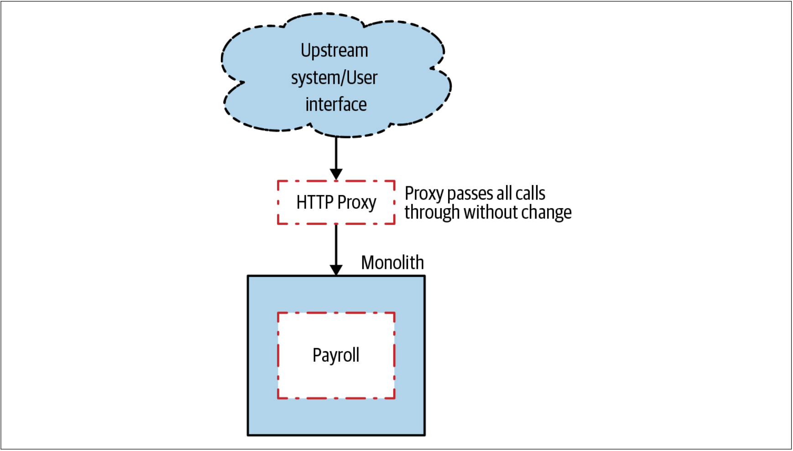

图3-6. 步骤1：在单体和上游系统之间插入反向代理

通过此步骤，我们可以评估在上游调用和下游单体之间增加额外的网络节点的影响。我们需要对新增加的代理组件设置任何必须的监控，并且基本上需要观察一段时间。从延迟的角度来看，我们将在所有请求的处理路径中增加一个网络节点和处理进程。我们期望使用良好的代理和网络来使得对延迟的影响最小（也许在几毫秒左右）。但是，如果事实并非如此，则我们有机会停下步伐并在继续前进之前将延迟太大的问题调查清楚。

如果单体前面的代理已经就绪，则可以跳过此步骤。但是，务必确保我们了解如何重新配置此代理以重定向请求。我建议至少要有重定向的经验，以在假定稍后代理可以工作前确保代理可以按照预期工作。如果在打算给新服务发送请求之前，就发现这是不可能的，那这真是令人讨厌的惊喜！

### 步骤2：迁移功能
如[图3-7](#f37)所示，一旦我们的HTTP 反向代理就绪，接下来，我们就要开始抽取我们的新的微服务。

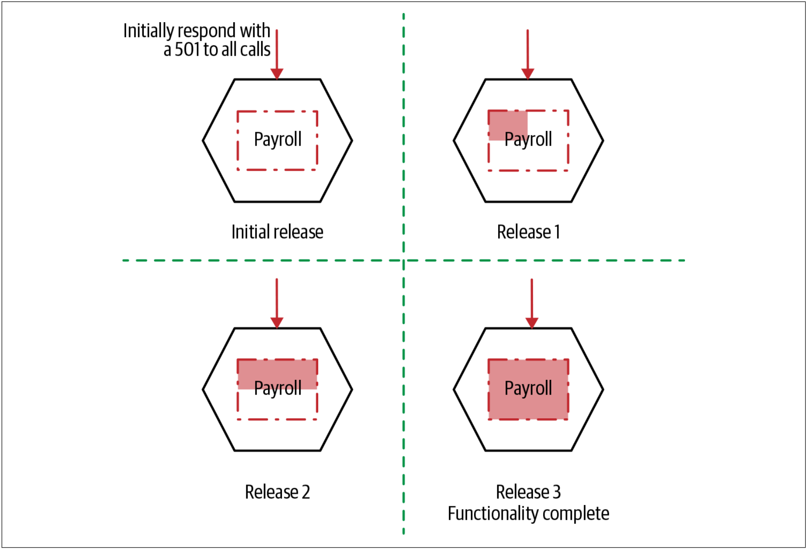

图3-7. 增量实现要迁移的功能

此步骤本身可以分为多个阶段。首先，在没有实现任何功能的情况下，启动并运行基本服务。服务需要能够接收对应功能的调用，但是在此阶段，可以只返回**501 Not Implemented**。即使在这一步，我们也会将此服务部署到生产环境中。这使我们可以熟悉生产部署过程，并可以测试就绪的服务。此时，我们的新服务尚未发布，因为我们尚未重定向现有的上游调用。实际上，我们将软件部署从软件发布中区分开来，这是一种常见的发布技术，稍后我们将再次介绍。

### 步骤3：调用重定向
如[图3-8](#f38)所示，一旦我们完成了需要迁移的所有功能，我们重新配置代理即可实现调用的重定向。如果由于某种原因而失败，那么我们可以将重定向切换回去——对于大多数代理来说，这是一个非常快速和容易的过程，从而可以实现快速回滚。

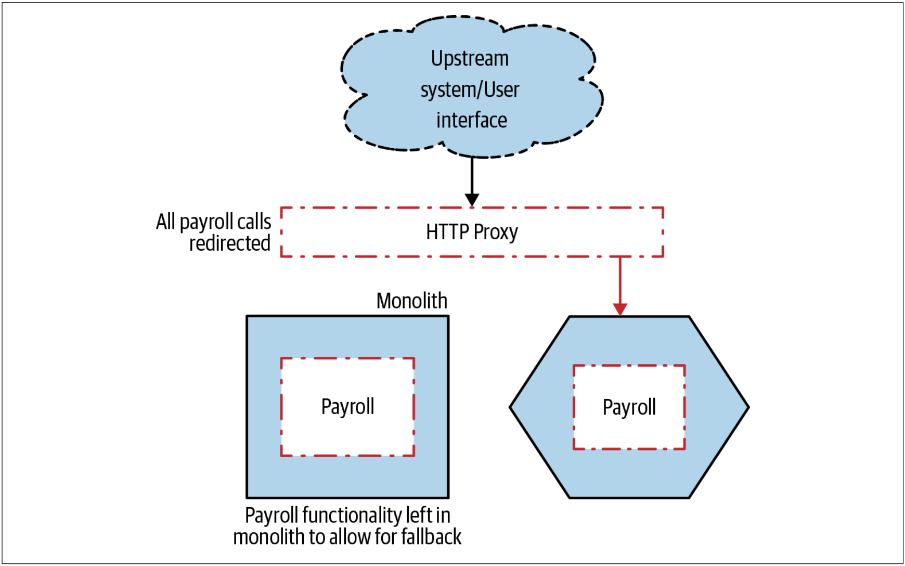

图3-8. 将调用重定向到Payroll功能，然后完成迁移

我们可能决定使用某种类似功能切换之类的方法来实现重定向，这种方式可以使所需的配置状态更加明显。在使用金丝雀发布时，可以考虑使用代理重定向调用的方式来实现增量发布新功能。当然，也可以应用于并行运行模式，或者其他本章将会讨论的模式。

## 如何解决数据的迁移？
到目前为止，我们还没有谈论如何迁移数据。在[图3-8](#f38)中，如果我们新迁移的Payroll服务需要访问单体中的数据库时，我们该怎么办？ 关于数据的迁移，我们将在第4章中更全面地探讨。

## 代理的选择
代理的实现方式部分取决于单体使用的协议。如果现有的单体使用HTTP，那么会是一个不错的开始。对HTTP的支持如此的广泛，以至于对管理重定向而言，我们有太多的选择。我可能会选择像NGINX这样的专用于代理的软件。NGINX是在考虑了这类场景的情况下而创建的，并且可以支持多种重定向的机制。我们可以尝试并测试NGINX提供的不同的重定向机制，并且这些重定向机制看起来表现非常好。

相较于某些重定向，有的重定向更简单。考虑使用**URI path**来重定向，也许就像REST[^译注3]资源所展示的那样。在[图3-9](#f39)中，我们将整个Invoice资源迁移到了我们的新服务上，这很容易通过解析**URI path**来实现重定向。

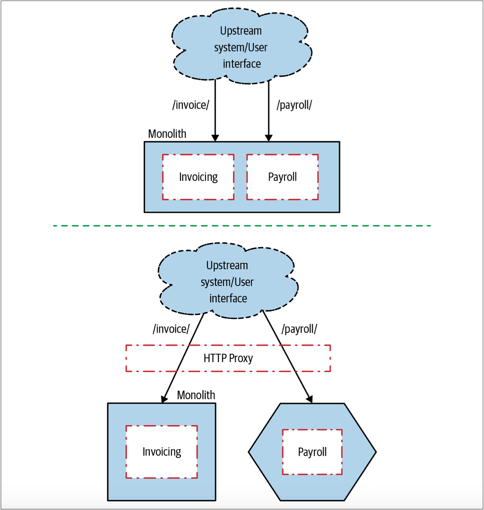

图3-9. 根据资源重定向

但是，如果当前的系统把关于被调用的功能特性的信息隐藏于请求体（*request body*）中（可能是表单参数），则我们需要利用POST参数来控制重定向规则，这种方式有时是可以的，但是会更复杂。如果我们发现我们遇到了这种情况，此时有必要检查我们可以选择的代理，以确保它们能够处理这种场景。

如果截获并重定向的特性太过复杂，或者单体所使用的协议的支持力度并不广泛，此时，我们可能会动心去自己编写一些代码。但是，对于自己编写代码的这种方法而言，我们要非常谨慎。之前，我已经手工编写了几个网络代理（一个用Java实现，另一个用Python实现），但是，这可能只能用来说明我的编码能力。并且在各种场景下，我自己编写的代理的效率都非常低，这大大增加了系统的延迟。如今，如果我需要更多的自定义功能，我可能会考虑将自定义功能添加到一个专用代理中。例如，NGINX允许我们使用Lua来为NGINX增加自定义功能。

### 增量推新
如[图3-10](#f310)所示，反向代理技术允许通过一系列小步骤改变架构，并且，每一个的小步骤都可以与系统的其他工作一起完成。

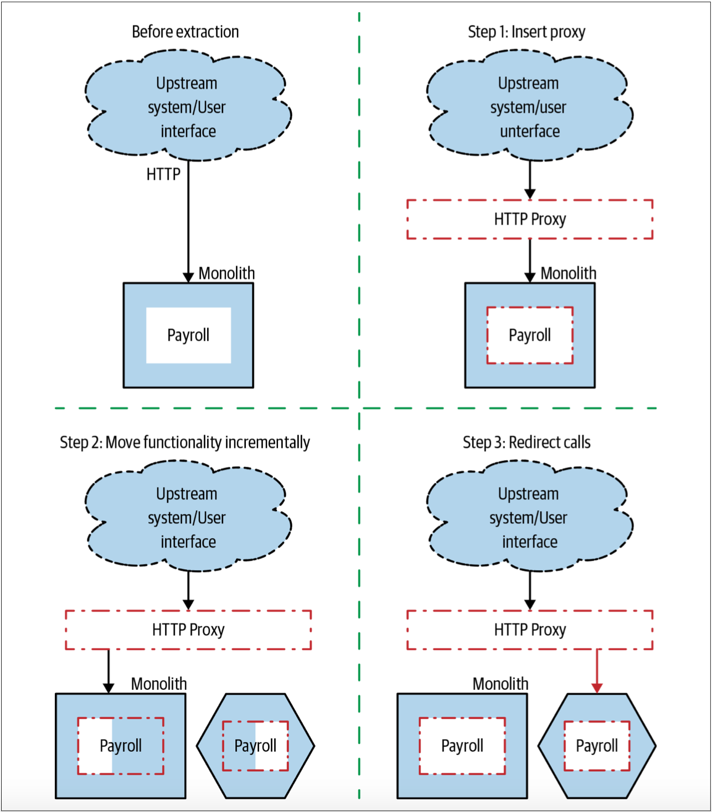

图3-10. 基于HTTP的绞杀者模式的实现

我们可能会认为，完全切换到Payroll功能的新实现的工作量仍然太大。在这种情况下，可以迁移较少的功能。例如，如[图3-11](#f311)所示，可以考虑仅迁移部分Payroll功能并适当的转换调用方式——部分功能在单体中实现，部分功能在微服务中实现。如果单体和微服务中的功能都需要查看同一组数据，则可能会导致问题。此时可能需要共享数据库，并且会带来因共享数据库而导致的所有问题。

没有巨大的变更，在架构升级时，无需停止升级的进程[^译注4]。代理技术可以更容易的将迁移工作拆解为多个阶段，并且还可以与其他交付工作一起交付。与其将工作（*backlog*）拆分为“feature”story 和“technical”story，不如将所有这些工作放在一起。要擅长增量修改技术0架构，同时又能提供新功能！

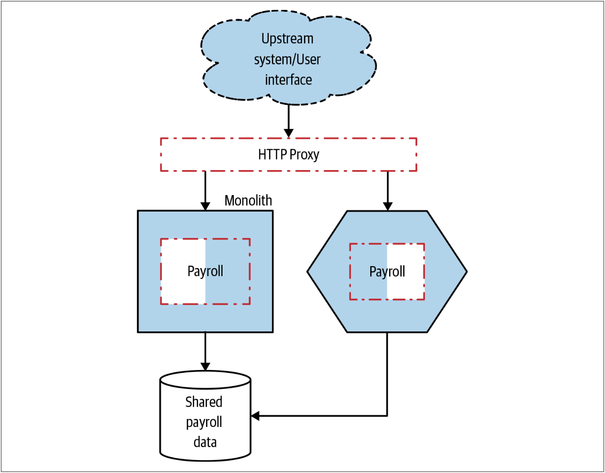

图3-11. 基于HTTP的绞杀者模式的实现

## 改变协议
也可以使用代理来转换调用的协议。例如，当前对外开放的可能是基于HTTP的SOAP接口，但是新的微服务将改为gRPC接口。然后，我们可以配置代理以对请求和响应做相应的转换，如[图3-12](#f312)所示。

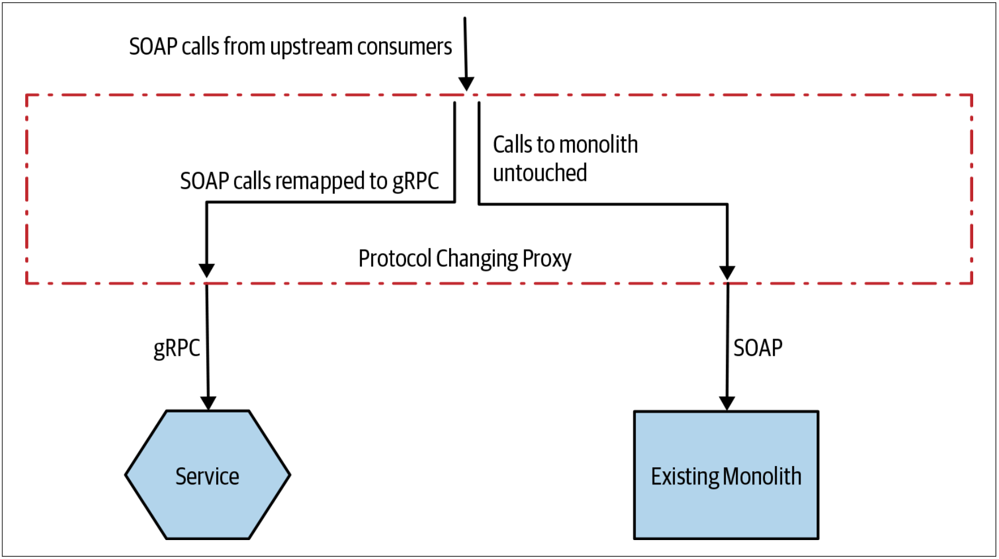

图3-12. 作为绞杀者模式迁移的一部分，可以使用代理来改变通信协议

对于这种方法而言，由于代理服务器本身的复杂度和执行逻辑开始不断积累，因此，我确实对此方法有所担忧。对于单个服务，这看起来还不错。但是，如果开始转换多个服务的协议，则在代理中完成的工作会越来越多。我们通常会优化服务的独立部署，但是，如果多个团队都需要编辑一个共享的代理层，则会降低变更以及部署变更的速度。需要注意的是，我们增加的不只是一个新的冲突来源。当我们讨论微服务架构时，经常会有这样的口头禅：**“Keep the pipes dumb, the endpoints smart”**[^译注5]。我们希望减少推送到共享中间件层的功能，因为将更多的功能推送到共享的中间件层的方式确实会降低功能开发的速度。



**smart endpoints and dumb pipes**

[smart endpoints and dumb pipes](https://martinfowler.com/articles/microservices.html#SmartEndpointsAndDumbPipes)出自Martin Fowler的介绍微服务的一篇文章，其含义就是：保持通信层的简单性，而让服务更智能。

这是区分微服务和SOA的最本质的特征。对于SOA而言，需要一个ESB层来整合系统中的服务，从而降低系统的复杂性。而很多的的功能和逻辑就要放在ESB层，此时可能就是一种：智能通信，而服务简单的方式了。具体如下图所示：

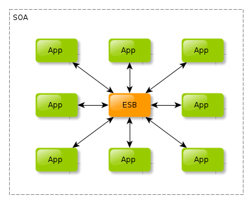

也就是说，SOA是：smart pipes and dumb endpionts。

Martin Fowler在文章中也没有否认SOA和Microservice的关系。

> This common manifestation of SOA has led some microservice advocates to reject the SOA label entirely, although others consider microservices to be one form of SOA, perhaps service orientation done right. Either way, the fact that SOA means such different things means it's valuable to have a term that more crisply defines this architectural style.
>
> 
——Martin Fowler

其实，Microservice是SOA的传承，但最本质的一个区别就在于微服务的“Smart endpoints and dumb pipes”。“Smart endpoints and dumb pipes”让微服务成为真正的分布式的、去中心化的架构，其本质就是去ESB，把所有的“智能”逻辑——包括路由、消息解析等——都隐藏在服务内部，从而去掉SOA中的那个大一统的ESB。

但是，去掉ESB之后，意味着服务之间的通信会变得更多，因为这意味着服务的拓扑结构由星型网络重新变成了总线型网络。当然，这也是微服务架构区别于传统的分布式系统的一个重要特征：网络交互的规模。但是优点就是能够做到：独立部署。



如果想迁移当前所使用的协议，我宁愿将协议的映射放在服务本身——也就是让服务同时支持新、旧通信协议。如[图3-13](#f313)所示，在服务内部，对旧协议的调用可以在服务内部重新映射为新的通信协议。这避免了对其他服务要使用的代理层的变更管理，并使该服务完全控制此功能如何随时间而变化。我们可以将微服务视为网络端点上的功能集合。我们可能会以不同的方式向不同的消费者开放相同的功能。在服务内部支持不同的消息或请求格式，基本上只是在满足上游消费者的不同需求而已。

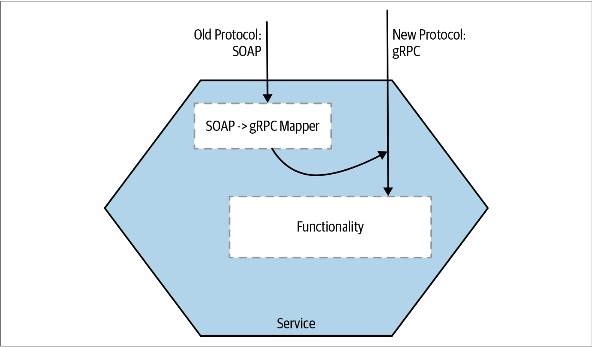

图3-13. 如果要改变协议类型，请考虑让服务通过多种协议开放其功能

在服务的内部特殊服务的请求和响应进行映射，可以让代理层保持简单，同时也让代理层更加通用。此外，通过提供同时支持两种通信协议的服务，我们也给予自己时间以在潜在的淘汰旧API之前迁移上游服务。

### service mesh
在[Square公司](https://squareup.com/us/en)，人们采用一种混合方法来解决为不同的上游服务提供不同协议的问题[^1]。他们决定从自研的RPC迁移到gRPC以实现服务到服务（*service-to-service*）的通信。gRPC是一个有着丰富的生态系统的、并有广泛支持的开源RPC框架。为了尽可能降低迁移的痛苦，他们希望减少每个服务的变更量。为此，他们使用了服务网格（*service mesh*）。

如[图3-14](#f314)所示，使用服务网格，每个服务实例都可以通过自己的专用本地代理与其他服务实例通信[^译注6]。可以为每个代理实例可以为与其配对的服务实例进行特殊配置。还可以使用控制平面（*control plane*）集中控制并监视这些代理。由于没有中央代理层（*central proxy layer*），因此，有效的避免了共享的**“smart” pipe**的隐患。此时，如果需要，每个服务可以拥有自己的“服务到服务”的通道。值得注意的是，由于Square架构的发展方式，该公司最终不得不使用开源代理Envoy创建自己的服务网格来满足其需求，而无法使用像Linkerd或Lstio这样的现有的解决方案。

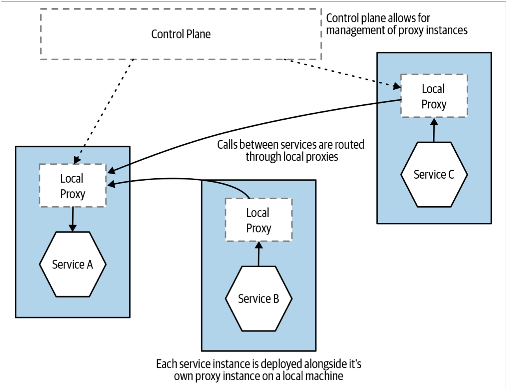

图3-14. service mesh概览

服务网格越来越受欢迎，从概念上讲，我认为服务网格的方法非常正确。服务网格是处理常见的service-to-service通信问题的好方法。我担心的是，尽管一些非常聪明的人做了很多工作，但要花一些时间才能使得服务网格的工具可以稳定的使用。毫无疑问，Istio看起来是服务网格领域的领导者，但Istio却远非是这个领域的唯一选择，并且似乎每周都会有新的工具出现。我一般建议：在做出选择之前，给服务网格尽可能多的时间来使其稳定。

### FTP协议的例子
尽管我详细的论述了绞杀者模式在基于HTTP的系统中的使用，但没有什么可以阻止我们拦截并重定向其他形式的通信协议。瑞士房地产公司Homegate使用一种绞杀者模式的变体来改变用户上传新房产清单的方式。

Homegate公司的用户通过FTP上传清单，而现有的单体系统则处理上传的文件。该公司热衷于向微服务架构转型，并且还希望开始支持一种新的上传机制。新的上传机制将不再采用FTP的批量上传方式，而是采用符合即将批准的REST API标准的REST API。 

Homegate公司不想让用户感知到变更，而是希望执行无缝更改。这意味着，至少目前，FTP仍是用户与系统交互的机制。最后，如[图3-15](#f315)所示，Homegate公司拦截了FTP上传（通过检测FTP服务器中的日志变化），并将新上传的文件定向到一个适配器，而该适配器则将上传的文件转换为新的REST API请求。

图3-15. 拦截FTP上传，并将其转到Homegate的新的listings服务

从用户的角度来看，上传过程本身并没有改变。其好处来自这样一个事实：处理上传的新服务能够更快地发布新数据，从而帮助用户更快地发布广告。稍后，会计划直接向客户开放新的REST API。有趣的是，在迁移到新服务期间，启用了两中清单上传机制。这使团队可以确保两种上传机制均能正常运行。这是“并行运行模式”的一个很好的例子，我们稍后将在第113页[^译注7]的[“并行运行模式”](Pattern_Parallel_Run.md)中探讨。

### 消息拦截的例子
到目前为止，我们已经研究了拦截同步调用，但是如果单体系统是由某种其他形式的协议驱动的呢？单体也许是通过消息代理（*message broker*）接收消息。此时，基本模式是一致的——我们需要一种方法来拦截调用，并将其重定向到我们的新微服务。主要的区别在于协议本身的性质。

#### 基于内容的路由
在[图3-16](#f316)中，我们的单体系统会接收大量的消息，我们需要拦截其中的部分消息。

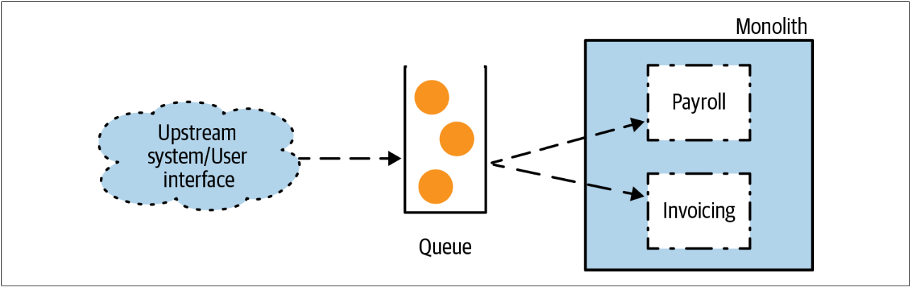

图3-16. 单体通过一个消息队列来接收请求

一种简单的方法是拦截所有将要发送给下游单体的消息，过滤消息以便可以将消息发送到合适的位置，如[图3-17](#f317)所示。这基本上就是基于内容的路由器模式的实现。Enterprise Integration Patterns[^2]中描述了基于内容的路由器模式。

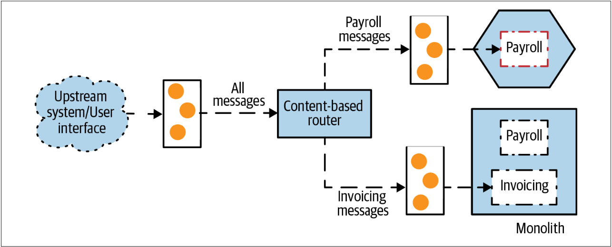

图3-17. 使用基于内容的路由来拦截调用

这种技术使我们能够保持单体不变。但是，我们在请求路径上放置了另一个队列，这可能会增加额外的延迟，这也是我们需要管理的另一件事情。另一个问题是：我们把多少“smarts”置于消息传递层？在*Building Microservices*一书的第4章，我谈到了在服务之间的网络中利用过多的“smarts”所带来的挑战，因为这会让系统更难于理解和更改。

相反，我强烈建议接受“smart endpoints, dumb pipes”的口头禅。“smart endpoints, dumb pipes”是我仍然坚持要做的事情。可以认为，基于内容的路由是我们实现了“smart pipe”，从而增加了如何路由系统之间的调用的复杂性。在某些情况下，基于内容的路由是一种非常有用的技术，但需要找到一个平衡。

#### 选择性消费
另一种选择是修改单体，让其忽略那些应该由我们的新服务接收的消息，如[图3-18](#f318)所示。此时，我们的新服务和单体共享同一个队列，并且在服务内部使用某种模式匹配程序来监听他们关心的消息。这种过滤技术是基于消息的系统中的普遍的需求，可以使用类似JMS中的Message Selector之类的技术或其他平台上的等效的技术来实现。

图3-18 使用基于内容的路由来拦截调用

[图3-18](#f318)的过滤方法不需要创建额外的队列，但是会面临很多挑战。首先，底层的消息技术可能支持也可能不支持共享单个队列的消息订阅（共享单个队列的订阅是一个通用的功能，所以如果是这种情况，我会感到惊讶）。其次，当我们要重定向调用时，需要对两项修改做出非常好地协调才可以。我们需要让单体停止读取用于新服务的调用，然后让新服务来处理消息。同样，还原调用拦截也需要执行两次修改以回滚。

同一队列的消费者类型越多，并且过滤规则越复杂，问题就会变得越多。可以想象这样一种情况：规则重叠时，两个消费者会接受到相同的消息；反之，则两个消费者均忽略了某些消息。因此，我可能会考虑仅对少量消费者或一组简单的过滤规则使用选择性消费的方法。尽管要注意前面提到的潜在缺点，尤其是陷入“smart pipes”的问题，但随着消费者类型的增加，基于内容的路由方法可能更有意义。

选择性消费方案或基于内容的路由方案所增加的复杂度是：如果我们采用异步request-response的通信方式，则需要确保可以将请求路由回客户端，并希望客户端不会意识到事情有所变化。消息驱动系统中的调用路由还有其他的选择，其中许多选择可以帮助我们实现绞杀者模式的迁移。我在这里推荐一个非常好的资源：Enterprise Integration Patterns [^2]。

## 其他的协议
希望可以从这些例子中了解：即使使用不同类型的协议，也有很多方法可以拦截对现有单体的调用。如果我们的单体是由批处理文件上传驱动的，此时该怎么办？拦截批处理文件，提取要拦截的调用，然后将其从文件中删除，最后再转发。确实，有些机制会使的此过程变得更加复杂，并且使用HTTP之类的协议会容易得多。但是，经过一些创造性的思考，绞杀者模式可以用于很多情况。

## 绞杀者模式的其他例子
在希望增量升级现有系统时，无论处于什么情况，绞杀者模式都非常有用。并且，绞杀者模式不仅限于实施微服务架构的团队。Martin Fowler在2004年提出绞杀者模式之前，该模式就已经使用了很长时间。在我的前东家——ThoughtWorks——时，我们经常使用绞杀者模式来帮助重建单体应用程序。[Paul Hammant在博客上整理了一份我们使用了绞杀者模式的、不完全的项目清单](https://paulhammant.com/2013/07/14/legacy-application-strangulation-case-studies/)。这些项目包括：trading company’s blotter，机票预订应用程序，铁路售票系统和分类广告门户网站。

---
[^1]: For a more thorough explanation, see [“The Road to an Envoy Service Mesh”](https://squ.re/2nts1Gc) by Snow Pettersen at Square’s developer blog.
[^2]: Bobby Woolf and Gregor Hohpe, Enterprise Integration Patterns (Addison-Wesley, 2003).
[^译注1]: 此处对应的是英文原书的第104页，而不是翻译之后的页数。
[^译注2]: headless为没有UI驱动的应用程序，例如谷歌浏览器的headless模式。
[^译注3]: REST: REpresentational State Transfer，也就是“表述性状态转换”。REST来自于Roy Fielding的[博士论文](https://www.ics.uci.edu/~fielding/pubs/dissertation/rest_arch_style.htm)。基于这篇论文里的理论，衍生出了RESTFul API的接口设计风格。
[^译注4]: 原文为：No big bang, stop-the-line re-platforming required.
[^译注5]: [smart endpoints and dumb pipes](https://martinfowler.com/articles/microservices.html#SmartEndpointsAndDumbPipes)。此处不对该术语进行翻译，因为保持原汁原味会更好。这个术语出自Martin Fowler的[介绍微服务的一篇文章](https://martinfowler.com/articles/microservices.html#SmartEndpointsAndDumbPipes)。其含义就是：保持通信层的简单性，而让服务更智能。这是区分微服务和SOA的最本质的特征。对于SOA而言，需要一个ESB层来整合系统中的服务，从而降低系统的复杂性，而很多的的功能和逻辑就要放在ESB层，此时可能就是一种：智能通信，而服务简单的方式了。
[^译注6]: 这种模式也成为挎斗模式。
[^译注7]: 此处为原书的第113页，而不是翻译之后的页码。