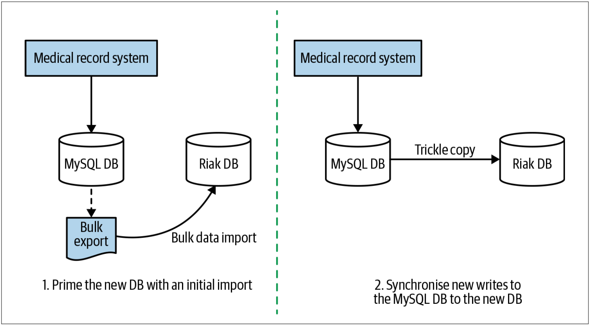
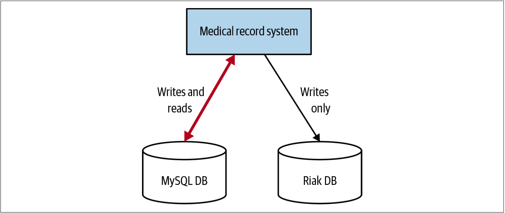
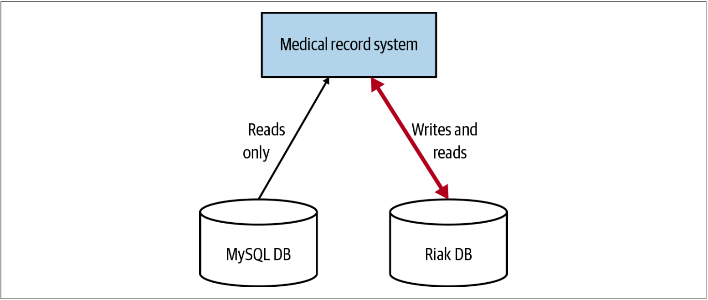
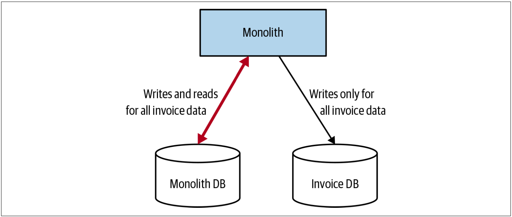
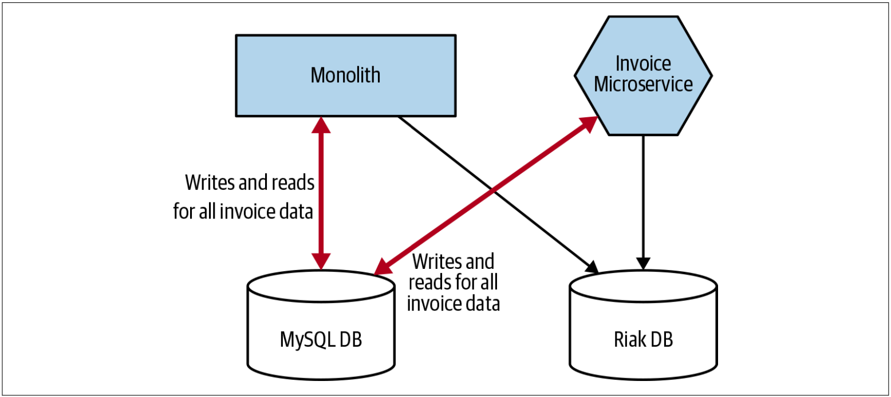

# 在应用中同步数据
即使在最简单的情况下，将数据从一个位置切换到另一位置也可能是一项复杂的工作。然而，数据越有价值，则迁移的复杂度则越高。当我们开始思考迁移病历数据时，仔细考虑如何迁移数据就显得尤为重要。

几年前，咨询公司Trifork参与了一个项目，以帮助存储丹麦公民的病历数据[^3]。该系统的初始版本已将数据存储在MySQL数据库中，但随着时间的推移，人们逐渐意识到，对于系统将会面临的挑战而言，MYSQL数据库将不再合适。人们决定使用另一种数据库：Riak。人们希望Riak数据库可以使系统得到更好地扩展以处理预期的负载，同时还可以提供改善的弹性（*resiliency*）特性。

现有系统将数据存储在一个数据库中，但是系统可以脱机的时间是有限制的，并且不丢失数据至关重要。因此，需要一种解决方案，该解决方案允许公司把数据迁移至新的数据库，同时还需要具备验证迁移的机制，并在此过程中具有快速回滚的机制。

人们决定让应用程序本身来执行两个数据源之间的数据同步。这个想法是：最初，现有的MySQL数据库仍然是数据源，但是在一段时间内，应用程序将确保MySQL和Riak中的数据保持同步。一段时间之后，Riak将在MySQL下线之前成为该应用程序的数据源。让我们更详细地看一下这个过程。

## Step 1. 批量同步数据
第一步是在新数据库中拥有数据的副本。对于病历项目而言，这涉及将数据从旧系统批量迁移到新的Riak数据库。在进行批量导入时，现有系统保持运行状态，因此，导入的数据源是从现有MySQL系统获取的数据快照，如[图4-13](#f413)。这会带来一种挑战，因为当批量导入完成时，源系统中的数据很可能已改变。然而，对于这个案例而言，让源系统脱机是不切实际的。

图4-13. 准备新的数据存储以进行基于应用程序的同步

批量导入完成后，执行CDC，从而把数据导入以后的数据修改应用到新数据库。这样可以使Riak与MySQL同步。一旦做到这一点，就该部署新版本的应用程序了。

## Step 2. 同步写操作，从老数据库读取数据
现在两个数据库都处于同步状态，因此部署该应用程序的新版本，该版本会将所有数据写入两个数据库，如[图4-14](#f414)所示。在此阶段，目标是确保应用程序正确地把数据写入两个数据库，并确保Riak的行为在可接受的公差（*acceptable tolerances*）范围之内。此时，仍然从MySQL读取所有数据，这确保了即使Riak出现问题，仍然可以从现有的MySQL数据库中检索数据。

图4-14. 应用程序保持两个数据库的同步，但是只使用一个数据作为数据源

只有对新的Riak系统建立起足够的信心之后，才能进行下一步。

## Step 3. 同步写操作，从新数据库读取数据
在此阶段，已验证对Riak的写操作是正常的。最后一步是确保从Riak读取数据也起作用。现在，对应用程序的简单修改使Riak成为数据源，如[图4-15](#f415)所示。请注意，我们仍然会同时写入两个数据库，因此，如果出现问题，我们会有一个回滚的选择。

图4-15. 现在，新数据库是数据源，但是旧数据库仍保持同步

一旦新系统已经足够成熟，就可以安全地移除旧数据库。

## 何处使用该模式
在丹麦的病历系统中，我们只需要处理一个应用程序。但是，我们一直在谈论的是拆分微服务的场景。那么，这种模式真的有帮助吗？首先要考虑的是，如果想在拆分应用程序代码之前先拆分数据库，则此模式可能很有意义。在[图4-16](#f416)中，我们恰好看到了这种情况，我们首先复制了与发票相关的数据。

图4-16. 单体保持两个数据库同步的例子

如果实施正确的话，两个数据源应始终保持同步，从而在需要快速切换数据源以进行回滚等情况下为我们提供显着的好处。因为无法在任何时间让应用程序脱机，因此，在丹麦病历系统的例子中，使用此模式似乎很明智。

现在，可以考虑使用这种模式。在这种模式下，单体服务和微服务都可以访问数据，但这会让系统变得极其复杂。在[图4-17](#f417)中，我们就遇到了这种情况。单体和微服务都必须确保跨数据库的正确同步才能使这种模式起作用。如果任何一方出了问题，我们可能会遇到麻烦。如果可以确保，在任何时间点，只有Invoice服务和单体中的Invoice功能的二者之一正在写数据库，则可以使用像如我们之前讨论过的绞杀者模式这种简单的切换技术来极大地减轻这种复杂性。但是，如果写操作可能由单体中的Invoice功能触发，也可能由新的Invoice服务触发（成为金丝雀发布的一部分），由此产生的同步将非常棘手，因此，我们可能不希望使用此模式。

图4-17. 单体和微服务均试图使两个数据库保持同步的例子

---
[^3]: For a detailed presentation on this topic, you can view a recording of Kresten Krab Thorup’s talk [“Riak on Drugs (and the Other Way Around)”](https://www.infoq.com/presentations/Case-Study-Riak-on-Drugs/).