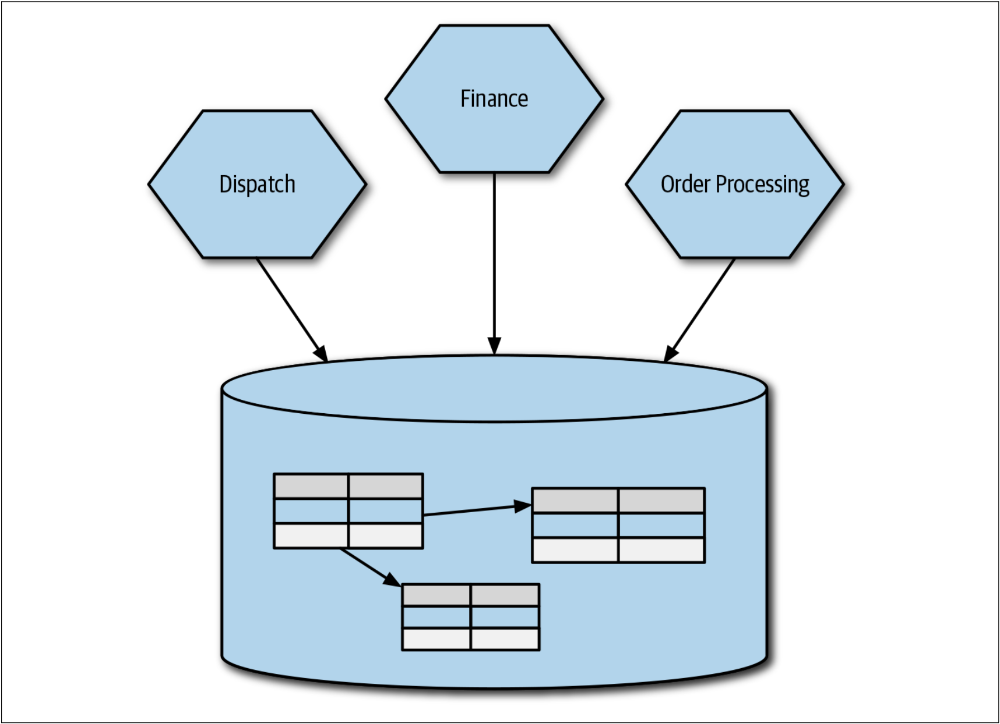
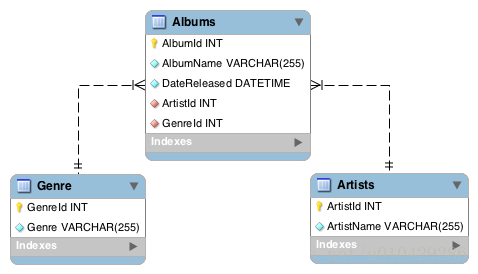

正如我们已经探索的那样，有很多方法可以将功能提取到微服务中。但是，我们需要解决一个显而易见但又没有人愿意讨论的问题：即，我们如何处理数据？微服务对于信息隐藏而言是最有效的，这也促使我们朝着在微服务中完全封装其自身的数据存储和检索机制的方向发展。这导致我们得出这样的结论：在向微服务架构迁移时，如果我们希望从迁移中获得最大收益，则需要拆分单体数据库。

但是，拆分数据库并不是一件容易的事。我们需要考虑拆分期间的数据同步，逻辑模式与物理模式分解，事务完整性，joins，延迟等问题。在本章中，我们将着眼于这些问题，并探索可以帮助我们解决这些问题的模型。

但是，在开始拆分之前，我们应该研究管理单个共享数据库所面临的挑战和应对模式。

# 共享数据库
正如我们在[第1章](On_Coupling_and_Cohesion.md)中讨论的那样，我们可以从领域耦合，时间耦合或实现耦合的角度来思考耦合。因为人们普遍在多个schema之间共享数据库。因此，在三种耦合中，对于数据库而言，我们最常用的就是实现耦合，如[图4-1](#f41)所示。

图4-1. 多个服务都直接访问同一个数据库

从表面上看，有很多问题会涉及到在多个服务之间共享单个数据库。但是，主要的问题是，我们自己放弃了决定共享什么和隐藏什么的机会，而这与我们对信息隐藏的渴望背道而驰。这意味着很难了解可以安全修改schema的哪些部分。知道外部可以访问数据库是一回事，但是不知道他们使用模式的哪一部分是另一回事。可以使用视图来缓解这种情况，我们将在稍后对此进行讨论，但这并不是一个完整的解决方案。


**schema**

在数据库中，schema是数据库的组织和结构，schema中包含了schema对象，可以是表(table)、列(column)、数据类型(data type)、视图(view)、存储过程(stored procedures)、关系(relationships)、主键(primary key)、外键(foreign key)等。数据库schema可以用一个可视化的图来表示，它显示了数据库对象及其相互之间的关系，如下图所示：

以上是模式图的一个简单例子，显示了三个表及其数据类型、表之间的关系以及主键和外键。

schema和database是否等同呢？是否一致，取决于数据库供应商：

1. MySQL的文档中指出，在物理上，模式与数据库是同义的，所以，模式和数据库是一回事。
2. 但是，Oracle的文档却指出，某些对象可以存储在数据库中，但不能存储在schema中。因此，模式和数据库不是一回事。
3. 而对于SQL Server，根据[SQLServer technical article](https://bit.ly/2DTJVtU)，schema是数据库SQL Server内部的一个独立的实体。所以，他们也不是一回事。

schema这个词可以用在很多不同的环境中，在特定数据库管理系统创建一个schema时，您需要使用DBMS特定定义模式，当你切换到一个新的数据库管理系统时，一定要查看该系统是如何定义schema的。


另一个问题是，谁“控制”数据变的越来越不清晰。处理数据的业务逻辑在哪里？现在是否存在跨服务处理数据的个情况？这写问题意味着业务逻辑缺乏内聚。[正如我们之前讨论的那样](Just_Enough_Domain_Driven_Design.md#将聚合和界定的上下文映射到微服务)，在将微服务视为行为和状态的组合时，就要封装一个或多个状态机。现在，如果修改状态的行为散布在系统中，那么确保可以正确实现该状态机是一个棘手的问题。

如[图4-1](#f41)，如果三个服务都可以直接修改订单信息，那么在服务之间的行为不一致时会发生什么？当确实需要修改修订订单的行为时会发生什么——必须将这些修改应用于所有的这三个服务吗？如前所述，我们的目标是提高业务功能的高内聚，而共享数据库往往意味着缘木求鱼。

## 解决共享数据库的方法
把数据库拆分开来以允许每个微服务拥有自己的数据，这尽管可能是一项艰巨的任务，但却几乎总是首选方案。如果无法做到这一点，则使用数据库视图（参阅128页的[数据库视图](Pattern_Database_View.md)）或采用数据库包装服务（请参阅132页的[“数据库包装服务”](Pattern_Database_Wrapping_Service.md)）会有所帮助。

## 可以在何处使用共享数据库
我认为，仅在两种场景下，直接共享数据库可以适用于微服务架构。

* 第一种是当数据是只读的静态参考数据时。稍后，我们会更详细地探讨该主题。现在，考虑一个schema，该schema包含了国家货币代码信息、邮政编码或邮政编码查询表等信息。此时，数据结构是高度稳定的，并且该数据的变更控制通常作为管理任务来处理。
* 另一种场景是，当一个服务将数据库作为明确的端点（*end-point*）而直接公开时，该端点是为处理多个使用者而设计和管理。当我们讨论数据库即服务接口时，我们将进一步阐明该想法（参见135页的[数据库即服务接口](Pattern_Database-as-a-Service_Interface.md)）。

