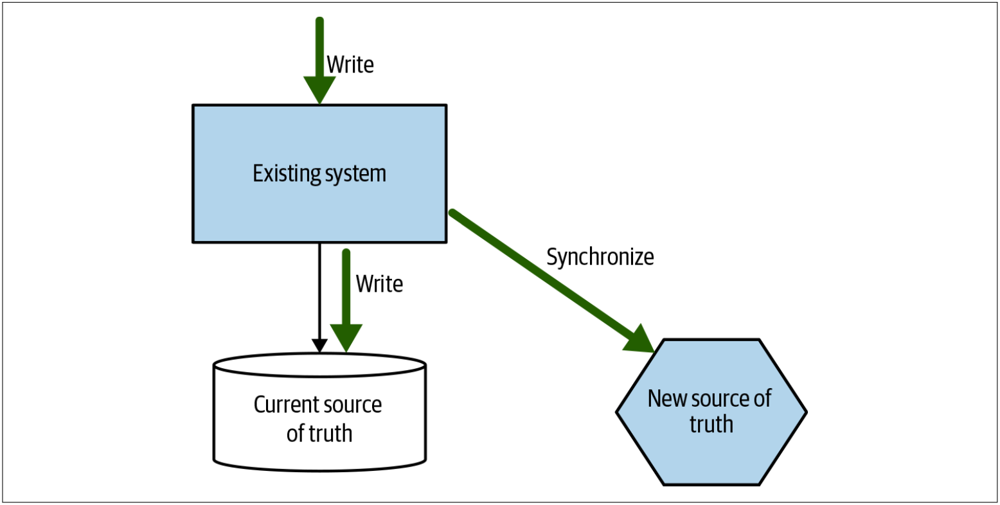
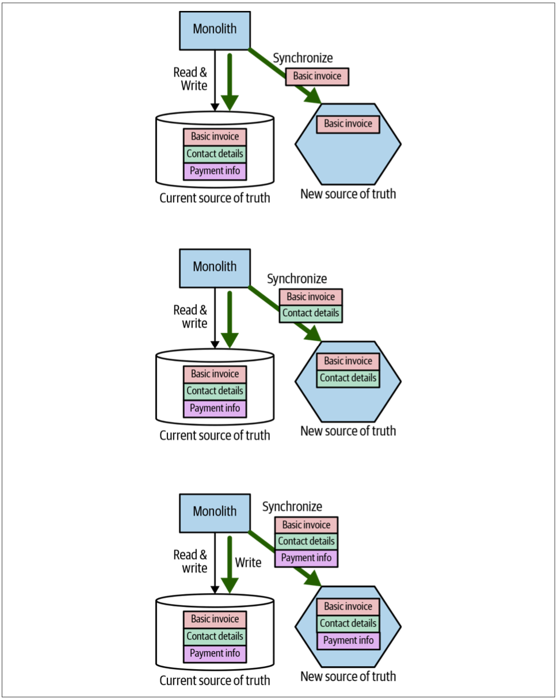
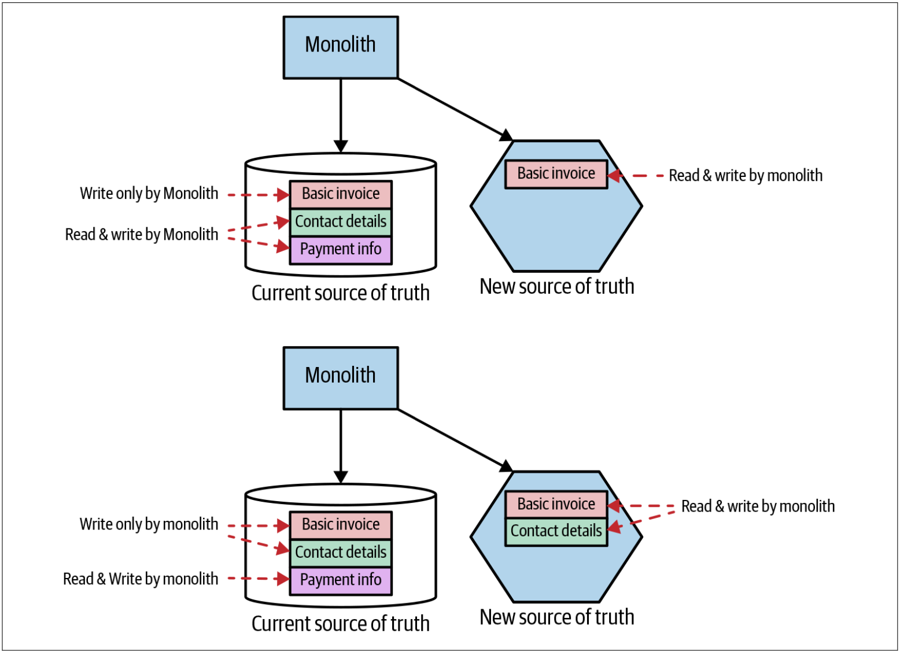
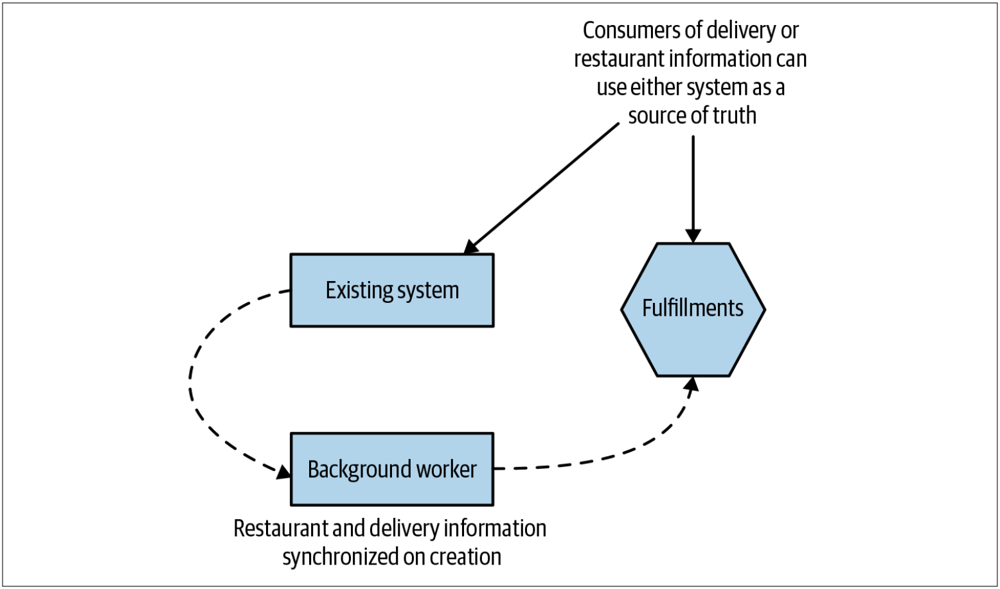
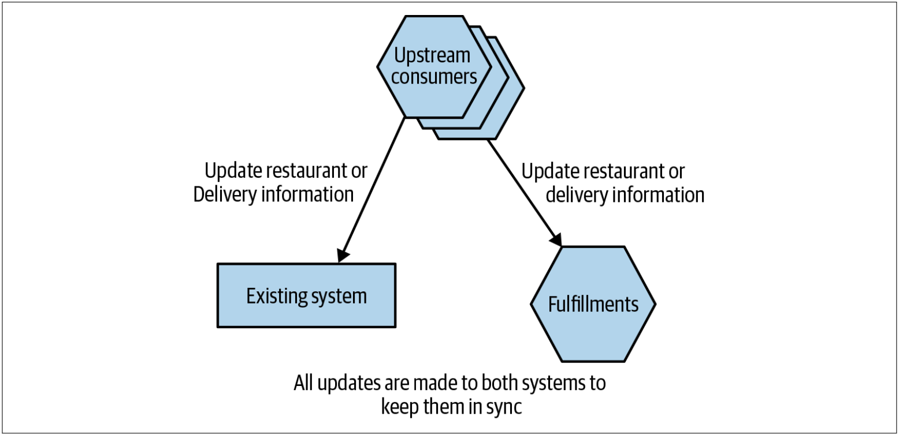
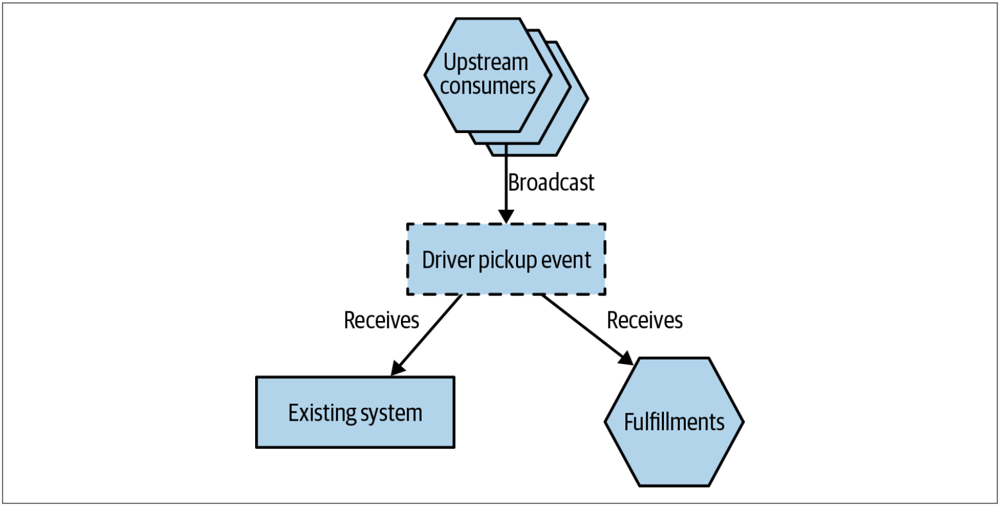

# 跟踪器写入模式
[图4-18](#f418)中的tracer write（*跟踪器写入*）模式可以说是**应用程序中同步数据模式**（参见第145页的[在应用程序中同步数据](Pattern_Synchronize_Data_in_Application.md)部分）的一种变体。使用tracer write，我们就可以采用增量的方式来移动数据源，并容许在迁移期间存在两个数据源。我们将确定一个新的服务来托管已重定向的数据。当前系统仍在本地维护数据记录，但是在修改数据时，也可以确保这些修改通过其服务接口写入新的服务。可以修改现有代码，以开始访问新服务，并且一旦所有功能都使用新服务作为数据源，就可以淘汰旧的数据源。需要仔细考虑如何在两个数据源之间同步数据。

图4-18. tracer write通过在迁移过程中容纳两个数据源，从而允许从一个系统到另一个系统的增量数据迁移

单一的数据源是一种太过理性的愿望。单一的数据源让我们能够确保数据的一致性，控制对数据的访问，并可以降低维护成本。问题是，如果我们坚持只为数据提供一个数据源的话，那么我们将被迫陷入一种情况——改变这些数据所在的位置将成为一个巨大的转换。在发布之前，单体是数据源。发布后，我们的新的微服务才是数据源。问题是，在这种转换过程中，很多事情都会出错。诸如tracer write之类的模式允许进行阶段性切换，从而减少每次发布的影响，作为交换条件，我们需要更加容忍拥有多个数据源。

这种模式称为tracer write的原因是，我们可以从一小部分数据开始同步，并随着时间的流逝而增加同步的数据，同时还可以增加新数据源的使用者的数量。如果以[图4-12](Data_Synchronization.md#f412)中概述的例子为例，与发票相关的数据已从单体中移至新的Invoice微服务，则我们可以首先同步基本的发票数据，然后迁移发票的联系信息（*contact information*），最后同步付款记录，如[图4-19](#f419)所示。

图4-19. 逐步将发票相关信息从单体转移到我们的Invoice服务

其他需要发票相关信息的服务可以选择从单体来获取信息，也可以选择从新服务来获取信息，具体取决于它们所需要的信息。如果他们需要的信息仍然仅在单体中可用，则他们将不得不等待该数据以及支持该数据的功能的迁移。一旦新的微服务中的数据和功能可用，消费者就可以切换到新的数据源。

我们的例子中的目标是迁移所有的消费者以使用Invoice服务，这些消费者包括单体本身。在[图4-20](#f420)中，我们看到了迁移过程中的几个阶段。最初，我们仅将基本的发票信息写入两个数据源。一旦我们确定此信息已正确同步，单体就可以开始从新服务中读取其数据。随着更多数据的同步，单体可以将新服务用作越来越多数据的数据源。一旦所有数据都同步了，并且旧数据源的最后一个消费者也已经切换到新服务，我们就可以停止同步数据。

图4-20. 作为tracer write的一部分来下线旧的数据源

## 数据同步
tracer write模式需要解决的最大的问题是：副本数据不一致带来的任何问题。要解决此问题，我们有几种选择：
* **Write to one source**：所有的写操作都发送到其中的一个数据源。 数据写完之后，再同步到其他的数据源。

* **Send writes to both sources**：上游客户端发出的所有写请求都发送到两个数据源。这种方法通过确保客户端自己调用每个数据源或通过依赖中间件将请求广播到每个下游服务来生效。

* **Seed writes to either source**：可以将写请求发送到任一数据源，并且在后台，数据在系统之间以双向方式同步。

把写操作发送到两个数据源，或发送到一个数据源并依赖某种形式的幕后同步，这是两种看起来似乎可行的解决方案，我们稍后将探讨使用这两种技术的例子。但是，尽管写入任何一个数据源的方案从技术上讲也是一种选择，但应避免使用这种方法，因为这种方法需要双向同步（双向同步可能很难实现）。

在所有的方案下，两个数据源中的数据一致性都会存在延迟。数据不一致的持续时间取决于很多因素。例如，如果采用每天夜间用批处理的方式把数据更新从一个源复制到另一个源，则第二个数据源可能包含有延迟24小时的数据。如果使用CDC系统将更新从一个系统流式传输到另一个系统，则数据不一致的时间窗口可以是几秒钟或更短的时间。

无论这种不一致的时间窗口是多少，这种同步给我们提供了所谓的**最终一致性**——最终，两个数据源将具有相同的数据。必须了解哪种数据不一致的周期适用于我们的场景，并使用该时间来驱动我们如何实现数据同步。


重要的是，在维护两个这样的数据源时，必须进行某种对帐流程，以确保能够按照预期执行数据同步。对账流程可能就像对每个数据库执行几条SQL查询一样简单。但是，如果不检查是否按预期进行数据同步，可能会导致两个系统之间出现不一致，并且在意识到不一致的存在时，为时已晚。在还没有消费者的情况下，让新的数据源运行一段时间，直到我们对新数据源的运行方式感到满意为止，是非常明智的。正如我们将在下一部分中探讨的那样，[Square公司](https://squareup.com/us/en)就是这样做的。


## Square公司的订单的例子
此模式最初是由Square的开发人员Derek Hammer分享给我的，此后，我发现了使用该模式的其他例子[^4]。Derek Hammer详细介绍了该模式如何帮助理清Square的与外卖相关订单的业务部分。

在最初的系统中，一个单独的Order概念用于管理多个工作流程：
* 一个工作流用于客户订购食物
* 另一个工作流用于餐厅准备食物
* 第三个工作流用于管理配送员取食物并配送给客户的状态

尽管如上的三个工作流都使用相同的Order，但是其利益相关者的需求是不同的。对于客户来说，Order是他们选择要配送的东西，也是他们需要付费的东西。对于餐馆来说，Order是需要烹调并运送的东西。对于配送员来说，Order是需要及时将其从餐厅送到顾客身边的东西。尽管有这些不同的需求，但订单的代码和关联数据都被绑定在一起。

将所有这些工作流程捆绑到一个Order概念中，在很大程度上就是我之前所说的“交付冲突”的源头——不同的开发人员尝试针对不同的用例进行修改会互相干扰，因为所有这些都需要对代码库的同一部分进行修改。 Square希望拆解Order，以便可以独立地修改每个工作流，并且还可以实现不同的缩放需求和健壮性需求。

### 创建新的服务
第一步是创建一个新的Fulfillments服务，如[图4-21](#f421)所示，该服务管理与餐厅和配送员相关的订单数据。Fulfillments服务将成为Order数据子集的新的数据源。最初，该服务仅公开了允许创建与Fulfillments相关的实体的功能。新服务启用后，将有一个后台工作线程把和Fulfillments相关的数据从现有系统复制到新的Fulfillments服务。该后台工作线程只是利用了Fulfillments服务提供的API，而不是直接将数据插入到数据库中，从而避免了直接访问数据库。

图4-21. 新的Fulfillments服务用于从现有系统复制与fulfillments相关的数据

通过功能标记（*feature flag*）来控制后台工作线程。该功能标记可以启用或禁用以停止数据复制。从而可以确保，如果后台工作线程在生产环境中引起任何问题，很容易停止该程序。该系统在生产环境中运行了足够长的时间，以确保数据同步是正常的。一旦人们觉得该后台工作线程是按照预期工作的，便删除了功能标记。

### 同步数据
对现有系统进行的修改导致与fulfillment相关的数据通过新的Fulfillments服务的API写入到新服务中。Square通过确保两个系统都进行了所有更新来解决此问题，如[图4-22](#f422)所示。但是，并非所有的更新都需要应用于两个系统。正如Derek所解释的那样，现在Fulfillments服务仅代表Order概念的一个子集，仅需复制配送或饭店客户所关心的订单的更新。

图4-22. 通过确保所有使用者对这两种服务进行适当的API调用来同步后续更新

任何修改对面向餐厅或面向配送信息的代码都需要进行修改，以执行两组API的调用：一组调用现有系统，另一组调用微服务。如果一组调用是成功的，而另一组调用失败了，则上游的客户端还需要处理任何的错误情况。对两个下游系统（现有的订单系统和新的配送服务）的数据修改并非以原子方式完成。这意味着可能会有一个短暂的窗口，在该窗口中，一个系统中可以看到数据修改，而在另一个系统则看不到数据修改。在两个系统都完成数据修改之前，可以看到，两个系统之间存在不一致。这是最终一致性的一种形式，我们在前面已经讨论过。

就Order信息的最终一致性而言，对于此特定的用例而言，这不是问题。数据在两个系统之间的同步速度足够快，不会影响系统用户。

如果Square一直使用事件驱动的系统来管理Order更新，而不是使用API，则他们可以考虑使用另一种实现方式。在[图4-23](#f423)中，我们有一条消息流，可以触发修改Order状态。现有系统和新的Fulfillments服务都会收到相同的消息。上游客户端不需要知道这些消息有多个消费者，可以使用发布-订阅方式的消息代理来解决多个消费者的场景。

图4-23. 另一种同步方法是让两个数据源都订阅相同的事件

将Square的架构改造为基于事件的架构以满足该用例将需要大量工作。 但是，如果已经在使用基于事件的系统，则可以更轻松地管理同步过程。还要值得注意的是，因为不能保证现有的系统和Fulfillments服务同时处理同一事件，基于时间系统的架构仍将表现为最终一致性。

### 迁移消费者
现在，随着新的Fulfillments服务拥有饭店和配送员工作流所需的所有信息，管理这些工作流程的代码可以开始切换到新服务。在迁移期间，可以增加更多功能来满足消费者的需求。最初，Fulfillments服务仅需要实现一个API，该API可以为后台工作线程创建新的记录。随着新的消费者迁移到新服务，可以评估消费者的需求并将新功能增加到服务中，以支持他们的需求。

对于Square的情况，事实证明，增量迁移数据以及增量改变消费者以使其采用新的数据源的方式都非常有效。Derek说，让所有消费者都切换到新的服务，这几乎是一件不可能的事情。增量迁移只是例行发布中所做的又一个小的变更（这也是我在本书中一直强烈提倡增量迁移模式的另一个原因！）。

从域驱动的设计的角度来看，当然可以辩称：和配送员，客户和餐厅相关的功能都代表了不同的有界上下文。从这种观点出发，Derek建议最好进一步考虑将该配送服务拆分为两个服务：一个用于餐厅，另一个用于配送员。尽管如此，虽然仍有进一步拆分的空间，但目前的这种迁移似乎已经非常成功。

在Square公司的例子中，Square决定保留重复的数据。把与餐厅和配送相关的订单信息保留在现有系统中，可以在无法使用Fulfillments服务的情况下，仍能提供信息的可见性。当然，这需要保持数据同步。我想知道，随着时间的推移，是否会重新审视保留重复数据的这一做法。一旦对Fulfillments服务的可用性有足够的信心，删除后台工作进程以及让消费者仅执行一组更新调用可以很好地帮助简化架构。

## 何处使用该模式
实现数据同步可能是大多数工作所在。如果可以避免双向同步，而是使用此处概述的一些较简单的方法，则可能会发现该模式更容易实现。如果已经在使用事件驱动的系统，或者有可用的CDC管道，那么我们可能已经有很多可用的模块用于同步数据。

需要仔细考虑可以容忍两个系统在多长时间内是不一致的。有些case可能不在乎系统之间的数据不一致性，其他的case可能希望复制几乎是即时的。可接受的数据不一致的时间窗口越短，实施此模式将越困难。

---
[^4]: Sangeeta Handa shared how Netflix used this pattern as part of its data migrations at the QCon SF conference, and Daniel Bryant subsequently did a [nice write-up](https://www.infoq.com/news/2018/11/netflix-data-migrations/) of this.