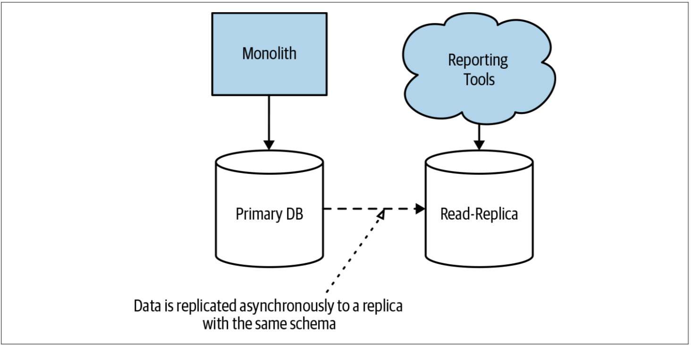
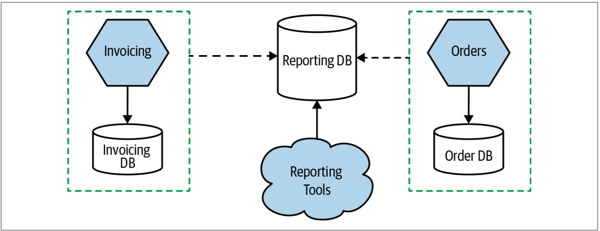

# 报表的问题
单体系统通常会有一个单体数据库。这意味着，那些想要分析全部数据（通常涉及跨数据的较大的join操作）的分析者，可以使用现成的数据模式来执行他们的报表。可以直接在单体数据库上执行这些报表，也可以[如图5-4](#f54)一样，在其只读副本上执行这些报表。在微服务架构下，我们打破了这种单体模式。这并不意味着不再需要跨越全部数据的报表。但是，现在，我们的数据分散在多个逻辑上相互隔离的数据模式中，因此获取全部数据的报表已经变得更加困难。

图5-4. 直接利用单体数据库产出报表

## 该问题何时会发生
报表的问题往往会出现的较早，该问题通常发生在我们开始考虑拆分单体的阶段。希望能在问题出现之前就发现该问题，但是我已经不止一次的发现，架构迁移到了一半时，团队才意识到架构的调整会给报表的使用者带来痛苦。很多时候，并没有尽早的考虑下游报表的需求，因为报表的需求超出了正常软件开发和系统维护的领域——报表的需求成为了一个盲区。


**out of sight, out of mind**

在这里，我将"out of sight, out of mind"译作盲区。盲区意味着着某些事情处于视野范围之外的区域，因此我们无法感知这些事情的存在，但是这并不是说这些事情就不存在。

你看见或者看不见，事情就在那里，不曾消失。

不单纯是报表的问题，盲区会导致其他的风险的存在。我亲眼见过多次线上事故就是因为参与者的盲区而引起的，此时他们一般会说：
* 我不知道这个模块还调用了其他模块，所以没考虑到影响
* 我对这块功能也不是很了解，所以没想到这里可能会异常
* RD说这里没有改动，所以就没有关注


如果报表已经使用专用数据源来计算，例如[数据仓库或数据湖](https://www.talend.com/resources/data-lake-vs-data-warehouse/)，则可以避开此问题。接下来，我们只需要确保微服务能够将适当的数据复制到现有的数据源即可。

## 该问题的解决方案
在许多情况下，那些关心在一个地方访问所有数据的利益相关者可能会在工具链和流程上进行投资，以希望可以使用SQL来直接访问数据库。因此，他们的报表可能与单体数据库的模式设计有关。这意味着，除非要改变报表的工作方式，否则我们仍需要提供一个单独的数据库来产出报表，并且该数据库要尽可能的与旧的模式设计相匹配，以限制任何修改带来的影响。

解决此问题的最直接方法是，首先将用于报表的单个数据库与微服务用于存储和检索数据的数据库分开，如[图5-5](#f55)所示。这样一来，报表数据库的内容和设计就可以与各微服务使用的数据库的设计和演变解耦。此时，还允许在考虑报表用户的特定需求的情况下，修改新报表的数据库。我们要做的就是：搞清楚微服务如何将数据“推送”到新的数据库。

图5-5. 将不同微服务的数据推送到专用的报表数据库

我们已经在第4章中研究了解决此问题的解决方案。CDC系统显然是解决此问题的潜在的解决方案，但是诸如数据视图之类的技术也可能是一种方案，对多个微服务公开的数据视图执行投影操作而产生单个报表。还可以考虑使用其他技术，例如将数据复制的逻辑作为微服务代码的一部分，或者利用中间件把对上游服务的监听事件传递给报表数据库。

在《Building Microservices》一书的第5章，我更详细地探讨了有关该主题的挑战和解决方案。

