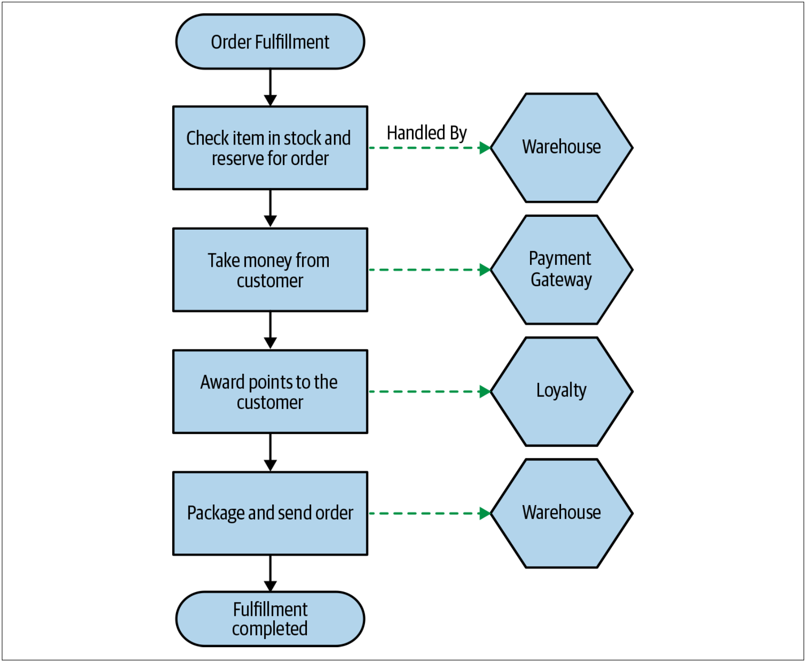
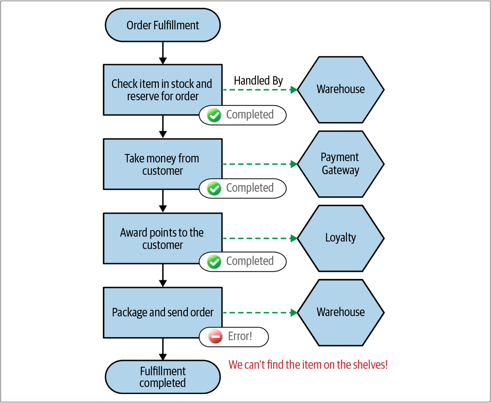
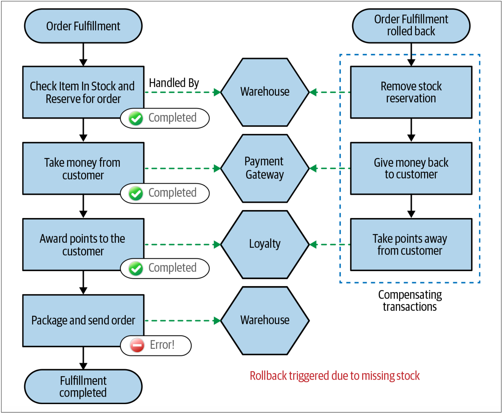
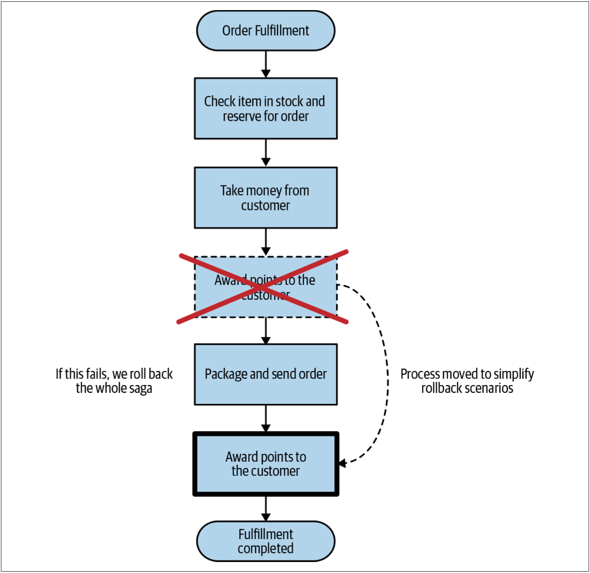
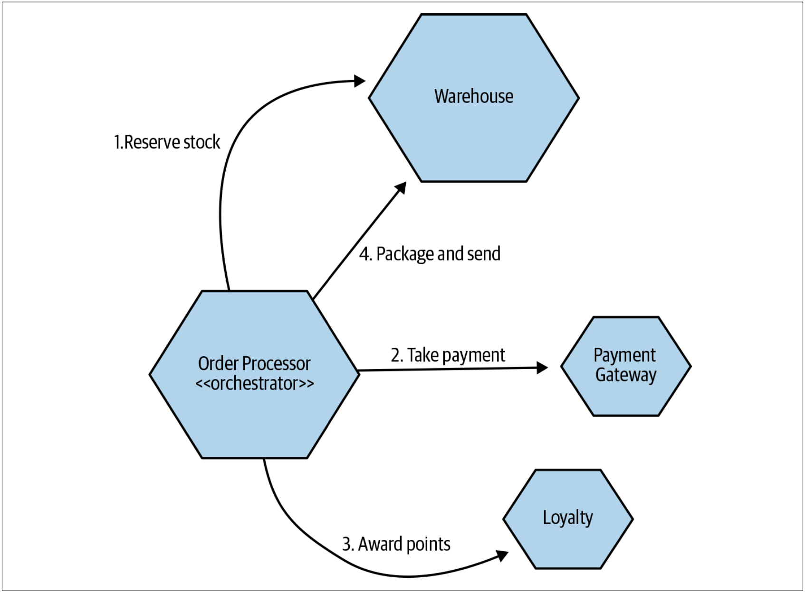
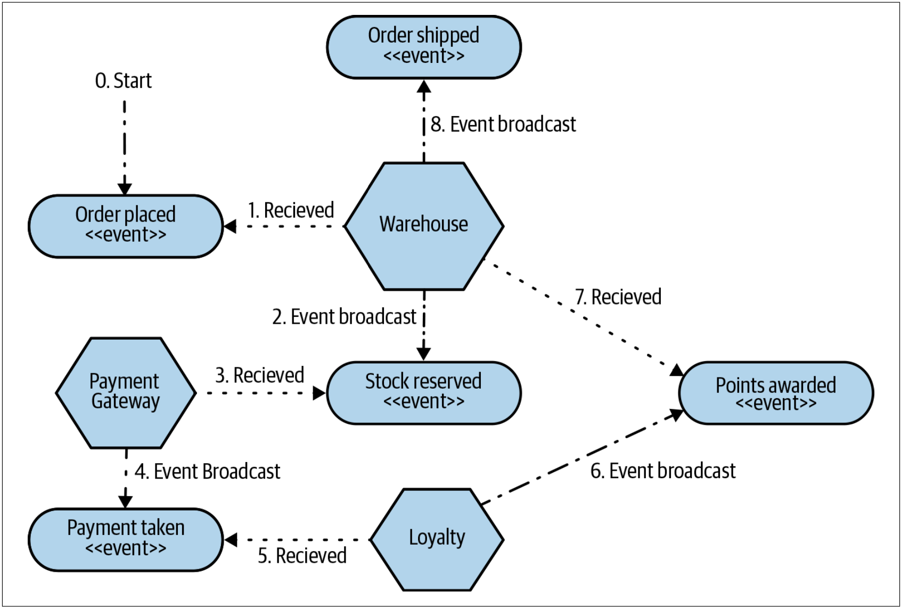

# Sagas
与二阶段提交不同，saga通过设计一个算法来协调状态的多种修改，但在状态修改时不需要长时间锁定资源。为此，我们将涉及到的步骤建模为可以独立执行的离散活动。saga具有强制我们对业务流程进行显示建模的附加好处，这种方式会带来重大好处。

Hector Garcia-Molina和Kenneth Salem首先提出了saga的核心思想[^10]来思考如何最好地处理他们所谓的长活事务（*LLT：long lived transactions*）所面临的挑战。*LLT*可能会花费很长时间（几分钟，几小时，甚至几天），并且事务的过程会对数据库进行修改。

如果直接将*LLT*映射到普通数据库事务，则单个数据库事务将跨越*LLT*的整个生命周期。这会导致在*LLT*期间需要长时间锁定多行甚至整表，如果其他的进程试图读取或修改这些锁定的资源，则会导致严重的问题。

相反，Hector Garcia-Molina和Kenneth Salem建议我们将这些*LLT*拆分为一系列的事务，每个事务都可以独立处理。Saga的想法是：每个*子事务*的持续时间将更短，并且只会修改受整个*LLT*影响的部分数据。其结果就是，随着锁范围的降低和锁时间的减少，底层数据库中的冲突将大大减少。

尽管sagas最初的设想是一种解决单个数据库中的长活事务的机制，但sagas也可以很好地协跨多个服务的修改。我们可以将一个业务流程分解为一个调用集合，这些调用将作为单个saga的一部分来调用所协调的服务。


在继续探讨sagas之前，我们需要明白，saga并不能给我们提供常规数据库的ACID事务中涉及到的原子性。当我们将*LLT*分解为单独的事务后，我们在saga自身的层面上就没有了原子性。对*LLT*内部的每个子事务而言，我们确实都有原子性，如果需要，每个子事务都可以关联到一个ACID事务的修改。Saga给我们提供了足够的信息来判断其状态；并由我们来处理该状态产生的影响。


让我们看一个简单的、如[图4-50](#f450)所示的订单处理流程，我们可以用这个流程来进一步探索微服务架构下的sagas。

图4-50. 订单处理流程的例子，其中包含负责执行操作的服务

在该例子中，把订单处理过程表示为一个saga，此流程中的每个步骤代表可以由不同服务执行的操作。每个服务都可以在其本地的ACID事务中处理任何的状态修改。例如，当我们使用Warehouse服务来检查和预订库存时，Warehouse服务可能会在其本地的Reservation表中创建一跳预定记录，这种数据的修改会在常规的事务中处理。

## saga的故障模式
随着将一个saga分解为很多相互独立的事务，我们需要考虑如何处理故障——更具体地说，就是在故障发生时如何恢复系统状态。saga的原始论文中描述了两种类型的恢复：后向恢复（*backward recovery*）和前向恢复（* forward recovery*）。

* **后向恢复**涉及到故障的还原，然后清理（回滚）所有已经完成的事务。 为此，我们需要定义补偿操作，以允许我们撤消先前提交的事务。
* **前向恢复**使我们可以从故障发生的地方进行恢复，并继续整个流程的处理。为此，我们需要能够重试事务，这意味着，我们的系统要保留足够的信息以允许重试。

根据要建模的业务流程的性质，我们需要考虑：任何故障模式都会触发后向恢复或前向恢复，或二者都触发。

### saga回滚
对于ACID事务而言，其回滚在事务提交之前发生。事务回滚后，对于数据库而言就好像什么都没有发生一样：我们试图进行的修改并没有发生。但是，对于saga而言，会涉及到多个事务，在我们决定回滚整个操作之前，其中的某些事务可能已经提交。那么，如何在事务提交之后对其回滚呢？

让我们再来看一下如[图4-50](#f450)所示处理订单的例子。考虑如下的故障模式：我们的流程已经到了尝试打包商品的阶段，但是却发现，我们在仓库中找不到该商品，如[图4-51](#f451)所示。系统认为该商品是存在的，只是货架上没有该商品！

图4-51. 我们尝试打包商品，但是我们在仓库中找不到该商品

现在，假设我们决定回滚整个订单，而不是给予客户延期交货该商品的选择。问题在于，我们已经完成该订单的付款并为之发放了积分。

如果所有这些步骤都在单个数据库事务中完成，则简单的事务回滚将清除所有这些数据。但是，订单执行流程中的每个步骤都是由不同的服务调用来处理，每个服务调用都运行于不同的事务范围。对于整个订单操作而言，没有简单的“回滚”。

相反，如果要实现回滚，则需要实现一个补偿事务（*compensating transaction*）。补偿事务是撤销先前已经提交的事务的操作。为了回滚订单处理过程，对于saga中已经提交的步骤，我们将触发其补偿事务，如[图4-52](#f452)所示。

图4-52. 触发整个saga的回滚

值得一提的是，补偿事务的行为与普通数据库回滚的行为并不完全相同。数据库回滚发生在提交之前；在回滚之后，事务就好像从未发生过一样。在补偿事务的情况下，事务当然会发生。我们正在创建一个新的事务来还原原始事务所做的修改，但是，我们无法回滚时间，从而也无法做到让原始事务就像没有发生过一样。

因为我们无法总是干净地还原事务，所以我们说这些补偿事务是语义回滚。有时，我们不能清理所有的修改，但是，我们为saga的[上下文](Just_Enough_Domain_Driven_Design.md#界定的上下文)做了足够的努力。例如，我们有一个步骤可能涉及向客户发送email，以告知其订单已经在路上了。如果我们决定回滚发送电子邮件的操作，但是我们无法撤回已经发送的email[^11]！相反，补偿事务可能会向客户发送第二封电子邮件，通知客户订单有问题，并且已经取消该订单 。


当然，有些email客户端允许我们撤回已经发送的邮件（例如Microsoft Outlook就有这个功能），但是也仅限于在收件人没有查看该邮件的情况下才可以撤回。一旦用户阅读了该邮件，是无法撤回该邮件的。


在系统中，持久化与回滚saga相关的信息是完全合适的。实际上，这些信息可能是非常重要的信息。出于多种原因，我们可能希望在Order服务中保存已中止订单的记录，以及所发生事情的相关信息。

### 调整操作步骤来减少回滚
在[图4-52](#f452)中，可以通过调整执行步骤来让回滚变得更简单。一个简单的修改就是：仅在订单实际发送时才奖励积分，如[图4-53](#f453)所示。此时，如果我们在尝试打包并发送订单时遇到问题，就不必担心需要回滚积分的操作。有时，我们仅通过调整执行流程就可以简化回滚操作。通过提前执行那些最有可能失败的步骤，并让流程更早地失败，我们可以避免在没有首先执行这些步骤时而导致的需要稍后触发其补偿事务的情况。

图4-53. 把操作步骤移动到saga的末端可以减少发生故障时所必须的回滚

如果可以做如上的调整，则这种修改可以让我们的工作更加轻松，我们甚至无需为某些步骤创建补偿事务。如果执行补偿事务非常困难，则这中调整尤其重要。我们可以将难以执行补偿事务的步骤移动到流程的末端以达到一个不再需要回滚其操作的阶段。

### 混合使用后向恢复和前向恢复
混合使用不同的故障恢复模式是完全合适的。有的故障可能需要回滚；其他的故障则可以从故障发生的地方进行恢复，并继续整个流程的处理。例如，对于订单处理而言，一旦客户已经付款，并且商品已经打包，则剩下的唯一步骤就是发送包裹。如果出于某种原因，我们无法发送包裹（也许今天，我们的快递公司因为其货车上没有足够的空间而无法接受该订单），则回滚整个订单似乎很奇怪。相反，我们可能只是重新发送包裹，并且如果重试失败，则需要人工干预以解决这种情况。

## 实现Sagas
到目前为止，我们已经研究了sagas运行的逻辑模型，但是我们需要更深入地研究saga的实现方法。我们来看一下saga的两种实现方式。协调sagas（*orchestrated sagas*）更接近原始的[解决空间（*solution space*）](Running_Too_Many_Things.md#problemspacesolutionspace)，并且主要依靠中央协调器集来跟踪事件。可以将之与编排sagas（*choreographed sagas*）进行对比。编排sagas无需中央协调器，而是使用更低耦合的模型，但是这种方式使的对saga流程的跟踪变得更加复杂。

### 协调sagas
协调sagas使用一个中央协调者（从现在开始我们称之为协调器）来定义操作的执行顺序并触发任何必需的补偿行为。可以将协调sagas视为一种命令-控制（*command-and-control*）的方法：中央协调器控制在什么时间发生什么事情，因此可以很好地了解任何给定saga所发生的情况。

以[图4-50](#f450)所示的订单处理流程为例，让我们看看该中央协调程序是如何作为一组协作服务而工作的，如[图4-54](#f454)所示。

图4-54. 如何用协调saga来执行订单处理流程的例子

[图4-54](#f454)中，**Order Processor**扮演中央协调器的角色，来协调我们的处理过程。**Order Processor**知道执行该操作需要哪些服务，并决定何时调用这些服务。如果调用失败，**Order Processor**可以决定要怎么做。这些协调处理器（*orchestrated processors*）倾向于大量使用服务之间的请求/响应调用：**Order Processor**将请求发送到某个服务（例如**Payment Getway**），并期望得到一个响应以使其知道请求是否成功同时以及期望在该响应中提供请求的处理结果。

在**Order Processor**内部对我们的业务流程进行显示建模是非常有益的。这样，我们就可以查看系统中的某个部分，并了解该过程应该如何工作。如此，可以让新手更加轻松的入门，并有助于更好地理解系统的核心部分。

不过，协调saga有一些缺点需要考虑。

* 首先，从本质上讲，这是一种耦合的方法。**Order Processor**需要了解所有的相关服务，从而使我们在[第1章](On_Coupling_and_Cohesion.md#领域耦合)中讨论的领域耦合的耦合程度更高。尽管这并不是不好，但我们仍然希望将领域耦合保持在可能的最低限度。此时，**Order Processor**需要了解并控制很多事情，以至于这种形式的耦合很难避免。
* 另一个更微妙的问题是，本应该在服务本身处理的逻辑可能开始被合并到协调器。如果这种情况开始发生，我们可能会发现自己的服务变得几乎没有自己的行为，仅仅是从诸如**Order Processor**之类的协调器那里接受订单而已。重要的是，此时，我们还仍然把构成这些协调流程的服务视为具有各自本地状态和行为的实体。这些服务控制其本地的状态机。


如果将逻辑集中到某个地方，则会变成一个中心化的架构。



还记得我们在[第3章第3节](Pattern_Strangler_Fig_Application.md#sedp)中介绍的微服务和SOA的区别以及微服务的*
smart endpoints and dumb pipes*吗？


避免协调流带来的过多的中心化的一种方法是，针对不同的流程，确保我们有不同的服务来扮演协调器的角色。我们可能有一个**Order Processor**服务来处理下单，一个**Returns**服务来处理退货和退款流程，一个**Goods Receiving**服务来处理新库存的上架，等等。那些协调器可能会使用类似Warehouse服务之类的服务；这样的模型使我们可以更轻松地将功能保留在Warehouse服务中，从而允许我们在所有的这些流程中复用功能。

> **
BPM 工具？
**
> 
> 业务流程建模（*BPM:business process modeling*）工具已经出现了好多年了。总的来说，BPM的设计目的是让非开发人员使用可视化的拖放工具来定义业务流程。BPM的想法是，开发人员创建业务流程的组件，然后非开发人员将这些组件连接在一起，形成更大的流程。使用这些工具似乎是实现协调sagas的一种很好的方式，实际上，流程协调几乎是BPM工具主要的使用场景（或者，反过来说，使用BPM工具导致我们不得不采用协调）。
> 
> 根据我的经验，我非常不喜欢BPM工具。主要原因是，根据我的经验，非开发人员定义业务流程的中心思想几乎从来都不是真的。针对非开发人员的工具最终会被开发人员所使用，并且非开发人员可能会有很多问题。非开发人员通常需要使用GUI来修改流程，他们创建的流程可能难以（或不可能）进行版本控制，可能流程本身在设计时就没有考虑测试的问题，等等。
> 
> 如果开发人员要实现我们的业务流程，让开发人员使用他们知道和了解以及适合其工作流的工具。通常，这意味着仅让他们使用代码来实现这些功能！如果确实需要了解业务流程的实现方式或运作方式，那么从代码投影一个可视化的工作流要比使用可视化的工作流来描述代码的工作方式要容易得多。
> 
> 正创建对开发人员更友好的BPM工具上花费了很多精力。开发人员对这些工具的反馈似乎褒贬不一，但对于某些工具来说，它们的效果很好，看到人们尝试改进这些框架，我也非常高兴。如果需要进一步探索这些工具，可以看一下[Camunda](https://camunda.com/)和[Zeebe](https://zeebe.io/)，这两个工具都是针对微服务开发人员的、开源的协调框架。

### 编排sagas
编排sagas旨在在多个协作的服务之间分配一个saga中不同操作的职责。如果协调saga是一种命令-控制（*command-and-control*）的架构，那么编排sagas则代表了一种*要信任-但也要查证*的架构。正如我们在[图4-55](#f455)的例子中看到的那样，编排sagas通常会大量的使用事件来实现服务之间的协作。

图4-55. 编排saga是如何执行我们的订单处理流程的例子


1987年，在美苏中程核武器协议谈判时，里根旁敲侧击，对戈尔巴乔夫说，他最喜欢一句俄国谚语：“trust, but verify”。意思是，他相信苏联领导人的承诺，但还必须有个有效的验证机制。具体可以参见维基百科的词条[Trust, but verify](https://en.wikipedia.org/wiki/Trust,_but_verify)。


这里面有很多事情，因此，值得更详细地对此探讨。

首先，这些服务需要对接收到的事件做出反应。从概念上讲，事件会在系统中进行广播，对其感兴趣的任何一方都可以接收该事件。我们不会把事件发送给某个服务，我们只需要发送事件即可，对事件感兴趣的服务可以接收这些事件并采取相应的反应。在[图4-55](#f455)的例子中，当Warehouse服务接收到第一个Order Placed事件时，它就知道要保留适当的库存并在其完成后触发一个事件。如果Warehouse服务无法处理库存，则需要抛出一个适当的事件（也许是Insufficient Stock事件）来中止该订单流程。

通常，我们会使用某种消息代理（*message broker*）来管理事件的可靠广播和分发。多个服务可能会对同一事件做出反应，此时，可以使用topic类型的消息。对某种事件类型感兴趣的服务可以订阅特定的topic，而不必担心这些事件的来源。由消息代理来确保该持久化该topic，并将与之相关的事件成功分发给订阅者。例如，我们可能有一个Recommendation服务，该服务还会监听Order Placed事件，并用之来构建用户可能喜欢的音乐的数据库。

在编排sagas的架构中，任何一个服务都没有必要知道任何的其它服务的存在。他们只需要知道，在收到某个事件时该服务该怎么做。从本质上讲，这使得架构的耦合更小。由于在实现时，订单处理流程被拆分到了此处的4个服务中，同时流程的实现也是分布式的，因此我们也避免了对中心化逻辑的担忧（如果没有一个可以集中逻辑的地方，那么逻辑就不会被集中！ ）。

编排saga的缺点是很难确定正在发生的事情。使用协调saga时，我们在协调器中显示的建模我们的流程。现在，对于本节所呈现的编排saga的架构，我们如何建立一个流程应该是什么样的心智模型？我们必须查看相互隔离的每个服务的行为，并在自己的头脑中重新构建该流程——即使是像[图4-55](#f455)这样的简单业务流程，在脑中重新构建该业务流程也远非是一个简单的过程。

缺乏对业务流程的显示表示已经够糟糕了，但是我们还缺乏一种了解saga状态的方式，这也让我们无法在需要时采取补偿行为。我们可以把某些职责交给独立的服务以执行补偿操作，但是从根本上讲，我们需要一种方法来了解在某些恢复情况时saga的状态是什么。缺乏查询saga状态的中控是一个大问题。我们通过协调器来实现saga状态的查询，那么，此时，我们如何解决这个问题呢？

最简单的方法之一是：通过消费已经发出的事件来从现有系统中投影有关saga状态的视图。如果我们为saga生成一个唯一的ID，则可以把这个ID放在该saga包含的需要发送的所有的事件中，这就是所谓的关联ID。然后，我们利用一个服务来快速消费所有的这些事件，并呈现一个视图以展示每个订单处于什么状态。如果其他服务本身无法解决问题，则可能会以编程方式采取行动来解决问题，并将其作为处理过程的一部分。

### 混合模式
尽管协调sagas和编排sagas在如何实施sagas方面似乎截然相反，但我们可以轻松地对其进行混合，也可以轻松的进行模型匹配。我们系统中的一些业务流程可能天然适合某种模型或另一种模型。我们可能还会有一个包含两种saga模型的单个saga。例如，在订单处理的例子中，在Warehouse服务的边界内，当管理包裹的打包和发货时，即使原始请求是较大的编排saga的一部分，我们也可以使用协调saga[^12]。

如果决定使用混合模型，那么，我们仍然要有一种清晰的方式来理解作saga所发生的事情，这一点非常重要。没有这种清晰的方式，理解故障模式就会变得复杂，同时，从故障中恢复将非常困难。

### 应该使用编排saga呢还是使用协调saga
实现编排sagas时可能会随之给我们以及团队带来我们所不熟悉的想法。编排sagas通常假设要大量使用事件驱动的协作，而这种协作尚未得到团队的广泛理解。但是，以我的经验来看，跟踪saga中的流程所带来的额外的复杂性几乎总是会超过拥有耦合度更低的架构所带来的好处。

但是，对于协调sagas和编排sagas，除了我自己的个人喜好之外，我的普遍建议是：当一个团队拥有整个saga的实现时，我会使用协调sagas。在这种情况下，在团队边界内，内在的更耦合的架构更易于管理。如果整个saga由多个团队参与，因为更容易将实现saga的职责分配给多个团队，并且低耦合的架构可让这些团队更独立地工作，所以，我非常喜欢拆分度更高的编排sagas。

## Sagas VS 分布式事务
我希望，正如我现在已经分解的那样，分布式事务面临一些重大挑战，除非某些非常特殊的情况，我倾向于避免这些挑战。在我们如今构建的各种应用程序上实施分布式事务而言，Pat Helland——分布式系统的先驱，为我们提炼了其基本的挑战[^13]：

> 在大多数分布式事务系统中，单节点的故障会导致事务提交停止。反过来，这会使应用程序陷入困境。在分布式事务系统中，分布式事务越大，系统崩溃的可能性就越大。当驾驶一架需要所有引擎都运转的飞机时，增加引擎会降低飞机的可用性。
> 
> 
——Pat Helland, Life Beyond Distributed Transactions

根据我的经验，把业务流程显示地建模为一个saga，避免了分布式事务的许多挑战，同时还可以使本来可能被隐式建模的流程对开发人员更加显式和明显。让系统的核心业务流程成为一等概念将带来很多好处。

关于实现协调saga和编排saga的更详细的讨论以及各种实现细节，不在本书的讨论范围之内。在《 Building Microservices》的第4章中对此进行了介绍，但我也推荐《Enterprise Integration Patterns》这本书来深入了解该主题的许多方面[^14]。

---
[^10]: See Hector Garcia-Molina and Kenneth Salem, “Sagas,” in ACM Sigmod Record 16, no. 3 (1987): 249–259.
[^11]: You really can’t. I’ve tried!
[^12]: It’s outside the scope of this book, but Hector Garcia-Molina and Kenneth Salem went on to explore how mul‐ tiple sagas could be “nested” to implement more complex processes. To read more on this topic, see Hector Garcia-Molina et al, “Modeling Long-Running Activities as Nested Sagas,” Data Engineering 14, no. 1 (March 1991: 14–18.
[^13]: See Pat Helland, “Life Beyond Distributed Transactions,” acmqueue 14, no. 5.
[^14]: Sagas are not mentioned explicitly in either book, but orchestration and choreography are both covered. While I can’t speak to the experience of the authors of Enterprise Integration Patterns, I personally was unaware of sagas when I wrote Building Microservices.
