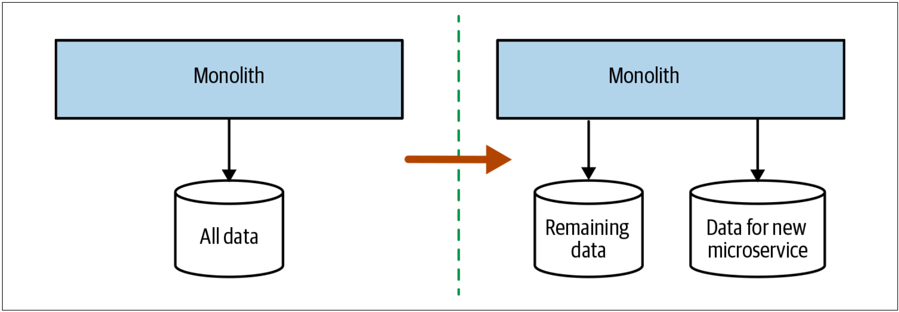
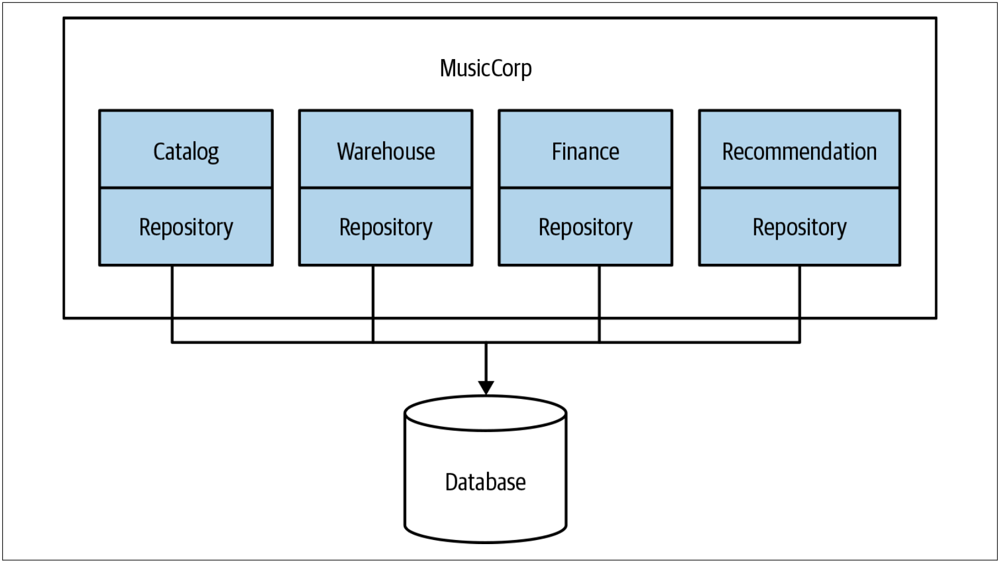
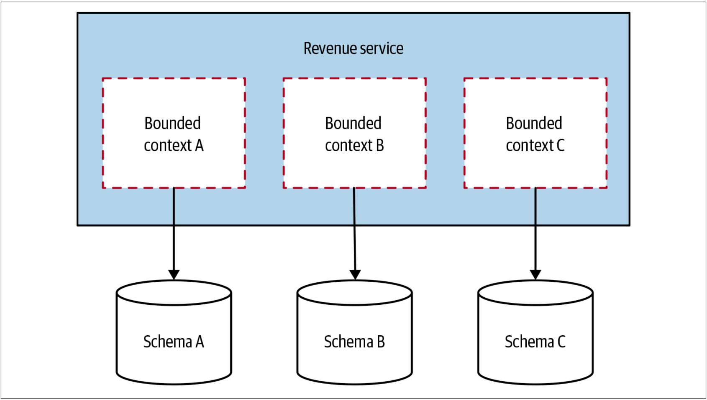
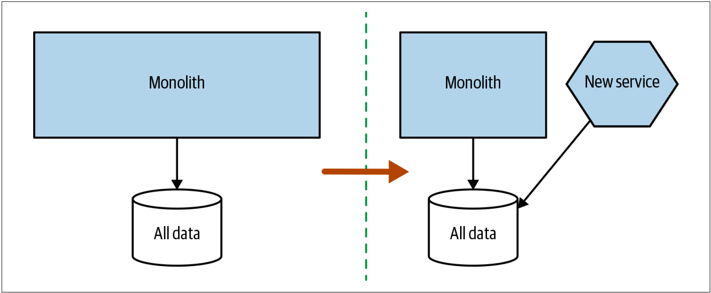
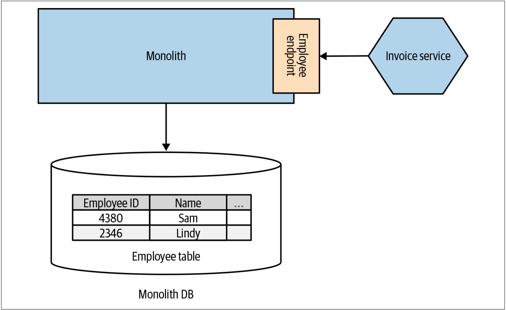
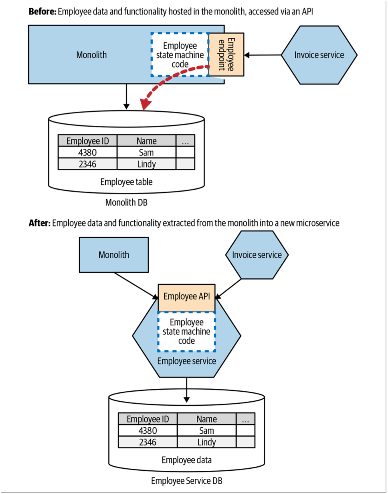
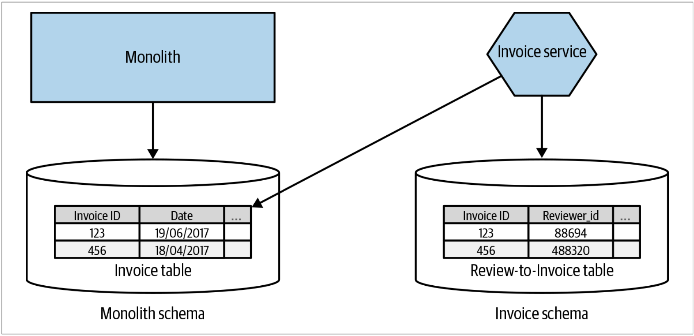
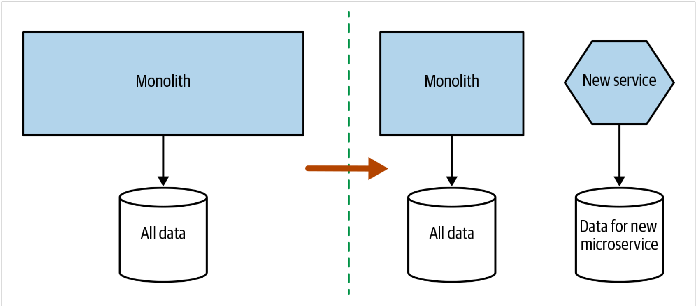

# 先拆分数据库还是先拆分代码

到目前为止，我们已经讨论了对共享数据库有用的很多模式，并希望转向较少耦合的模型。稍后，我们会详细研究数据库的拆分模式。但是，在此之前，我们需要讨论拆分数据库和拆分代码的顺序。直到应用程序代码运行在其自己的服务中，并将服务控制的数据抽取到服务自己的逻辑隔离数据库，微服务的抽取才算完成。但是，本书主要是关于实现增量变更的，因此，我们必须探索：如何对微服务的抽取过程进行排序的方法。我们有几种选择：
* 先拆分数据库，然后再拆分代码
* 先拆分代码，然后再拆分数据库
* 同时拆分数据库和代码

不同的选择各有利弊。现在，我们来看一下这些选择，并根据所采用的方法，来看一些可能有用的模式。

## 先拆分数据库
使用分离的schema，执行单个操作时，可能会增加数据库的调用次数。之前，我们可以用单个SELECT语句获得所需的所有数据，而现在，我们需要从两个schema中获取到数据，并在内存中对其进行合并。当我们转而使用两个schema时，最终，我们也破坏了事务的完整性，这可能会对我们的应用程序产生重大影响。本章稍后会讨论这些挑战，本章稍后的内容涵盖了分布式事务和sagas之类的主题，以及它们如何帮助我们解决这些挑战。如[图4-26](#f426)所示，我们拆分了schemas，但并未拆分应用程序的代码。如果我们意识到变更有异常，我们就可以还原变更或继续调整，从而不会影响服务的任何使用者。一旦确信数据库的拆分是合理的，我们就可以考虑将应用程序代码拆分成两个服务。

图4-26. 首先拆分schema可以使我们更早的发现性能和事务完整性方面的问题

另一方面，先拆分数据库的缺点是，该方法很难产生太多的短期利益。 使用该方法时，我们仍然是部署单体代码。可以说，共享数据库的缺点是随着时间的流逝而逐渐显现出来，因此，此刻，我们正在花费时间和精力来获得长期回报，而不是获得足够的短期利益。有鉴于此，只有在特别关心性能或数据一致性问题时，我才会选择先拆分数据库的方法。 还需要考虑的是，如果单体本身是一个黑盒系统，例如一款商业软件，那么我们将无法使用先拆分数据库的方法。

> **
工具说明
**
>
> 因为很多原因，修改数据库是一件困难的事，原因之一就是只有有限的工具可以让我们轻松的修改数据库。修改代码时，我们有IDE的内置重构工具；并且，还存在额外的好处，那就是：从根本上讲，我们要修改的系统是无状态的。对于数据库而言，我们要修改的内容是有状态的，同时，我们还缺少良好的重构类工具。
>
> 许多年前，这种工具上的空白促使我和两个同事，Nick Ashley和Graham Tackley，开发了一个名为DBDeploy的开源工具。这个工具现在已经不存在了（开发一个开源工具与维护一个开源工具完全不同！），DBDeploy允许捕获修改并将其存入SQL脚本，这些脚本可以以确定性的方式在schema上运行。每个schema都有一个特殊的表，该表用于跟踪已应用了哪些schema脚本。
>
> DBDeploy的目标是允许我们对schema进行增量修改，以控制每个修改的版本，并允许在不同时间修改多个schema（例如开发scheam，测试schema和生产schema）。
> 
> 如今，我推荐人们使用[FlywayDB](https://flywaydb.org/)或提供类似功能的产品，但是无论选择哪种工具，我都强烈建议确保这些工具允许我们捕获版本控制的增量脚本中的每个修改。

### 每个界定的上下文一个数据持久层

**repository的概念**

在《企业架构模式》中，译者将repository翻译为资源库，并给出如下说明：通过用来访问领域对象的一个类似集合的接口，在领域与数据映射层之间进行协调。

在《领域驱动设计：软件核心复杂性应对之道》中，译者将repository翻译为仓储，并给出如下说明：一种用来封装存储，读取和查找行为的机制，它模拟了一个对象集合。

而在此处，将repository翻译为资源库或者仓储都不太合适，这会让这个概念越翻译越难以理解。就像把“back pression”翻译成背压一样。

微软的官方文档：**[Design the infrastructure persistence layer](https://docs.microsoft.com/en-us/dotnet/architecture/microservices/microservice-ddd-cqrs-patterns/infrastructure-persistence-layer-design#:~:text=of%20Work%20patterns.-,The%20Repository%20pattern,from%20the%20domain%20model%20layer.)**中，是这样定义repository的：

> Repositories are classes or components that encapsulate the logic required to access data sources. They centralize common data access functionality, providing better maintainability and decoupling the infrastructure or technology used to access databases from the domain model layer. If you use an Object-Relational Mapper (ORM) like Entity Framework, the code that must be implemented is simplified, thanks to LINQ and strong typing. This lets you focus on the data persistence logic rather than on data access plumbing.
> 
> The Repository pattern is a well-documented way of working with a data source. In the book [Patterns of Enterprise Application Architecture](https://www.amazon.com/Patterns-Enterprise-Application-Architecture-Martin/dp/0321127420/), Martin Fowler describes a repository as follows:
> 
> > A repository performs the tasks of an intermediary between the domain model layers and data mapping, acting in a similar way to a set of domain objects in memory. Client objects declaratively build queries and send them to the repositories for answers. Conceptually, a repository encapsulates a set of objects stored in the database and operations that can be performed on them, providing a way that is closer to the persistence layer. Repositories, also, support the purpose of separating, clearly and in one direction, the dependency between the work domain and the data allocation or mapping.

因此，简单而言，此处，repository的含义就是：数据持久层。


一种常见的做法是增加一个数据持久层（*repository layer*）来把代码和数据库绑定在一起，从而实现把数据库映射成对象或数据结构。数据持久层可以利用类似Hibernate的框架来支持。没有必要为所有的数据访问都创建一个数据持久层，如[图4-27](#f427)所示，可以按照[界定的上下文](Just_Enough_Domain_Driven_Design.md#界定的上下文)来拆解数据持久层，这很有价值。

图4-27. 拆分数据持久层

给定一个上下文，将数据库的映射代码和该上下文的代码放置在一起，可以帮助我们了解哪些代码位使用了数据库的哪些部分。例如，如果在每个界定的上下文中使用诸如映射文件（*mapping file*）之类的技术，那么Hibernate可以让我们非常清楚的了解到：哪些代码位使用了数据库的哪些部分。我们可以由此而看到：哪些界定的上下文访问了schema中的哪些表。如上的做法可以帮助我们极大地了解：将来进行任何拆分时需要移动哪些表。

但是，采用数据映射的方法并不能给我们提供全部的线索。例如，我们也许可以判断出`finance`的代码使用了`ledger表`，`catalog`的代码使用了`item表`；但是，我们可能不清楚数：据库是否存强制实施了从`ledger表`到`item表`的`外键`。数据库级别的约束可能是迁移工作的绊脚石，发现这些数据库级别的约束，我们需要使用另一种工具来可视化数据。非常好的起点是：使用免费的[SchemaSpy](http://schemaspy.sourceforge.net/)之类的工具，该工具可以可视化表之间的关系。

如上的方法可以帮助我们了解表之间的耦合，这些耦合可能会跨越未来的服务边界。但是，如何斩断这些耦合？在多个界定的上下文中使用相同的数据表会是什么情况？我们将在本章的稍后部分详细探讨该主题。

### 何处使用该模式
在我们希望重新修改单体以更好地了解如何拆分单体的任何情况下，为每一个界定的上下文定义一个数据持久层的模式都非常有效。按照领域概念拆分数据持久层会帮助我们了解到：微服务的[接缝](To_Change_the_Monolith_or_Not.md#重构单体)不仅存在于数据库，而且还存在于代码本身。

### 每个界定的上下文一个数据库
一旦从应用程序的角度明确隔离数据访问，就可以把这种方法继续应用于数据schema。微服务独立可部署的思想的核心是：微服务应该拥有自己的数据。在分离出应用程序代码之前，我们可以通过围绕识别出的界定的上下文来明确地分离数据库，并拆分数据库。

在ThoughtWorks的时候，我们当时正在实施一些新的机制来计算和预测公司的收入。在此过程中，我们确定了需要编写的三个主要的功能区域。我与项目领导——Peter Gillard-Moss——讨论了这个问题。Peter解释说，该功能感觉很独立，但是他担心如果将这些功能放在单独的微服务中会带来额外的工作。目前，他的团队很小——只有3个人，并且认为团队还无法证明拆分这些新服务是合理的。最后，他们选择了一个模型，该模型把新的收入功能有效地部署为单个服务，该单个服务包含三个隔离的界定的上下文（每个上下文最终都成为单独的JAR文件），如图[4-28](#f428)所示。

图4-28. Revenue服务中的每个界定的上下文都有其独立数据库schema，后续可以对其进行分离

每个界定的上下文都有其自己的、完全独立的数据库。该想法是：如果以后需要把这些上下文分离为微服务，这会容易得多。然而，事实证明，根本不需要这么做。几年后，revenue服务仍然保持不变，还是处于一个单体和多个关联数据库的形式，一个模块化单体的绝好例子。

### 何处使用该模式
乍一看，对于单体而言，维护分离的数据库的额外工作没有多大意义。我把该模式视为一种“[对冲](https://baike.baidu.com/item/%E5%AF%B9%E5%86%B2/650238)”模式。与单个数据库相比，分离为多个数据库需要做更多的工作，但是可以在以后的微服务迁移时保留选择的余地。即使从未使用过微服务，清晰的分离数据schema也确实可以帮助我们，尤其是当我们有很多人在单体上工作时。

我总是建议人们使用该模式来构建全新的系统（而不是重新实现现有系统）。我不建议新产品或初创企业采用微服务。对于新产品或初创企业而言，人们对域的了解可能还不够成熟，还无法确定稳定的域边界。特别是对于初创公司而言，其产品的性质可能会发生巨大变化。但是，每个界定的上下文一个数据的模式可能是一个不错的选择。分离数据schema，让其保持在可以方便日后分离服务的状态。这样，我们将获得数据库分离的好处，同时还降低了系统的复杂性。

## 先拆分代码
总的来说，我发现，大多数团队会先拆分代码，然后拆分数据库，如[图4-29](#f429)所示。团队希望从新服务中获取短期收益，以使他们有信心利用数据库分离来完成服务拆分。

图4-29. 先拆分应用程序层让我们拥有一个共享的数据schema

通过拆分应用程序层，可以更轻松地了解新服务所需的数据。我们还能获得较早的拥有可独立部署的代码的好处。我一直对先拆分代码的方法感到担心的是：团队在应用程序的拆分上可能会走得很远然后停下来，从而继续保持着共享数据库的状态。如果这就是我们的方向，那么必须了解：没有完成数据层的分离会给未来带来麻烦。我见过陷入这种陷阱的团队，但也可以很高兴地向在“此处”做正确事情的组织报告这些谈资。JustSocial就是一个做正确事情的组织，JustSocial使用先拆分代码的方法作为自己的微服务迁移的一部分。此处，另外的风险是我们可能会延迟发现那些把`join操作`放在应用程序层而引起的令人讨厌的意外。

如果这是我们的方向，请对自己忠诚：我们是否可以确保将微服务所拥有的所有数据拆分出来，作为下一步的一部分？

### 把单体作为数据访问层
与其直接从单体中访问数据，不如在单体中创建一个访问数据的API。在[图4-30](#f430)中，`Invoice服务`需要`Customer服务`中有关雇员的信息，因此我们创建了一个`Employee API`，以允许`Invoice服务`访问这些信息。JustSocial的Susanne Kaiser与我分享了这种模式，JustSocial公司已经成功地将其用于微服务迁移。这种模式有很多用途，令我感到惊讶的是，该模式似乎没有获得应有的知名度。

图4-30. 在单体上开放API可使服务避免直接与单体数据绑定

把单体作为数据访问层的方法没有得到广泛使用的部分原因可能是因为人们在某种程度上认为“单体已死且无用”。人们想摆脱单体。人们不会考虑让其更有用！但是，该方法有明显的好处：我们不必解决数据拆分（或者尚未开始解决数据拆分），但却可以隐藏信息，从而使我们的新服务与单体的隔离更加容易。如果我认为单体中的数据将保留在那里，我将更倾向于采用此模型。该方式仍可以很好地工作，特别是如果我们认为新服务实际上是无状态的。

把这种模式视为识别其余待抽取的服务的一种方式并不难。扩展“把单体作为数据访问层”的想法，我们可以将Employee API从单体中分离出来，并让其成为一个微服务，如[图4-31](#f431)所示。

图4-31. 使用Employee API识别要从单体中拆分的Employee服务的服务边界

### 何处使用该模式
当管理数据的代码仍在单体中时，把单体作为数据访问层的方法最有效。正如我们之前所讨论的，在涉及数据时，一种看待微服务的方法是：把微服务看成是封装状态和管理状态转换的代码。因此，如果仍在单体中提供此数据的状态转换，则意味着微服务需要经过单体中的状态转换来访问（或修改）数据状态。

如果在单体数据库中尝试访问的数据确实应由微服务“拥有”，那么我更倾向于建议跳过此模式，而是选择把数据拆分出去。

### 多schema存储
正如我们已经讨论过的，“不要让不好的情况变得更糟糕”是一个好主意。如果我们仍在直接使用数据库中的数据，这并不意味着微服务存储的新数据也应放在该数据库中。[图4-32](#f432)展示了一个Invoice服务的例子。发票的核心数据仍然存在单体中，我们当前从单体中访问发票的核心数据。我们向Invoices服务增加了审核的功能；审核功能相当于不在单体中的、全新的功能。为此，我们需要将审核者存储在一个表中，并把员工对应到到Invoice ID。如果把这张新表放到单体里，我们会扩张现有的数据库！相反，我们把这些新数据存储到微服务自己的schema中。

图4-32. Invoice服务把新数据存于自己的schema中，但是仍然会直接访问单体中的老数据

在[图4-32](#f432)的例子中，我们必须考虑：当外键实际上跨越schema边界时，会发生什么。在本章的后面，我们将更深入地探讨这个问题。

从单体数据库中提取数据将花费一些时间，而且这个过程也不是一步就能完成。因此，微服务既访问单体数据库中的数据，同时又管理其自己的本地存储，对于这种情况，我们应该感到高兴。当我们设法从单体中清除其余数据时，可以一次将其迁移到新schema的一个表中。

### 何处使用该模式
当向微服务添加需要存储新数据的全新功能时，此模式很好用。显然，新增加的数据并不是单体所需的数据（新的功能不存在于单体中），因此，开始时就让新数据从单体数据库中分离出来。当把数据从单体移到微服务自己的schema中时，此模式也很有意义——这个过程可能需要一些时间。

如果我们所访问的数据位于单体schema中，并且我们从未计划将其转移到微服务自己的schema中，我强烈建议将该模式与把单体作为数据访问层（参见166页的[把单体作为数据访问层](Splitting_the_Database_First_or_the_Code.md#把单体作为数据访问层)）的方法结合使用。

## 同时拆分数据库和代码
当然，从分阶段的角度来看，我们可以选择在一个较大的步骤中完成拆分，如[图4-33](#f433)所示。此时，我们同时拆分代码和数据。

图4-33. 在一个步骤中即拆分代码又拆分数据

我所担心的是，这种拆分需要迈出更大的一步，并且需要更长的时间才能评估结果。我强烈建议避免使用这种方法，而应先拆分数据层或应用程序层。

## 那么，我应该先拆分什么呢
我明白：你可能已经厌倦了所有这些“取决于”的东西，对吗？我不能怪你。问题是，每个人的情况都不一样，所以我想为你提供足够的上下文信息，并讨论各种利弊，以帮助你下定决心。但是，我知道，有时人们并不想在这些事情上过多思考，而只是想要一个方法而已，所以就有了这一节的内容。


**[a hot take](https://en.wikipedia.org/wiki/Hot_take)**

正如在维基百科上的解释：在新闻业中，[a hot take](https://en.wikipedia.org/wiki/Hot_take)是“针对新闻报道的”蓄意挑衅性评论，这种评论“通常是在紧迫的期限内撰写的，很少进行研究或报道，**甚至更少地思考**” 。


如果可以修改单体，并且担心对性能或数据一致性的潜在影响，我会先拆分数据。否则，我将先拆分代码，并使用代码的拆分来帮助我理解代码对数据所有制的影响。但重要的是，我们也要为自己思考，并考虑在特定情况下会影响决策过程的所有因素。
