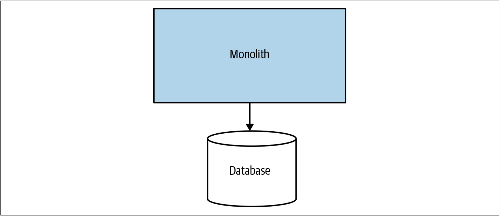
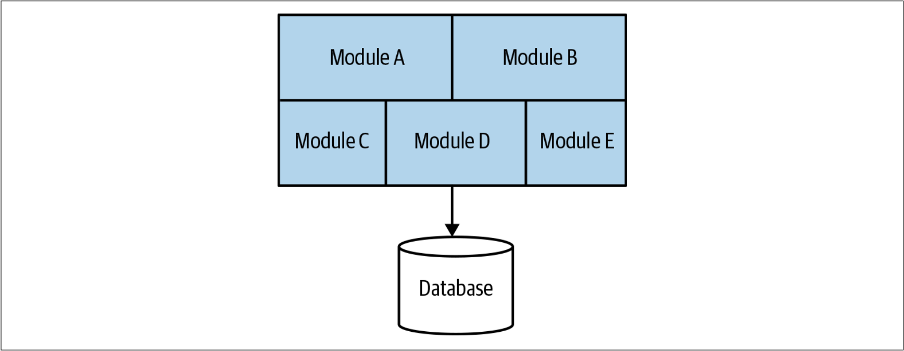
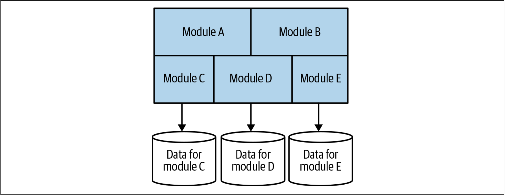

# 单体应用
我们已经介绍过微服务的相关内容，但是本书讨论的是：从单体迁移到微服务。因此，我们还需要确定“单体”的含义。

当我在本书中谈到“单体”时，我主要指的是**一个部署单元**。当系统中的所有功能必须一起部署时，将其视为一个单体。符合这一要求的单体系统至少有三种类型：单进程（*single-process*）系统[^译注1]，分布式单体（*distributed monolith*）系统和第三方黑盒（*third-party black-box*）系统。

## 单进程的单体应用
讨论单体时，能想到的、最常见的例子是这样一个系统：所有的代码都作为程序而部署，如[图1-6](#f16)所示。我们可能会拥有该程序的多个实例以保证程序的鲁棒或扩展。但是，从根本上讲，所有的代码都打包在一个程序中。这些单进程系统几乎总是从数据库中读取数据或将数据存储到数据库。因此，实际上，他们本身就可以构成简单的分布式系统。

图1-6. 单进程单体应用：所有的代码都被打包进一个进程

我所能看到的、人们与之斗争的单体系统，大多数都是属于这种单进程的单体系统。因此，我们会花费大部分时间来重点关注单进程的单体系统。从现在开始，除非另有说明，“单体”的含义均为这种单进程的单体系统。

### 模块化单体
模块化单体是单进程单体的一种变体：单个程序由独立的模块组成，每个模块都可以独立工作，但仍需要组合到一起才能部署，如[图1-7](#f17)所示。把软件拆分为模块的概念并不新鲜，我们会在本章后面再回顾模块化的一些历史。

图1-7. 模块化的单体结构：程序中的代码被拆分为不同的模块

对于很多组织而言，模块化单体是一个不错的选择。如果模块的边界定义良好，则可以进行高度并行的工作。不过，模块化单体在避免更加分布式的微服务架构所带来的挑战时，也无法获得微服务部署更简单的优势。[Shopify](https://www.shopify.com/)是使用模块化单体技术来代替微服务架构的一个很好的例子，并且对于该公司而言，模块化的单体架构看起来运作良好。[^3]

模块化单体的挑战之一是：数据库往往很少在代码层面拆分。这回导致，如果将来想要取消单体架构时，我们可能会面临重大挑战。我看到过有些团队试图通过把数据库拆分到和模块对齐的方式，来进一步推动模块化单体，如[图1-8](#f18)所示。从根本上讲，即使我们可以采用[图1-8](#f18)的方式让代码独立，但是对现有的单体进行[图1-8](#f18)所示的改造仍然具有很大的挑战性。如果想尝试做类似的事情，在第4章中探讨的许多模式可以为我们提供帮助。

图1-8. 具有数据库拆分的模块化单体

## 分布式的单体应用
> A distributed system is one in which the failure of a computer you didn’t even know existed can render your own computer unusable. (不知道哪个角落的某台计算机发生了故障，导致了我们自己的电脑无法使用，这就是分布系统。)[^4]，[^译注2]
>
> [**
——Leslie Lamport
**](http://www.lamport.org/)

分布式单体是由多个服务构成的系统，但是无论出于何种原因，整体系统都必须一起部署。分布式单体很好地满足了SOA的定义，但是通常都无法兑现SOA的承诺。以我的经验而言，分布式单体结构具有分布式系统的所有缺点，同时还具有单进程单体的缺点，但是其既没有足够的分布式系统的优势也没有足够的单进程单体的优势。我在工作中遭遇到的分布式单体很大程度上影响了我对微服务架构的兴趣。

分布式单体通常出现在这样的环境：没有将足够的精力放在诸如信息隐藏和业务功能内聚之类的概念上，于是导致了架构的高度耦合。在这种架构中，某个服务的变化经常会如“以石击水，不起浪花，也泛涟漪”一般影响到其他大服务，看似毫无问题的、服务的本地范围内的变化，却会破坏系统的其他部分。

## 第三方的黑盒系统
我们还可以把某些第三方软件视为单体，我们可能希望在迁移工作中对其进行“分解”。这种第三方软件可能包括：工资管理系统，CRM系统和HR系统。这些软件的共性是：软件由其他人开发，我们无法对其代码进行更改。第三方软件可能是在我们自己的基础架构上部署的现成（*off-the-shelf*）软件，也可能是我们正在使用的某种SaaS产品。我们在本书中探讨的许多分解技术也可以应用于那些无法更改其底层代码的系统。

## 单体应用的挑战
无论是单进程单体还是分布式单体，单体通常更容易遭受耦合的风险，特别是实现（*implementation*）耦合和部署（*deployment*）耦合。我们稍后就会讨论耦合的相关主题。

随着越来越多的人在同一个地方工作，他们之间的工作就会出现相互阻碍的情况。不同的开发人员想要更改同一段代码，不同的团队想要在不同时间发布功能（或延迟部署）。谁拥有什么以、谁要做出决定这种事情就会纠缠不清。大量的研究表明了权责混乱带来的挑战。[^5] 我把这个问题称之为交付冲突。

拥有单体并不意味着我们一定会面临交付冲突的挑战，但是微服务架构却意味着我们永远不会面临交付冲突的问题。微服务架构确实为我们提供了可以划定系统不同部分的权责的具体界限，从而为减少交付冲突提供更大的灵活性。

## 单体应用的优势
但是，单进程单体也有很多优点：
* 更简单的部署拓扑可以使其避免分布式系统下的许多陷阱
* 简化开发人员的工作流程
* 简化监控、故障排除和诸如端到端测试之类的行为

单体还可以简化单体内部的代码复用。如果要在分布式系统中复用代码，我们则必须决定采用哪种复用方式：是复制代码，还是抽取为库，亦或把公共的功能置于某个服务。对于单体而言，选择就简单得多了。很多人都喜欢单体的这种简单性——所有的代码都在这里，所以就使用它吧！

不幸的是，因为单体架构所固有的问题，人们开始把单体视为一种应该避免其发生的事情。我遇到过各种各样的人，他们都把“单体”称为“遗留代码”的代名词。这种想法是个问题。单体架构是一种选择，而且是一种有效的选择。单体并非在所有情况下都是正确的选择，微服务也并非适用于所有的情况，但是单体仍然是一种选择。如果我们陷入如下的陷阱：通过系统性抹黑单体来作出交付软件的可行选择，那么我们会面临没有正确的做事的风险，也会是我们的用户面临没有正确做事的风险。我们将在第3章中进一步探讨单体和微服务的权衡，并讨论一些工具，用以帮助我们更好地评估在我们的场景下哪种架构更适合我们。

---
[^3]: For an overview of Shopify’s thinking behind the use of a modular monolith rather than microservices, Kirs‐ ten Westeinde’s [talk on YouTube](https://www.youtube.com/watch?v=ISYKx8sa53g) has some useful insights.
[^4]: see [https://www.microsoft.com/en-us/research/publication/distribution/](https://www.microsoft.com/en-us/research/publication/distribution/) for more.
[^5]: Microsoft Research has carried out studies in this space, and I recommend all of them. As a starting point, I suggest [“Don’t Touch My Code! Examining the Effects of Ownership on Software Quality”](https://www.microsoft.com/en-us/research/publication/dont-touch-my-code-examining-the-effects-of-ownership-on-software-quality/) by Christian Bird et al.
[^译注1]: 单进程系统并不意味该系统只有一个进程在工作。
[^译注2]: Leslie Lamport是在计算机领域非常多才多艺的一个科学家。他在1978年发表的关于分布系统时序的一篇论文是被引用最多的文章之一，他在1982年描述的拜占庭将军问题成为阐述分布系统协商机制的经典案例，他在1985年推出的LaTeX语言成为学术界最流行的排版语言，他在1990年设计的行为时序逻辑语言（TLA）为并发事件推演提供了数学工具。分布式系统领域著名的Paxos算法也是由Leslie Lamport发明的。