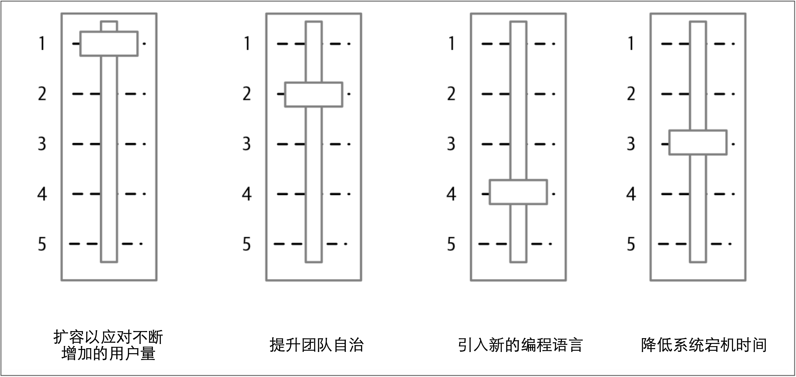

# 权衡折衷

到目前为止，我已经概述了人们可能想单独使用微服务的原因，并简要给出了考虑其他选择的理由。但是，在现实世界中，人们通常会尝试一次改变许多事情，而不是尝试一次改变一件事情。一次改变太多事情会导致事情的优先级比较复杂，从而导致所需的更改量快速增加，并且无法在短期内看到任何收益。

一切的开始都比较简单。我们需要重新设计应用程序，以应对流量的大幅增长。我们也确定微服务是未来的方向。

有人冒出来说：“那么，如果我们采用微服务的话，我们可以同时使我们的团队更加自治！”

另一个人附和道：“这给了我们一个很好的机会来尝试Kotlin！”

在不知不觉中，就有了一个庞大的变革计划，该计划正在：
* 试图发挥团队自治能力
* 扩容应用程序并同时引入新技术
* 为加强工作计划而采取其他措施

微服务就在这种情况下被锁定为解决流量上涨的方案。如果只关注扩容，在迁移过程中可能就会发现，还不如对现有的单体应用进行水平扩展。然而，水平扩展的方案却不能帮助我们达到次要目标：提高团队自治或引入Kotlin作为编程语言。

因此，把变革背后的核心驱动力与希望获得的任何的间接收益区分开来非常重要。 在上述例子中，提高应用程序的容量是最重要的事情。为了其他的次要目标的进展而进行的工作（例如提高团队自治）可能会很有用，但是如果它们阻碍或损害了关键目标，就应该把这些次要目标往后放。

重要的是要认识到某些事情比其他事情更重要。否则，就无法正确确定优先级。此时，我喜欢把每个期望的结果视为一个滑动条。每个滑动条都以中间位置为起点。当一件事情变得更加重要时，必须放弃另一件事情的优先级——如[图2-1](#f21)所示。[图2-1](#f21)清晰地表明，虽然我们想让多语言编程变得更容易，但却没有确保应用程序具有更高的弹性重要。当要弄清楚如何前进时，清晰地阐明这些结果并对其排序可以使决策更加容易。

图2-1. 利用滑动条来平衡优先级

可以修改不同目标的相对优先级（并且随着我们了解的更多，也应该调整他们的优先级）。[图2-1](#f21)所示的方法可以帮助并指导我们做出决策。如果想划分职责，将更多的权力下放到新成立的自治团队，则类似[图2-1](#f21)这样的简单模型可以为自治团队的本地决策提供信息，并帮助自治团队做出更好的选择，从而使他们与整个公司层面要实现的目标保持一致。