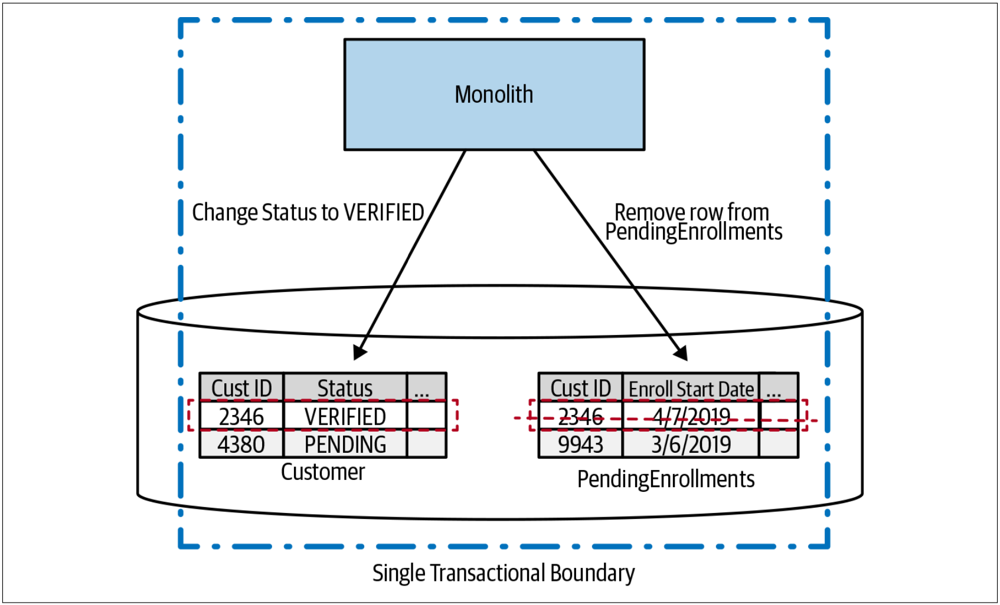
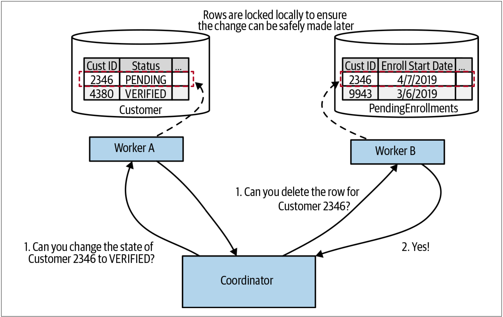
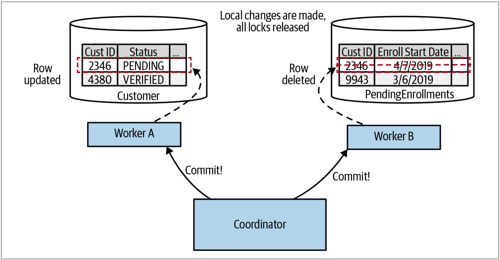

# 数据库事务
在拆分数据库时，我们已经谈到了可能会导致的一些问题。维护数据库的引用完整性会成为问题，延迟可能会增加，同时生成报表等行为会变得更加复杂。我们已经研究了应对这些挑战的各种方法，但还有一个很大的挑战：事务如何解决？

在事务中修改数据库的能力可以使我们的系统更易于理解，因此也更易于开发和维护。我们依靠数据库来确保数据的安全性和一致性，从而让我们可以有精力考虑其他事情。但是，当我们跨数据库拆分数据时，我们将失去使用数据库事务以原子方式更新数据的好处。

在探讨如何解决事务问题之前，让我们简要看一下普通的数据库事务可以为我们提供什么。

## 事务的ACID特性
当我们谈论数据库事务时，通常，我们所谈论的是具备ACID特性的事务。ACID是概述数据库事务的关键特性的首字母缩写，我们依赖ACID来确保系统数据存储的持久性和一致性。ACID代表原子性（*atomicity*），一致性（*consistency*），隔离性（*isolation*）和持久性（*durability*），这些属性给我们提供如下的能力：

* **原子性：**确保事务中完成的所有操作要么全部完成要么全部失败。对我们试图做出的任何修改，如果由于某些原因而导致修改失败，则整个操作都将中止，就好像从未进行过任何修改一样。
* **一致性：**修改数据库时，确保数据库处于有效、一致的状态。
* **隔离性：**允许多个事务同时运行而不会产生相互干扰。确保一个事务期间进行的任何临时状态的修改对其他事务不可见，可以实现此目的。
* **持久性：**交易一旦完成，需要确保我们相信，即使系统出现故障，数据也不会丢失。

值得注意的是，并非所有数据库都提供事务。我曾经使用过的所有的关系数据库都提供了事务，许多新的NoSQL数据库（例如Neo4j）也提供了事务。多年来，MongoDB仅在单个文档上支持ACID事务，对MongoDB中的多个文档进行原子更新，可能会引起问题[^8]。

该书不是一本详细介绍事务的书。因此，为了简洁起见，我对事务的很多描述进行了简化。对于那些想进一步探索这些概念的人，我推荐《Designing Data-Intensive Applications》[^9]这本书。在接下来的内容中，我们将主要关注事务的原子性。这并不是说其他属性不重要，只是因为原子性往往是我们划分事务边界时遇到的第一个问题。

## 缺乏原子性的ACID
我想澄清的是，当我们拆分数据库时，仍然可以使用ACID式的事务，但是，此时，事务的范围缩小了，其用途也缩小了。参见图[4-46](#f446)。我们一直在跟踪新客户加入到我们系统所涉及到的过程。我们已经到达该过程的最后阶段，该阶段会将客户的状态从“PENDING”修改为“VERIFIED”。在用户完成注册后，我们还想从PendingEnrollments表中删除匹配的记录。对于单个数据库而言，可以在单个ACID数据库事务的范围内完成——要么都写入新行，要么都不写入新行。

图4-46. 在一个事务的范围内更新两个表

对比[图4-46](#f446)和[图4-47](#f447)。我们在[图4-47](#f447)中执行完全相同的修改，但是却在不同的数据库中进行修改。这意味着要考虑两个事务，每个事务都可以独立于另一个事务而工作。

图4-47. 在两个不同事务的范围内完成数据的更新

当然，我们可以对这两个事务进行排序，只有在我们能修改Customer表中的数据时，才从PendingEnrollments表中删除对应的数据。但是，我们仍然必须考虑：如果从PengingEnrollments表中删除失败该怎么办？此时，所有的处理逻辑都需要我们自己实现。可以重新执行这些步骤是处理该场景的一个非常有用的想法（我们在探索sagas时会再次提到这一点）。但是，从根本上讲，把一个事务操作拆分为两个独立的数据库事务，我们必须接受：我们失去了整个操作的原子性保证。

缺乏原子性可能会引发严重的问题，尤其是，如果我们要迁移的系统依赖于数据的原子性。在这一点上，人们开始寻找其他解决方案，以能够一次修改多个服务。通常，人们开始考虑的第一个选择是分布式事务。让我们来看一下实现分布式事务的最常见算法之一——二阶段提交，作为探索与分布式事务整体相关的挑战的一种方法。

## 二阶段提交
二阶段提交算法(有时缩写为*2PC*)经常用于试图提供在分布式系统中进行事务性修改的能力在。该分布式系统中，作为整个操作的一部分，多个独立的进程都可能需要更新。我想让大家先了解到**2PCs**有其局限性，我们会讲到这些局限性，了解这些局限性是值得的。分布式事务，更具体地说是二阶段提交，经常由迁移到微服务架构的团队提出，来作为解决他们所面临的挑战的一种方法。但是，正如我们将看到的，**2PCs**可能无法解决我们的问题，并且可能会给我们的系统带来更多的混乱。

**2PC**算法分为两个阶段（因此得名二阶段提交）：投票阶段（*voting phase*）和提交阶段（*commit phase*）。在投票阶段，一个中央协调者（*central coordinator*）与所有将参与事务的workers协商，并要求确认是否可以修改状态。在[图4-48](#f448)中，我们可以看到两个请求：一个请求用于把客户状态更新为VERIFIED，另一个请求用于从PendingEnrollments表中删除数据。如果所有的workers都同意执行要求其执行的状态修改，那么算法则进入下一阶段。如果任何一个worker回复无法执行对应的操作，可能是因为所要求的状态修改违反了服务本地的某些条件，则整个操作中止。

图4-48. 在二阶段提交的第一阶段，所有的workers投票来决定他们是否可以实施一些本地的状态修改

需要强调的是，在workers表示可以进行更新后，更新并不会立即生效。相反，workers保证在未来的某个时刻能够做出更新。Workers如何做出这样的保证呢？例如，在[图4-48](#f448)中，Worker A说它能够更新Customer表中的行状态，以更新特定客户的状态到VERIFIED。如果在后续的某个点进行了不同的操作，删除了该行，或者执行了另一个较小的更新，但却意味着后续更新到VERIFIED的操作被认为是非法的，该怎么办？为了保证后续可以执行该更新，Worker A可能必须锁定记录，以确保如上提到的变更不会发生。

如果有任何的workers没有投票，则中央协调者需要向所有参与方发送回滚消息，以确保它们可以在本地清理，以释放它们可能持有的任何锁。如果所有的workers都同意进行修改，我们就进入提交阶段，如[图4-49](#f449)所示。在该阶段，会进行实际的修改，并释放相关的锁。

图4-49. 在二阶段提交的提交阶段，更新才被实际应用

需要注意的是，在这样的系统中，我们无法保证这些提交会完全同时发生。协调者需要向所有参与者发送commit请求，不同参与者可能会在不同的时间接收到该消息并处理。这意味着，如果我们允许在事务协调者（*transaction coordinator*）之外查看这些workers的状态，我们有可能看到Worker A所做的修改，但却尚未看到Worker B所做的修改。协调者和workers之间的延迟越大，workers处理响应的速度越慢，这种不一致的时间窗口就越大。回到我们对ACID的定义，隔离性确保我们在事务过程中不会看到中间状态。但在二阶段提交中，我们失去了ACID的隔离性。

当**2PC**工作时，通常，其核心只是协调分布式锁。Workers需要锁定其本地资源，以确保可以在第二阶段进行提交。在单进程的系统中管理锁并避免死锁并不是一件好事。现在，想象一下在多个参与者之间协调锁的挑战。此时并非处于有利地形。

有很多与二阶段提交相关的失败模式，我们没有时间去探索这些失败的模式。考虑如下的问题：一个worker投票以表示可以继续执行事务，但是，在协调者发出commit请求时，该worker却没有响应。那么，此时我们该怎么办？这些故障模式中的某些故障可以自动处理，但有些故障却让系统处于需要手动取消的状态。

参与者越多，系统的延迟就越大，二阶段提交的问题就越多。分布式锁可能是向系统中注入大量延迟的一种快速方法，尤其是在如下的情况下：锁定的范围较大，事务的持续时间较长。因此，二阶段提交通常仅用于非常短暂的操作。操作时间越长，锁定资源的时间就越长！


关于二阶段提交的详细信息，可以参考：https://www.cs.princeton.edu/courses/archive/fall16/cos418/docs/L6-2pc.pdf 。


## 对分布式事务直接说No
鉴于如上所概述的所有的原因，我强烈建议避免使用分布式事务（例如二阶段提交）来协调跨不同微服务的状态变化。那我们还能做什么呢？

Well，第一个选择是不要在一开始就将数据拆分开来。如果要以一种真正的原子性和一致性的方式来管理某些状态，同时我们又没办法在没有ACID式的事务的情况下合理的解决该问题，那么将在单个数据库中存储该状态，并将管理该状态的功能置于单个服务（或者我们的单体）中。如果我们正在研究在哪里拆分单体，并确定了哪些拆分是容易的（或很难的），那么，我们就可以很好的决定：现在就对当前在一个事务中管理的数据进行拆分是一件很难处理的事情。先在系统的其他区域上展开工作，然后后续再回过头来解决该问题。

但是，如果我们确实需要拆分在一个事务中管理的数据，却又希望避免管理分布式事务的所有麻烦，此时会发生什么？我们如何在多个服务中执行操作但又避免资源锁定？如果操作需要花几分钟，几天甚至几个月的时间，该怎么办？在这种情况下，我们可以考虑使用另一种方法：sagas。

---
[^8]: This has now changed with support for multidocument ACID transactions, which was released as part of Mongo 4.0. I haven’t used this feature of Mongo myself; I just know it exists!
[^9]: See Martin Kleppmann, Designing Data-Intensive Applications (Sebastopol, O’Reilly Media, Inc., 2017).

