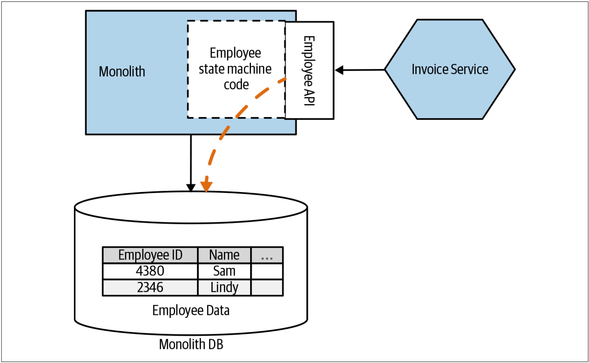
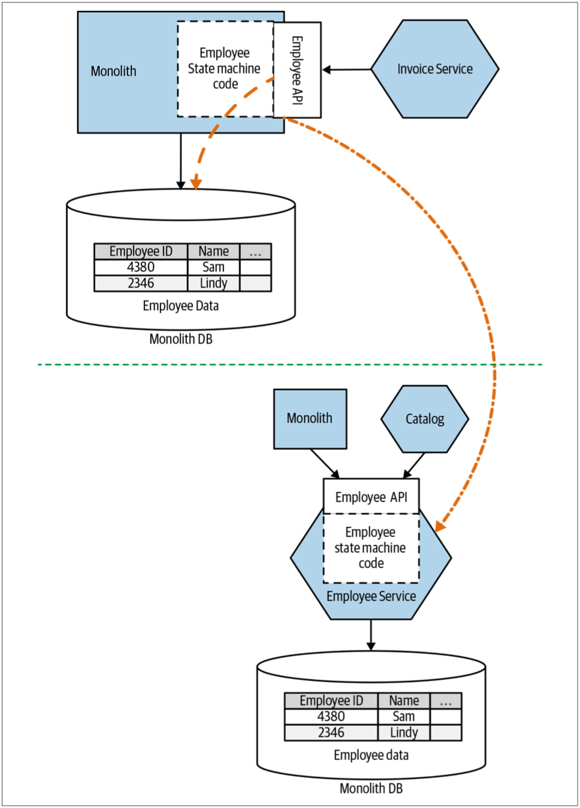
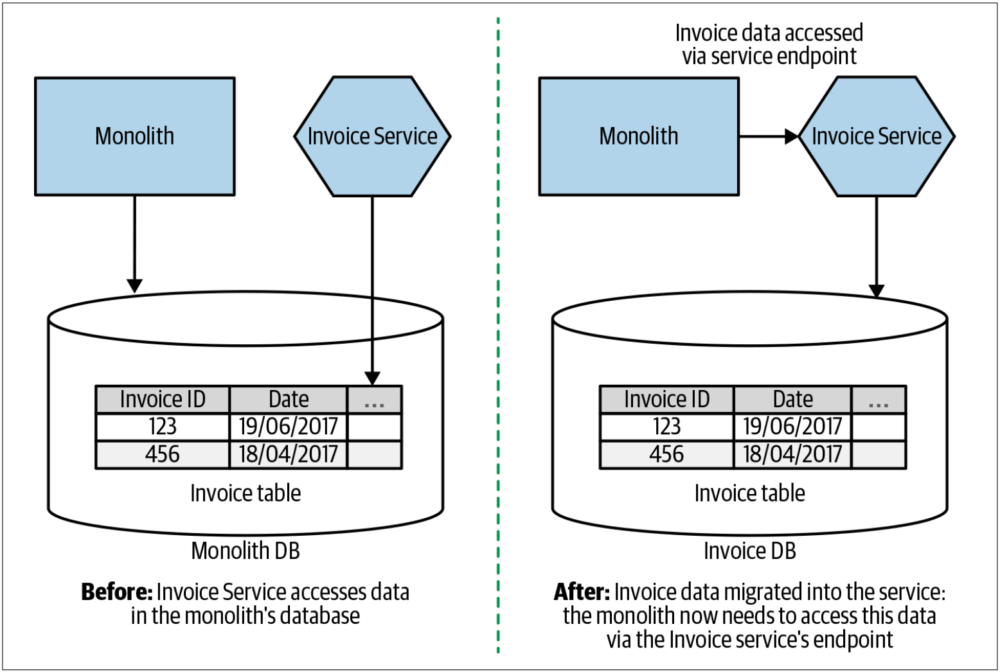
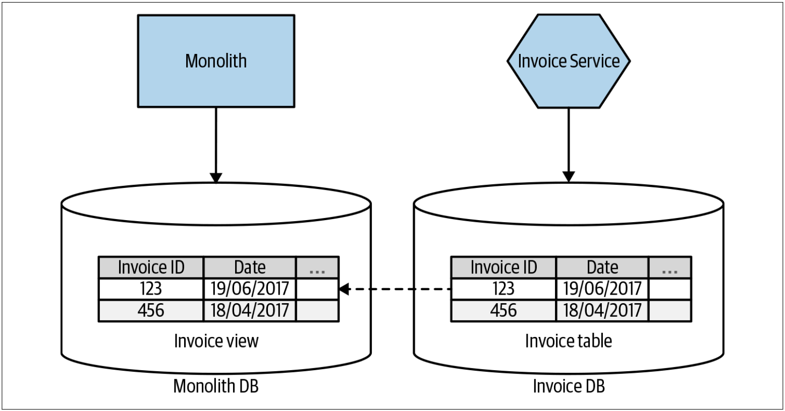

# 转换数据的所有权
到目前为止，我们还没有真正解决根本问题。我们只是用各种不同的绷带来包扎一个大型的、共享的数据库。在开始考虑从巨型的单体数据库中抽取数据这一棘手的任务之前，我们需要考虑我们所讨论的数据实际上应该存放在何处。当我们将服务从单体中拆分出来时，某些数据应该随之一起提供，而有些数据则应该保留在原处。

* 如果我们接受这样的想法——[微服务封装一个或多个聚合相关联的逻辑](Just_Enough_Domain_Driven_Design.md#聚合)，那么我们还需要把聚合的状态管理以及与之关联的数据移到微服务自己的数据schema中。
* 另一方面，如果我们的新的微服务需要与仍在单体中的聚合交互，则需要通过定义明确的接口来开放此功能。

现在，让我们看看如上的两种选择。

## 在单体中开放聚合
在[图4-8](#f48)中，我们的新服务——Invocing需要访问与管理发票没有直接关系的各种信息。至少，Invocing服务需要当前的Employees聚合的相关信息来管理审批工作。而目前，Employees的相关数据全部位于单体数据库中。在单体上，通过服务端点（可能是API或事件流）开放Employees聚合的相关信息，我们明确了Invoice服务所需要的信息。

图4-8. 通过适当的服务接口开放单体的信息，从而使我们的新微服务可以访问这些信息

我们想要把微服务视为行为（*behaviro*）和状态（*state*）的组合。我已经讨论过这样的想法：把微服务视为包含一个或多个用来管理领域聚合（*domain aggregates*）的状态机。当从单体中暴露聚合时，我们希望以相同的方式来思考。单体仍然“拥有”如下的概念：什么样的状态修改是允许的，什么样的状态修改是不允许的。我们不想仅仅将其视为数据库的包装器。

除了公开数据之外，我们还将公开如下的操作：允许外部各方查询聚合的当前状态，允许外部各方发起新状态转换的请求。我们仍然可以决定从服务边界公开聚合的哪些状态，并限制可以从外部请求什么状态转换操作。

### 抽取更多服务的途径
通过定义Invoice服务的需求，并在定义明确的接口中显式公开所需的信息，我们将有可能发现未来的服务边界。在[图4-9](#f49)中，接下来，显而易见的步骤可能是提取Employee服务。通过一个API来开放与员工相关的数据，我们已经摸索了很久来了解消费者对新的Employee服务的需求。

图4-9. 使用现有的端点来驱动抽取新的Employee服务

当然，如果我们确实从单体中提取了那些employees聚合，而单体需要那些employee数据，则可能需要修改单体才能使用Employee新服务！

### 何处使用该模式
当仍然由数据库“拥有”所要访问的数据时，此模式可以很好地使新服务可以获得所需的访问权限。抽取服务时，新服务回调单体来访问其所需的数据可能比直接访问单体的数据库的方式要多做些工作，但从长远来看，这是一个更好的主意。我仅在无法修改所涉及到的单体以公开这些新端点的情况下才会考虑使用数据库视图。在无法修改单体的情况下，可以使用单体数据库的数据库视图，也可以使用前面讨论的CDC模式（具体参见第120页的[CDC模式](Pattern_Change_Data_Capture.md)），或创建一个专用的数据库包装服务（ 参阅第132页的[把数据库包装成服务](Pattern_Database_Wrapping_Service.md)），以开放我们所需的Employee信息。

## 修改数据的所有权
我们已经研究了：当Invoice服务需要访问其他的功能所拥有的数据（如前所述，我们需要访问Employee数据）时，会发生什么。但是，当我们考虑当前位于单体中的数据应该由我们新抽取的服务来控制时，会发生什么？

在[图4-10](#f410)中，我们概述了需要进行的修改。因为应该由Invoice来管理数据的生命周期，因此我们需要把与Invoice相关的数据从单体中移出，并移至新的Invoice服务中。然后，我们需要修改单体，以将Invoice服务视为与发票相关的数据的真实来源；并修改单体，以使其调用Invoice服务端点以读取数据或请求数据修改。

图4-10. 新的Invoice服务拥有相关数据的所有权

但是，从现有的单体数据库中剥离发票数据可能是一个复杂的问题。我们可能必须考虑破坏外键约束、破坏事务边界等等的影响，所有的这些主题，我们都将在本章的后面来介绍。如果可以修改单体，以便单体仅需要读取与发票相关的数据，则可以考虑从发票服务的数据库中投影视图，如[图4-11](#f411)所示。但是，此时，数据库视图的所有限制也都将同时生效。因此，强烈建议修改单体，以直接调用新的Invoice服务。

图4-11. 把Invoice数据作为视图投影回单体

### 何处使用该模式
何处使用该模式更加明确。如果新抽取的服务封装了修改某些数据的业务逻辑，则这些数据应在新服务的控制之下。数据应从从来的地方移到新服务中。当然，将数据移出现有数据库的过程并非是一个简单的过程。实际上，将数据移除现有数据库将是本章其余部分的重点。

